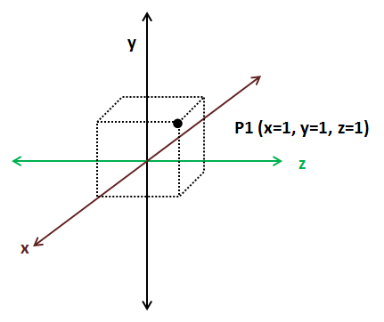
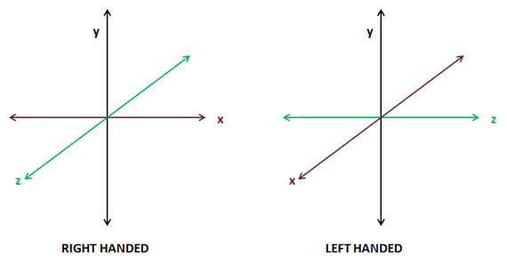

# 坐标简介（A brief about coordinates）

本章中我们将讨论坐标和坐标系（Coordinate System），尝试以简单的方式介绍一些基本的数学概念，为后面章节将要介绍的技术和内容提供帮助。我们将会将一些内容简化，以易于学习，但牺牲了准确性。

我们通过指定坐标来确定物体在空间中的位置。联想地图，通过在地图上指定纬度和经度来确定一个点。只需一对数字，就可以精确地确认一个点，这对数字就是点坐标（实际上有些复杂，需要更多的数据才能在地图上确定一个点，因为地图是一个不完美的椭圆球体（地球）的投影，但这是一个很好的类比）。

坐标系是一个系统，它使用一个或多个数字，即一个或多个分量来唯一地确定一个点的位置。存在着多种不同的坐标系（如笛卡尔坐标系，极坐标系等），并且可以将坐标从一个坐标系转换到另一个坐标系。我们将使用笛卡尔坐标系。

在二维笛卡尔坐标系中，坐标由两个数字定义，它们表示到两个相互垂直的X轴和Y轴间距离。

 

继续类比地图，坐标系定义一个原点。对于地理坐标来说，原点被设置为赤道和零度经线交叉的点。根据原点设置的位置，特定点的坐标是不同的。坐标系也可以定义轴的方向。在上图中，X坐标随着点向右移动而增加，Y坐标随着点向上移动而增加。但我们也可以定义一个与笛卡尔坐标系不同的，具有不同的轴取向的坐标系，我们将得到不同的坐标。
 

如你所见，我们需要定义一些参数，例如原点和轴方向，以便使构成坐标的数字对有恰当的含义。为了使用一组坐标，我们必须使用对应的坐标系，好消息是可以通过平移和旋转将坐标从一个坐标系转换到另一个坐标系。

如果要处理三维坐标，我们需要增加一个轴，即Z轴。三维坐标将由三个数字(x, y, z)构成。
 

在二维笛卡尔坐标系中，只要轴相互垂直，我们就可以改变三维坐标系中的轴的方向。下图显示另一个三维坐标系。
 

三维坐标可分为左手系和右手系两种类型。你怎么知道它是什么类型的？用你的手在你的拇指和食指之间形成一个“L”，中指应指向垂直于其他两个手指的方向。拇指应该指向X轴的正方向，食指应该指向Y轴的正方向，而中指应该指向Z轴的正方向。如果你能用左手做到，那么它就是左手系，如果你需要用右手，那它就是右手系。

 

二维坐标系是相同的，因为通过旋转，我们可以从一个坐标系转换到另一个坐标系。但是，三维坐标系并不都是相同的。如果它们可以使用相同的手来表示，换句话说，如果两者都是左手系或者右手系，那么就能通过旋转从一个坐标系转换到另一个坐标系。

现在已经明确了一些基本的概念，让我们来讲解一些在处理三维图形时常用的术语。当我们在此后的章节中解释如何渲染三维模型时，将看到我们将使用不同的三维坐标系，这是因为每个坐标系都有不同的设定，有不同的目的。一组坐标是没有意义的，除非明确它是某个坐标系的坐标。当你看到坐标(40.438031, -3.676626)时，你可能会有一个大胆的想法。但是如果我说它是几何坐标（经度和纬度）时，你就会发现它是马德里某个地方的坐标。

当我们加载三维物体时，我们将得到一组三维坐标。这些坐标在被称为物体坐标系（Object Coordinate Space）的三维坐标系中表达。当建模师在设计这些三维模型的时候，他们对该模型将显示的三维场景毫不知情，因此只能使用与模型相关的坐标系来定义坐标。

当要绘制一个三维场景时，所有的三维物体将与被称为世界空间坐标系的坐标系对应。我们需要将三维物体的坐标系转换到世界坐标系。一些物体需要旋转、拉伸、放大和转换，以便在三维场景中能够正确地显示。

我们还需要限制所显示的三维空间的范围，例如移动摄像机穿梭在三维空间中。然后我们需要将世界空间坐标系的坐标转换到摄像机或观察空间坐标系。最后，这些坐标需要转换为二维的屏幕坐标，所以我们需要将三维观察坐标投影到二维屏幕空间坐标系。

下图展示了OpenGL坐标系（Z轴垂直于屏幕），坐标在-1和+1之间。

 

如果你不能清楚地理解这些概念，别担心。在下一章中，它们将用实例表现出来。
