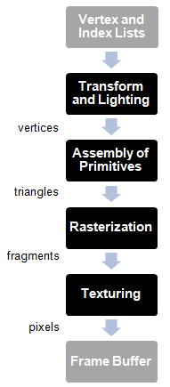
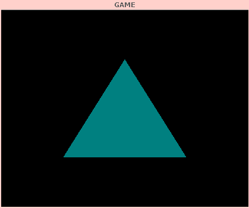

# 渲染（Rendering）

在本章中，我们将学习用OpenGL渲染场景时要做的事项。如果你已经习惯了OpenGL的旧版本，习惯了使用固定管线，你可能会跳过这一章，不想知道为什么它需要这么复杂。它其实更简单、更灵活，你只需要给它一个表现的机会。现代OpenGL使你只需考虑一个问题，这可以使你以更合理的方式组织代码和开发。

将三维表示映射到二维屏幕的一系列步骤被统称为图形管线（Graphics Pipeline）。OpenGL最初的版本使用了一个被称为固定管线（Fixed-function Pipeline）的模型。该模型在绘制过程中定义了一组固定的操作步骤，程序员被每一步骤可用的函数集约束，可以使用的效果和可进行的操作受到API（例如，“设置雾”或“添加光照”）的限制，但是这些功能的实现是固定的，并且不能修改。

图形管线由以下操作步骤组成：



OpenGL 2.0 引入了可编程管线（Programmable Pipeline）的概念。在该模型中，组成图形管线的不同步骤可以通过使用一组叫做着色器（Shader）的特定程序来控制或编程。下图简单的展示了OpenGL可编程管线：


该渲染方式最初将以顶点缓冲区为形式的一系列顶点作为输入。但是，什么是顶点？顶点（Vertex）是描述二维或者三维空间中的点的数据结构。如何描述三维空间中的一个点呢？通过指定其X、Y和Z坐标。什么是顶点缓冲区？顶点缓冲区（Vertex Buffer）是使用顶点数组来包装所有需要渲染的顶点的另一种数据结构，并使这些数据能够在图形管线的着色器中使用。

这些顶点由顶点着色器（Vertex Shader）处理，顶点着色器的功能是计算每个顶点到屏幕空间中的投影位置。该着色器还可以生成与颜色或纹理相关的其他输出，但其主要目的还是将顶点投影到屏幕空间中，即生成点。

几何处理阶段（Geometry Processing）将由顶点着色器变换的顶点连接成三角形。它依照顶点储存的顺序，使用不同的模型对顶点进行分组。为什么是三角形？三角形就是显卡的基本工作单元，它是一个简单的几何形状，可以组合和变换，以构建复杂的三维场景。此阶段还可以使用特定的着色器来对顶点进行分组。

光栅化（Rasterization）阶段接收此前生成的三角形，剪辑它们，并将它们转换为像素大小的片元。

这些片元将在片元处理阶段（Fragment Processing）被片元着色器（Fragment Shader）使用，以生成写入到帧缓冲区的像素的最终颜色。帧缓冲区（Framebuffer）是图形管线的最终输出，它储存了每个像素应该被绘制到屏幕上的值。

注意，显卡被设计成并行处理上述所有操作，输入的数据可以并行处理以生成最终场景。

让我们开始编写第一个着色器程序。着色器是使用基于ANSI C的OpenGL着色器语言（GLSL）编写的。首先，在`resources`目录下创建一个名为“`vertex.vs`”（扩展名为顶点着色器英文简写）的文件，内容如下：

```glsl
#version 330

layout (location=0) in vec3 position;

void main()
{
    gl_Position = vec4(position, 1.0);
}
```

第一行是一个表示我们正使用的GLSL语言版本的标识符。下表是GLSL版本、与该版本匹配的OpenGL版本和使用方法（来自维基百科：[https://en.wikipedia.org/wiki/OpenGL\_Shading\_Language\#Versions](https://en.wikipedia.org/wiki/OpenGL_Shading_Language#Versions)）：

| GLSL版本 | OpenGL版本 | 着色器标识符 |
| --- | --- | --- |
| 1.10.59 | 2.0 | \#version 110 |
| 1.20.8 | 2.1 | \#version 120 |
| 1.30.10 | 3.0 | \#version 130 |
| 1.40.08 | 3.1 | \#version 140 |
| 1.50.11 | 3.2 | \#version 150 |
| 3.30.6 | 3.3 | \#version 330 |
| 4.00.9 | 4.0 | \#version 400 |
| 4.10.6 | 4.1 | \#version 410 |
| 4.20.11 | 4.2 | \#version 420 |
| 4.30.8 | 4.3 | \#version 430 |
| 4.40 | 4.4 | \#version 440 |
| 4.50 | 4.5 | \#version 450 |

第二行指定此着色器的输入格式。OpenGL缓冲区中的数据可以是我们想要的任何数据，也就是说，该语言不会强迫你传递预定义语言的任何指定数据结构。从着色器的角度来看，它期望接收一个存有数据的缓冲区。它可以是一个位置，一个有一些附加信息的位置，或者我们想要的任何数据。顶点着色器只接收浮点数组。当填充缓冲区时，我们定义要由着色器处理的缓冲区块。

首先，需要把这些块变成对我们有意义的数据。现在规定从位置0开始，我们期望接收由三个属性(X, Y, Z)组成的向量。

着色器有个`main`代码块，就像任何C语言程序一样，上述示例是非常简单的。它只是将接收到的坐标不经任何变换地返回到`gl_Position`。你现在可能想知道为什么三个属性的向量被转换成四个属性的向量（`vec4`）。这是因为`gl_Position`仅接收`vec4`类型的数据，因为它是齐次坐标（Homogeneous Coordinates）。也就是说，它希望接收到形似(X, Y, Z, W)的东西，其中W代表一个额外的维度。为什么还要添加另一个维度？在此后的章节中，你会看到我们需要做的大部分操作都是基于向量和矩阵的。如果没有额外的维度，一些操作不能组合。例如，不能把旋转和位移操作组合起来。（如果你想学习更多有关于这方面的知识，这个额外的维度允许我们组合仿射和线性变换。你可以通过阅读《3D Math Primer for Graphics and Game Development》（作者是Fletcher Dunn 和 Ian Parberry）来更多地了解这一点。）

现在来看看我们的第一个片元着色器。在`resources`目录下创建一个名为`fragment.fs`（扩展名片元着色器英文简写）的文件，内容如下：

```glsl
#version 330

out vec4 fragColor;

void main()
{
    fragColor = vec4(0.0, 0.5, 0.5, 1.0);
}
```

该结构与我们的顶点着色器非常相似。现在，它将为每个片元设置固定的颜色。输出值被定义为第二行的`vec4`类型的`fragColor`变量。

现在我们已经创建了着色器，该如何使用它们呢？以下是我们要做的一系列步骤：
1. 创建OpenGL程序。
2. 载入顶点和片元着色器文件。
3. 为每个着色器创建一个新的着色器程序并指定它的类型（顶点或片元）。
4. 编译着色器。
5. 将着色器绑定到OpenGL程序上。
6. 连接程序。

最后，着色器将会被载入到显卡中，我们可以通过引用程序ID来使用它。

```java
package org.lwjglb.engine.graph;

import static org.lwjgl.opengl.GL20.*;

public class ShaderProgram {

    private final int programId;

    private int vertexShaderId;

    private int fragmentShaderId;

    public ShaderProgram() throws Exception {
        programId = glCreateProgram();
        if (programId == 0) {
            throw new Exception("Could not create Shader");
        }
    }

    public void createVertexShader(String shaderCode) throws Exception {
        vertexShaderId = createShader(shaderCode, GL_VERTEX_SHADER);
    }

    public void createFragmentShader(String shaderCode) throws Exception {
        fragmentShaderId = createShader(shaderCode, GL_FRAGMENT_SHADER);
    }

    protected int createShader(String shaderCode, int shaderType) throws Exception {
        int shaderId = glCreateShader(shaderType);
        if (shaderId == 0) {
            throw new Exception("Error creating shader. Type: " + shaderType);
        }

        glShaderSource(shaderId, shaderCode);
        glCompileShader(shaderId);

        if (glGetShaderi(shaderId, GL_COMPILE_STATUS) == 0) {
            throw new Exception("Error compiling Shader code: " + glGetShaderInfoLog(shaderId, 1024));
        }

        glAttachShader(programId, shaderId);

        return shaderId;
    }

    public void link() throws Exception {
        glLinkProgram(programId);
        if (glGetProgrami(programId, GL_LINK_STATUS) == 0) {
            throw new Exception("Error linking Shader code: " + glGetProgramInfoLog(programId, 1024));
        }

        if (vertexShaderId != 0) {
            glDetachShader(programId, vertexShaderId);
        }
        if (fragmentShaderId != 0) {
            glDetachShader(programId, fragmentShaderId);
        }

        glValidateProgram(programId);
        if (glGetProgrami(programId, GL_VALIDATE_STATUS) == 0) {
            System.err.println("Warning validating Shader code: " + glGetProgramInfoLog(programId, 1024));
        }

    }

    public void bind() {
        glUseProgram(programId);
    }

    public void unbind() {
        glUseProgram(0);
    }

    public void cleanup() {
        unbind();
        if (programId != 0) {
            glDeleteProgram(programId);
        }
    }
}
```

`ShaderProgram`类的构造函数在OpenGL中创建一个新的程序，并提供添加顶点和片元着色器的方法。这些着色器被编译并绑定到OpenGL程序中。当所有的着色器都被绑定时，应该调用`link`方法，来连接所有代码并验证所有操作都已正确地完成。

一旦着色器程序被连接，编译的顶点和片元着色器可以被释放（通过调用`glDetachShader`方法）。

验证是通过调用`glValidateProgram`方法完成的。此方法主要用于调试，当游戏到达生产阶段时，应将其删除。此方法将验证在**当前OpenGL状态**下着色器是否正确。这意味着，即使着色器是正确的，在某些情况下也可能验证失败，这是因为当前状态不够完整（一些数据可能尚未加载），无法运行着色器。因此，我们可以将错误信息输出到标准错误输出中。

`ShaderProgram`类还提供了在渲染时激活该程序（绑定）和停止使用它（解绑）的方法。最后，它提供了一个`cleanup`方法，用于在它不再被需要时，释放所有资源。

既然有一个清理方法，让我们更改`IGameLogic`接口来添加一个`cleanup`方法：

```java
void cleanup();
```

该方法将在游戏循环结束时调用，所以需要修改`GameEngine`类的`run`方法：

```java
@Override
public void run() {
    try {
        init();
        gameLoop();
    } catch (Exception excp) {
        excp.printStackTrace();
    } finally {
        cleanup();
    }
}
```

现在我们可以在`Renderer`类的`init`方法中使用着色器来显示一个三角形。首先，我们要创建着色器程序：

```java
public void init() throws Exception {
    shaderProgram = new ShaderProgram();
    shaderProgram.createVertexShader(Utils.loadResource("/vertex.vs"));
    shaderProgram.createFragmentShader(Utils.loadResource("/fragment.fs"));
    shaderProgram.link();
}
```

我们已经创建了一个工具类，它提供了一个从类路径中取得文件内容的方法，此方法用于取得我们的着色器代码。

现在我们可以把三角形定义为一组浮点数，创建一个一维浮点数组，它将定义三角形的顶点。如你所见，数组中没有数据结构。就目前而言，OpenGL无法知道该数组的结构，这只是一组浮点数：

```java
float[] vertices = new float[]{
     0.0f,  0.5f, 0.0f,
    -0.5f, -0.5f, 0.0f,
     0.5f, -0.5f, 0.0f
};
```

下图体现了在坐标系中的三角形。


现在我们有了坐标，需要把它们储存到显卡中，并告诉OpenGL它的数据结构。现在将介绍两个重要的概念，顶点数组对象（Vertex Array Object，VAO）和顶点缓冲对象（Vertex Buffer Object，VBO）。如果你对接下来的代码感到困惑，请记住，现在所做的是把将要绘制的模型对象的数据传递到显存中。当储存它的时候，我们会得到一个ID，稍后绘制时会使用它。

先介绍顶点缓冲对象（VBO）吧，VBO只是显存中存储顶点的内存缓冲区。这是用来暂存一组用于建模三角形的浮点数的地方。如上所述，OpenGL对我们的数据结构一无所知。事实上，它不仅可以储存坐标，还可以储存其他信息，比如纹理、颜色等。

顶点数组对象（VAO）是一个对象，储存一个或多个通常被称为属性列表的VBO。每个属性列表可以保存一种类型的数据：位置、颜色、纹理等。在每个渲染间隔中，你可以自由地储存所需的任何数据。

一个VAO就像是一个包装，它按一组定义对储存在显卡中的数据分组。当创建一个VAO时，我们得到一个ID。我们使用此ID来渲染它和使用它在创建过程中定义的数据。

让我们继续编写示例代码。首先要做的事就是把浮点数储存在一个`FloatBuffer`中。这主要是因为我们必须使用基于C语言的OpenGL库的接口，所以必须把浮点数组转换成可以由库管理的东西。

```java
FloatBuffer verticesBuffer = MemoryUtil.memAllocFloat(vertices.length);
verticesBuffer.put(vertices).flip();
```

我们使用`MemoryUtil`类来在堆外内存中创建了一个缓冲区，以便OpenGL库访问它。在储存了数据（调用`put`方法）之后，我们需要调用`flip`方法将缓冲区的位置重置为0（也就是说，我们已经完成了对它的写入）。记住，Java中的对象，被分配在一个叫堆（Heap）的内存空间。堆是JVM内存中保留的一大堆内存，储存在堆中的对象不能通过本地代码访问（JNI，这种机制使得Java不能直接调用本地代码）。Java代码和本地代码直接共享内存数据的唯一方法是在Java中直接地分配内存。

如果你来自LWJGL的旧版本，强调一些要点是很重要的。你可能注意到了，我们不使用工具类`BufferUtils`，而使用`MemoryUtil`类来创建缓冲区。这是由于`BufferUtils`不是非常有效的，并且仅被用于向下兼容。LWJGL3提供了两种缓冲区的管理方法：

* 自动管理缓冲区，即由垃圾回收器自动回收的缓冲区。这些缓冲区适用于短暂的操作，或者用于传递到GPU的数据，并且不需要储存于进程内存中。这是通过使用`org.lwjgl.system.MemoryStack`实现的。
* 手动管理缓冲区。此情况下，一旦完成操作，我们需要小心地释放它们。这些缓冲区适用于长时间的操作或者大量的数据。这是通过使用`MemoryUtil`类实现的。

你可以在此处查阅细节：
[https://blog.lwjgl.org/memory-management-in-lwjgl-3/](https://blog.lwjgl.org/memory-management-in-lwjgl-3/ "here")

在此情况下，我们的数据被发送到GPU，这样可以考虑使用自动管理的缓冲区。但稍后我们将使用它们来储存可能需要手动管理的大量数据，这就是使用`MemoryUtil`类的原因，因此，这就是为什么我们要在最后一个块中释放缓冲区资源。在下章中，我们将学习如何使用自动管理缓冲区。

现在需要创建VAO然后绑定它：

```java
vaoId = glGenVertexArrays();
glBindVertexArray(vaoId);
```

然后需要创建VBO，绑定它并将数据输入：

```java
vboId = glGenBuffers();
glBindBuffer(GL_ARRAY_BUFFER, vboId);
glBufferData(GL_ARRAY_BUFFER, verticesBuffer, GL_STATIC_DRAW);
glEnableVertexAttribArray(0);
```

接下来是最重要的部分。我们需要定义数据结构，并将其储存在VAO的属性列表中，这是用下述代码完成的：

```java
glVertexAttribPointer(0, 3, GL_FLOAT, false, 0, 0);
```

它的参数是：

* index: 指定着色器期望此数据的位置。
* size: 指定每个顶点属性的数据数（从1到4）。现在，我们使用三维坐标，所以它应该是3。
* type: 指定数组中每个数据的类型，现在是浮点数。
* normalized: 指定值是否应归一化。
* stride: 指定连续顶点数据之间的字节偏移量（稍后我们再解释）。
* offset: 指定缓冲区中第一个数据的偏移量。

在完成了VBO操作之后，我们可以解除它和VAO的绑定（绑定到0）。

```java
// 解绑VBO
glBindBuffer(GL_ARRAY_BUFFER, 0);

// 解绑VAO
glBindVertexArray(0);
```

一旦完成操作，我们**必须**通过手动调用`memFree`方法释放由`FloatBuffer`占用的堆外内存，因为Java垃圾回收不会清理分配的堆外内存。

```java
if (verticesBuffer != null) {
    MemoryUtil.memFree(verticesBuffer);
}
```

这就是`init`方法应有的代码。我们的数据已经在显卡中准备使用了，现在只需要修改`render`方法在游戏循环中进行渲染。

```java
public void render(Window window) {
    clear();

    if ( window.isResized() ) {
        glViewport(0, 0, window.getWidth(), window.getHeight());
        window.setResized(false);
    }

    shaderProgram.bind();

    // 绑定VAO
    glBindVertexArray(vaoId);

    // 绘制顶点
    glDrawArrays(GL_TRIANGLES, 0, 3);

    // 还原状态
    glBindVertexArray(0);

    shaderProgram.unbind();
}
```

如你所见，我们只需要清理窗口，绑定着色器程序，绑定VAO，绘制储存在VAO关联的VBO中的顶点，然后还原状态，仅此而已。

我们还在`Renderer`类中添加了一个`cleanup`方法用于释放资源。

```java
public void cleanup() {
    if (shaderProgram != null) {
        shaderProgram.cleanup();
    }

    glDisableVertexAttribArray(0);

    // 删除VBO
    glBindBuffer(GL_ARRAY_BUFFER, 0);
    glDeleteBuffers(vboId);

    // 删除VAO
    glBindVertexArray(0);
    glDeleteVertexArrays(vaoId);
}
```

就这样！如果你小心地按着上述步骤做，你会看到类似的图像。



这就是我们的第一个三角形！你也许会想这并不会使它成为前十名的游戏，你的想法是对的。你也可以认为这是一件无聊的事情来画一个无聊的三角形。但请记住，我们正在介绍关键的概念，并准备基于架构来做更复杂的事情，请耐心等待，继续阅读。
