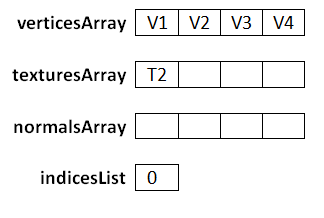
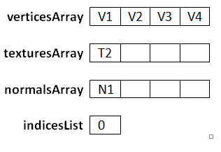
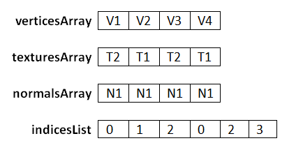
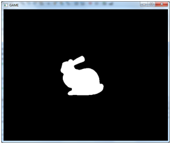

# 加载更复杂的模型（Loading more complex models）

本章中我们将学习加载在外部文件中定义的复杂模型。这些模型将使用3D建模工具(例如[Blender](https://www.blender.org/))创建。到目前为止，我们已经通过直接编码定义其几何图形的数组来创建模型。但在本章中，我们将学习如何加载以OBJ格式定义的模型。

OBJ（或.obj）是Wavefront Technologies开发的一种几何定义开放文件格式，现已被广泛采用。OBJ文件定义构成三维模型的顶点、纹理坐标和多边形。这是一种相对容易解析的格式，因为它基于文本，每一行定义一个元素（顶点、纹理坐标等）。

在.obj文件中，每行以一个标记元素类型的标识符开头：

* 以"\#"开始的行是注释。
* 以"v"开始的行用坐标(x, y, z, w)定义一个几何顶点。例如：`v 0.155 0.211 0.32 1.0`。
* 以"vn"开始的行是用坐标(x, y, z)定义顶点法线（Normals）。例如：`vn 0.71 0.21 0.82`。之后再讨论这个东西。
* 以"vt"开始的行定义纹理坐标。例如：`vt 0.500 1`。
* 以"f"开始的行定义了一个面。利用该行中的数据可以构造索引数组。我们只处理面导出为三角形的情况。它可以有几种定义方式：
    * 它可以定义顶点位置（`f v1 v2 v3`）。例如：`f 6 3 1`。在这种情况下，这个三角形是由位置为6、3和1的几何顶点定义的（顶点索引总是从1开始）。
    * 它可以定义顶点位置、纹理坐标和法线（`f v1/t1/n1 v2/t2/n2 v3/t3/n3`）。例如：`f 6/4/1 3/5/3 7/6/5`。第一部分是`v1/t1/n1`，其定义了坐标、纹理坐标和顶点法线。看到该部分可以说出：选择几何顶点6、纹理坐标4和顶点法线1。

OBJ格式有更多的元素类型（如一组多边形、定义材质等）。现在我们仅实现上述子集，我们的OBJ加载器将忽略其他元素类型。

但是什么是法线呢？让我们先定义它。一个平面的法线是一个垂直于该平面的长度为1的向量。


如上所见，一个平面可以有两条法线，我们应该用哪一个呢？三维图形中的法线是用于光照的，所以我们应该选择面向光源的法线。换言之，我们应该选择指向模型外的法线。

我们有一个由多边形和三角形组成的3D模型，每个三角形由三个顶点组成，三角形的法线向量是垂直于三角形表面的长度为1的向量。

顶点法线与特定顶点相关联，并且是周围三角形的法线的组合（当然它的长度等于1）。在这里你可以看到一个3D网格的顶点模型（取自[维基百科](https://en.wikipedia.org/wiki/Vertex_normal#/media/File:Vertex_normals.png)）


现在我们开始创建OBJ加载器。首先，我们将修改`Mesh`类，因为现在必须使用纹理。我们可能加载一些没有定义纹理坐标的OBJ文件，因此必须能够使用颜色而不是使用纹理渲染它们。在此情况下，面的定义格式为：`f v/n`。

`Mesh`类现在有一个名为`colour`的新属性。

```java
private Vector3f colour;
```

并且构造函数不再需要`Texture`。取而代之的是，我们将为纹理和颜色属性提供`get`和`set`方法。

```java
public Mesh(float[] positions, float[] textCoords, float[] normals, int[] indices) {
```

当然，在`render`和`clear`方法中，在使用纹理之前，必须检查纹理是否为`null`。正如你在构造函数中看到的，现在需要传递一个名为`normals`的新浮点数组。如何使用法线渲染？答案很简单，它只是VAO中的另一个VBO，所以我们需要添加如下代码：

```java
// 顶点法线VBO
vboId = glGenBuffers();
vboIdList.add(vboId);
vecNormalsBuffer = MemoryUtil.memAllocFloat(normals.length);
vecNormalsBuffer.put(normals).flip();
glBindBuffer(GL_ARRAY_BUFFER, vboId);
glBufferData(GL_ARRAY_BUFFER, vecNormalsBuffer, GL_STATIC_DRAW);
glEnableVertexAttribArray(2);
glVertexAttribPointer(2, 3, GL_FLOAT, false, 0, 0);
```

现在我们已经完成了对`Mesh`类的修改，可以修改代码来使用纹理坐标或固定的颜色。因此，我们需要像这样修改片元着色器：

```glsl
#version 330

in  vec2 outTexCoord;
out vec4 fragColor;

uniform sampler2D texture_sampler;
uniform vec3 colour;
uniform int useColour;

void main()
{
    if ( useColour == 1 )
    {
        fragColor = vec4(colour, 1);
    }
    else
    {
        fragColor = texture(texture_sampler, outTexCoord);
    }
}
```

如你所见，我们创建了两个新Uniform：

* `colour`: 将储存基本颜色。
* `useColour`: 这是个标志，当你不想使用纹理时，它将被设置为1。

在`Renderer`类中，我们需要创建这两个Uniform。

```java
// 为默认颜色与控制它的标志创建Uniform
shaderProgram.createUniform("colour");
shaderProgram.createUniform("useColour");
```

和其他Uniform一样，在`Renderer`类的`render`方法中，我们也需要为每个`GameItem`设置这些Uniform的值。

```java
for(GameItem gameItem : gameItems) {
    Mesh mesh = gameItem.getMesh();
    // 为该游戏项设置模型观察矩阵
    Matrix4f modelViewMatrix = transformation.getModelViewMatrix(gameItem, viewMatrix);
    shaderProgram.setUniform("modelViewMatrix", modelViewMatrix);
    // 为该游戏项渲染网格
    shaderProgram.setUniform("colour", mesh.getColour());
    shaderProgram.setUniform("useColour", mesh.isTextured() ? 0 : 1);
    mesh.render();
}
```

现在我们可以创建一个名为`OBJLoader`的新类，该类解析OBJ文件，并用其中包含的数据创建一个`Mesh`实例。你可能会在网上发现一些其他实现可能比这更有效，但我认为该方案更容易理解。这是一个工具类，它将有如下静态方法：

```java
public static Mesh loadMesh(String fileName) throws Exception {
```

参数`fileName`指定OBJ模型的文件名称，该文件必须包含在类路径中。

在该方法中我们首先要做的是读取文件内容并将所有行储存到一个数组中，然后创建几个列表来储存顶点、纹理坐标、法线和面。

```java
List<String> lines = Utils.readAllLines(fileName);

List<Vector3f> vertices = new ArrayList<>();
List<Vector2f> textures = new ArrayList<>();
List<Vector3f> normals = new ArrayList<>();
List<Face> faces = new ArrayList<>();
```

然后解析每一行，并根据开头标识符得到顶点位置、纹理坐标、顶点法线或面定义，最后重新排列这些数据。

```java
for (String line : lines) {
    String[] tokens = line.split("\\s+");
    switch (tokens[0]) {
        case "v":
            // 几何顶点
            Vector3f vec3f = new Vector3f(
                Float.parseFloat(tokens[1]),
                Float.parseFloat(tokens[2]),
                Float.parseFloat(tokens[3]));
            vertices.add(vec3f);
            break;
        case "vt":
            // 纹理坐标
            Vector2f vec2f = new Vector2f(
                Float.parseFloat(tokens[1]),
                Float.parseFloat(tokens[2]));
            textures.add(vec2f);
            break;
        case "vn":
            // 顶点法线
            Vector3f vec3fNorm = new Vector3f(
                Float.parseFloat(tokens[1]),
                Float.parseFloat(tokens[2]),
                Float.parseFloat(tokens[3]));
            normals.add(vec3fNorm);
            break;
        case "f":
            Face face = new Face(tokens[1], tokens[2], tokens[3]);
            faces.add(face);
            break;
        default:
            // 忽略其他行
            break;
    }
}
return reorderLists(vertices, textures, normals, faces);
```

在讲解重新排序之前，让我们看看如何解析面的定义。我们已创建了一个名为`Face`的类，它负责解析一个面的定义。一个`Face`是由一个索引组列表组成的，在本例中，由于我们处理的是三角形，所以我们将有三个索引组。


我们将创建另一个名为`IndexGroup`的内部类，它将储存索引组的数据。

```java
protected static class IdxGroup {

    public static final int NO_VALUE = -1;

    public int idxPos;

    public int idxTextCoord;

    public int idxVecNormal;

    public IdxGroup() {
        idxPos = NO_VALUE;
        idxTextCoord = NO_VALUE;
        idxVecNormal = NO_VALUE;
        }
}
```

`Face`类如下所示：

```java
protected static class Face {

    /**
     * 面三角形的索引组列表（每个面三个顶点）。
    */
    private IdxGroup[] idxGroups = new IdxGroup[3];

    public Face(String v1, String v2, String v3) {
        idxGroups = new IdxGroup[3];
        // 解析行
        idxGroups[0] = parseLine(v1);
        idxGroups[1] = parseLine(v2);
        idxGroups[2] = parseLine(v3);
    }

    private IdxGroup parseLine(String line) {
        IdxGroup idxGroup = new IdxGroup();

        String[] lineTokens = line.split("/");
        int length = lineTokens.length;
        idxGroup.idxPos = Integer.parseInt(lineTokens[0]) - 1;
        if (length > 1) {
            // 如果OBJ不定义纹理坐标，则可为null
            String textCoord = lineTokens[1];
            idxGroup.idxTextCoord = textCoord.length() > 0 ? Integer.parseInt(textCoord) - 1 : IdxGroup.NO_VALUE;
            if (length > 2) {
                idxGroup.idxVecNormal = Integer.parseInt(lineTokens[2]) - 1;
            }
        }

        return idxGroup;
    }

    public IdxGroup[] getFaceVertexIndices() {
        return idxGroups;
    }
}
```

当解析面时，我们可以看到没有纹理但带有矢量法线的对象。在此情况下，面定义可能像`f 11//1 17//1 13//1`这样，所以我们需要检查这些情况。

最后，我们需要重新排列这些数据。`Mesh`类需要四个数组，分别用于位置坐标、纹理坐标、法线矢量和索引。前三个数组应该具有相同数量的元素，因为索引数组是唯一的（注意，相同数量的元素并不意味着相同的长度。顶点坐标是三维的，由三个浮点数组成。纹理坐标是二维的，由两个浮点数组成）。OpenGL不允许我们对每个元素类型定义不同的索引数组（如果可以的话，我们就不需要在应用纹理时重复顶点）。

当你打开一个OBJ文件时，你首先可能会看到储存顶点坐标的列表，比储存纹理坐标和顶点数量的列表的元素数量更多。这是我们需要解决的问题。举一个简单的例子，定义一个具有像素高度的正方形（只是为了演示），其OBJ文件可能是这样的（不要太关注法线坐标，因为它只是为了演示）。

```java
v 0 0 0
v 1 0 0
v 1 1 0
v 0 1 0

vt 0 1
vt 1 1

vn 0 0 1

f 1/2/1 2/1/1 3/2/1
f 1/2/1 3/2/1 4/1/1
```

当完成对文件的解析时，我们得到如下所示列表（每个元素的数字是它在文件中的位置顺序，按出现顺序排列）：


现在我们将使用面定义来创建包含索引的最终数组。需要考虑的是，纹理坐标与法线向量的定义顺序与顶点的定义顺序不对应。如果列表的大小是相同的并有序的，那么面定义就只需要每个顶点一个索引。

因此，我们需要排列数据，并根据需要进行相应的设置。首先要做的是创建三个数组（用于顶点、纹理坐标和法线）和一个索引列表。如上所述，三个数组元素数量相同（等于顶点数），顶点数组将是顶点列表的副本。


现在我们开始处理这些面。第一个面的第一个索引组是1/2/1。我们使用索引组中的第一个索引（定义几何顶点的索引）来构造索引列表，称之为`posIndex`。

面指定我们应该把占据第一个位置的元素的索引添加到索引列表中。因此，我们将`posIndex`减去1后放到`indicesList`中（必须减1，因为数组的起始是0，而OBJ文件格式中起始是1）。


然后，我们使用索引组的其他索引来设置`texturesArray`和`normalsArray`。索引组中的第二个索引是2，所以我们必须将第二个纹理坐标放在与所占顶点指定的`posIndex`位置（V1）相同的位置上。



然后我们看到第三个索引，它为1，所以要做的是将第一个法线向量坐标放在与所占顶点指定的`posIndex`位置（V1）相同的位置上。



在处理了第一个面之后，数组和列表如下所示。


在处理了第二个面之后，数组和列表如下所示。



第二个面也定义了已经被赋值的顶点，但是它们有相同的值，所以处理这个问题上很简单。我觉得这个过程已经讲解得足够清晰了，不过在你明白之前可能会有些棘手。重新排列数据的方法如下所示。请记住，我们要的是浮点数组，所以必须把顶点、纹理和法线数组转换为浮点数组。因此，对于顶点和法线来说数组的长度是顶点列表的长度乘以3，而对于纹理坐标来说数组的长度是顶点列表的长度乘以2。

```java
private static Mesh reorderLists(List<Vector3f> posList, List<Vector2f> textCoordList,
    List<Vector3f> normList, List<Face> facesList) {

    List<Integer> indices = new ArrayList<>();
    // 按声明的顺序创建位置数组
    float[] posArr = new float[posList.size() * 3];
    int i = 0;
    for (Vector3f pos : posList) {
        posArr[i * 3] = pos.x;
        posArr[i * 3 + 1] = pos.y;
        posArr[i * 3 + 2] = pos.z;
        i++;
    }
    float[] textCoordArr = new float[posList.size() * 2];
    float[] normArr = new float[posList.size() * 3];

    for (Face face : facesList) {
        IdxGroup[] faceVertexIndices = face.getFaceVertexIndices();
        for (IdxGroup indValue : faceVertexIndices) {
            processFaceVertex(indValue, textCoordList, normList,
                indices, textCoordArr, normArr);
        }
    }
    int[] indicesArr = new int[indices.size()];
    indicesArr = indices.stream().mapToInt((Integer v) -> v).toArray();
    Mesh mesh = new Mesh(posArr, textCoordArr, normArr, indicesArr);
    return mesh;
}

private static void processFaceVertex(IdxGroup indices, List<Vector2f> textCoordList,
    List<Vector3f> normList, List<Integer> indicesList,
    float[] texCoordArr, float[] normArr) {

    // 设置顶点坐标的索引
    int posIndex = indices.idxPos;
    indicesList.add(posIndex);

    // 对纹理坐标重新排序
    if (indices.idxTextCoord >= 0) {
        Vector2f textCoord = textCoordList.get(indices.idxTextCoord);
        texCoordArr[posIndex * 2] = textCoord.x;
        texCoordArr[posIndex * 2 + 1] = 1 - textCoord.y;
    }
    if (indices.idxVecNormal >= 0) {
        // 对法线向量重新排序
        Vector3f vecNorm = normList.get(indices.idxVecNormal);
        normArr[posIndex * 3] = vecNorm.x;
        normArr[posIndex * 3 + 1] = vecNorm.y;
        normArr[posIndex * 3 + 2] = vecNorm.z;
    }
}
```

此外需要注意的是纹理坐标是UV格式，所以Y坐标为用一减去文件中取到的值。

现在，我们终于可以渲染OBJ模型。我准备了一个OBJ文件，其中是此前章节中使用过的具有纹理的立方体。为了在`DummyGame`类的`init`方法中使用它，我们需要创建一个`GameItem`实例。

```java
Texture texture = new Texture("/textures/grassblock.png");
mesh.setTexture(texture);
GameItem gameItem = new GameItem(mesh);
gameItem.setScale(0.5f);
gameItem.setPosition(0, 0, -2);
gameItems = new GameItem[]{gameItem};
```

然后将会得到一个熟悉的有纹理的立方体。


我们可以尝试渲染其他模型，例如可以使用著名的Stanford Bunny模型（它可以免费下载），它放在resources文件夹中。这个模型没有纹理，所以我们可以这样做：

```java
Mesh mesh = OBJLoader.loadMesh("/models/bunny.obj");
GameItem gameItem = new GameItem(mesh);
gameItem.setScale(1.5f);
gameItem.setPosition(0, 0, -2);
gameItems = new GameItem[]{gameItem};
```



这个模型看起来有点奇怪，因为没有纹理也没有光，所以我们不能看到它的体积，但是你可以检查模型是否正确地加载。在`Window`类中，设置OpenGL参数时，添加这一行代码。

```java
glPolygonMode( GL_FRONT_AND_BACK, GL_LINE );
```

当你放大的时候，你会看到如下所示的东西。


现在你可以看到构成模型的所有三角形。

有了这个OBJ载入类，你现在可以使用Blender创建模型。Blender是一个强大的工具，但刚开始使用它有点困难，它有很多选项，很多关节组合，在首次使用它时你需要花时间做很多最基本的事情。当使用Blender导出模型时，请确保包含法线并将面导出为三角形。


导出时请记得分割边，因为我们不能将多个纹理坐标指定给同一个顶点。此外，我们需要为每个三角形定义法线，而不是指定给顶点。如果你在某些模型中遇到了光照问题（在下一章中），你应该验证一下法线。你可以在Blender中看到法线。


