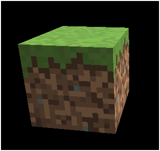
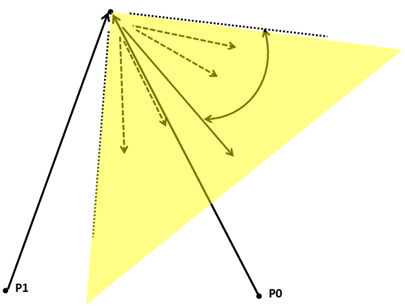
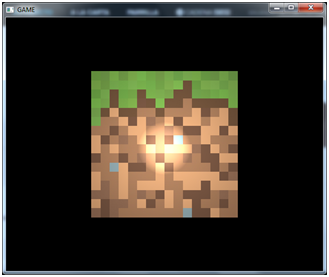
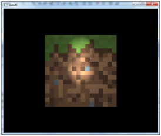

# 要有更多的光（Let there be even more light）

在本章中，我们将实现在此前章节中介绍的其他类型的光。我们先从平行光开始。

## 平行光

如果你回想一下，平行光从同一方向照射到所有物体上。它用来模拟遥远但光强很高的光源，比如太阳。


平行光的另一个特点是它不受衰减的影响，联想太阳光，所有被阳光照射的物体都以相同的光强被照射，因为离太阳的距离太大，以至于它们之间的相对位置都是无关紧要的。事实上，平行光被模拟为位于无穷远处的光源，如果它受到衰减的影响，那么它将对任何物体都没有影响（它对物体颜色的影响将等于0）。

此外，平行光也由漫反射和镜面反射分量组成，与点光源的区别在于它没有位置，但有方向，并且它不受衰减的影响。回到平行光的属性，想象我们正在模拟太阳在三维世界中运动，下图展示了黎明、正午和黄昏时的光线方向。


上图中的光线的方向为：

* 黎明: \(-1, 0, 0\)
* 正午: \(0, 1, 0\)
* 黄昏: \(1, 0, 0\)

注意：你可能认为上述坐标是位置坐标，但它们只是一个矢量，一个方向，而不是一个位置。以数学的角度来看，矢量和位置是不可分辨的，但它们有着完全不同的含义。

但是，我们如何模拟这个光位于无穷远处呢？答案是使用$w$分量，即使用齐次坐标并将$w$分量设置为$0$。

* 黎明: \(-1, 0, 0, 0\)
* 正午: \(0, 1, 0, 0\)
* 黄昏: \(1, 0, 0, 0\)

这就如同我们在传递法线。对于法线，我们将其$w$分量设置为$0$，表示我们对其位移不感兴趣，只对方向感兴趣。此外，当我们处理平行光时，也需要这样做，摄像机的位移不应影响平行光的方向。

让我们开始编码实现和模拟平行光，首先要做的是创建一个类来储存它的属性。它只是另一个普通的Java对象，其具有复制构造函数，并储存光的方向、颜色和强度。

```java
package org.lwjglb.engine.graph;

import org.joml.Vector3f;

public class DirectionalLight {

    private Vector3f color;

    private Vector3f direction;

    private float intensity;

    public DirectionalLight(Vector3f color, Vector3f direction, float intensity) {
        this.color = color;
        this.direction = direction;
        this.intensity = intensity;
    }

    public DirectionalLight(DirectionalLight light) {
        this(new Vector3f(light.getColor()), new Vector3f(light.getDirection()), light.getIntensity());
    }

    // 接下来是Getter和Setter...
```

如你所见，我们用`Vector3f`来储存方向。保持冷静，当将平行光传递到着色器时，我们将处理$w$分量。顺便一提，接下来要做的就是更新`ShaderProgram`来创建和更新储存平行光的Uniform。

在片元着色器中，我们将定义一个结构体来模拟平行光。

```glsl
struct DirectionalLight
{
    vec3 colour;
    vec3 direction;
    float intensity;
};
```

有了上述定义，`ShaderProgram`类中的新方法就很简单了。

```java
// ...
public void createDirectionalLightUniform(String uniformName) throws Exception {
    createUniform(uniformName + ".colour");
    createUniform(uniformName + ".direction");
    createUniform(uniformName + ".intensity");
}
// ...
public void setUniform(String uniformName, DirectionalLight dirLight) {
    setUniform(uniformName + ".colour", dirLight.getColor() );
    setUniform(uniformName + ".direction", dirLight.getDirection());
    setUniform(uniformName + ".intensity", dirLight.getIntensity());
}
```

我们现在需要使用Uniform，通过`DummyGame`类控制太阳的角度来模拟它是如何在天上移动的。


我们需要更新光的方向，所以太阳在黎明时（$-90°$），光线在$(-1, 0, 0)$方向上，其$x$分量从$-1$逐渐增加到$0$，$y$分量逐渐从$0$增加到$1$。接下来，$x$分量增加到$1$，$y$分量减少到$0$。这可以通过将$x$分量设置为角的正弦和将$y$分量设置为角的余弦来实现。


我们也会调节光强，当它远离黎明时强度将增强，当它临近黄昏时强度将减弱。我们通过将强度设置为$0$来模拟夜晚。此外，我们还将调节颜色，使光在黎明和黄昏时变得更红。这将在`DummyGame`类的`update`方法中实现。

```java
// 更新平行光的方向，强度和颜色
lightAngle += 1.1f;
if (lightAngle > 90) {
    directionalLight.setIntensity(0);
    if (lightAngle >= 360) {
        lightAngle = -90;
    }
} else if (lightAngle <= -80 || lightAngle >= 80) {
    float factor = 1 - (float)(Math.abs(lightAngle) - 80)/ 10.0f;
    directionalLight.setIntensity(factor);
    directionalLight.getColor().y = Math.max(factor, 0.9f);
    directionalLight.getColor().z = Math.max(factor, 0.5f);
} else {
    directionalLight.setIntensity(1);
    directionalLight.getColor().x = 1;
    directionalLight.getColor().y = 1;
    directionalLight.getColor().z = 1;
}
double angRad = Math.toRadians(lightAngle);
directionalLight.getDirection().x = (float) Math.sin(angRad);
directionalLight.getDirection().y = (float) Math.cos(angRad);
```

然后，我们需要在`Renderer`类中的`render`方法中将平行光传给着色器。

```java
// 获取平行光对象的副本并将其坐标变换到观察坐标系
DirectionalLight currDirLight = new DirectionalLight(directionalLight);
Vector4f dir = new Vector4f(currDirLight.getDirection(), 0);
dir.mul(viewMatrix);
currDirLight.setDirection(new Vector3f(dir.x, dir.y, dir.z));
shaderProgram.setUniform("directionalLight", currDirLight);
```

如你所见，我们需要变换光的方向到观察空间，但我们不想应用位移，所以将$w$分量设置为$0$。

现在，我们已经准备好在片元着色器上完成剩下的工作了，因为顶点着色器不需要修改。此前已经说过，我们需要定义一个名为`DirectionalLight`的新结构体来模拟平行光，所以需要一个新的Uniform。

```glsl
uniform DirectionalLight directionalLight;
```

我们需要重构一下代码，在上一章中，我们有一个名为`calcPointLight`的函数，它计算漫反射和镜面反射分量，并应用衰减。但如上所述，平行光使用漫反射和镜面反射分量，但不受衰减影响，所以我们将创建一个名为`calcLightColour`的新函数来计算那些分量。

```glsl
vec4 calcLightColour(vec3 light_colour, float light_intensity, vec3 position, vec3 to_light_dir, vec3 normal)
{
    vec4 diffuseColour = vec4(0, 0, 0, 0);
    vec4 specColour = vec4(0, 0, 0, 0);

    // 漫反射光
    float diffuseFactor = max(dot(normal, to_light_dir), 0.0);
    diffuseColour = diffuseC * vec4(light_colour, 1.0) * light_intensity * diffuseFactor;

    // 镜面反射光
    vec3 camera_direction = normalize(camera_pos - position);
    vec3 from_light_dir = -to_light_dir;
    vec3 reflected_light = normalize(reflect(from_light_dir , normal));
    float specularFactor = max( dot(camera_direction, reflected_light), 0.0);
    specularFactor = pow(specularFactor, specularPower);
    specColour = speculrC * light_intensity  * specularFactor * material.reflectance * vec4(light_colour, 1.0);

    return (diffuseColour + specColour);
}
```

然后，`calcPointLight`方法将衰减因数应用到上述函数计算的结果上。

```glsl
vec4 calcPointLight(PointLight light, vec3 position, vec3 normal)
{
    vec3 light_direction = light.position - position;
    vec3 to_light_dir  = normalize(light_direction);
    vec4 light_colour = calcLightColour(light.colour, light.intensity, position, to_light_dir, normal);

    // 应用衰减
    float distance = length(light_direction);
    float attenuationInv = light.att.constant + light.att.linear * distance +
        light.att.exponent * distance * distance;
    return light_colour / attenuationInv;
}
```

我们还将创建一个新的函数来计算平行光的效果，它只调用仅需光照方向的`calcLightColour`方法。

```glsl
vec4 calcDirectionalLight(DirectionalLight light, vec3 position, vec3 normal)
{
    return calcLightColour(light.colour, light.intensity, position, normalize(light.direction), normal);
}
```

最后，`main`方法通过环境光和平行光的颜色分量综合起来计算片元颜色。

```glsl
void main()
{
    setupColours(material, outTexCoord);

    vec4 diffuseSpecularComp = calcDirectionalLight(directionalLight, mvVertexPos, mvVertexNormal);
    diffuseSpecularComp += calcPointLight(pointLight, mvVertexPos, mvVertexNormal); 

    fragColor = ambientC * vec4(ambientLight, 1) + diffuseSpecularComp;
}
```

就这样，现在我们可以模拟太阳在天空中的运动，如下所示（在示例代码中运动速度加快，不用等待太久就可以看到）。



## 聚光源

现在我们将实现与点光源非常相似的聚光源，但是它发射的光仅限于三维圆锥体中。它模拟从焦点或任何其他不向所有方向发射光的光源。聚光源有着和点光源一样的属性，但它添加了两个新的参数，圆锥角和圆锥方向。


聚光源与点光源的计算方法相同，但有一些不同。从顶点位置到光源的矢量不在光锥内的点不受光照的影响。



该如何计算它是否在光锥内呢？我们需要在光源和圆锥方向矢量（两者都归一化了）之间再做次数量积。


$L$和$C$向量之间的数量积等于：$\vec{L}\cdot\vec{C}=|\vec{L}|\cdot|\vec{C}|\cdot Cos(\alpha)$。在聚光源的定义中，我们储存锥角的余弦值，如果数量积高于该值，我们就知道它位于光锥内部（想想余弦图，当$α$角为$0$时，其余弦值为$1$。在0°~180°时，角度越小余弦值越大）。

第二个不同之处是远离光锥方向的点将受到更少的光照，换句话说，衰减影响将更强。有几种计算方法，我们将选择一种简单的方法，通过将衰减与下述公式相乘：

$$1 - (1-Cos(\alpha))/(1-Cos(cutOffAngle)$$

(在片元着色器中，我们没有传递角度，而是传递角度的余弦值。你可以检查上面的公式的结果是否位于0到1之间，当角度为0时，余弦值为1。)

实现非常类似于其他的光源，我们需要创建一个名为`SpotLight`的类，设置适当的Uniform，将其传递给着色器并修改片元着色器以获取它。你可以查看本章的源代码。

当传递Uniform时，另一件重要的事是位移不应该应用到光锥方向上，因为我们只对方向感兴趣。因此，和平行光的情况一样，当变换到观察空间坐标系时，必须将$w$分量设置为$0$。



## 多光源

我们终于实现了四种类型的光源，但是目前每种类型的光源只能使用一个实例。这对于环境光和平行光来说没问题，但是我们确实希望使用多个点光源和聚光源。我们需要修改片元着色器来接收光源列表，所以使用数组来储存这些数据。来看看怎么实现吧。

在开始之前要注意的是，在GLSL中，数组的长度必须在编译时设置，因此它必须足够大，以便在运行时能够储存所需的所有对象。首先是定义一些常量来设置要使用的最大点光源数和聚光源数。

```glsl
const int MAX_POINT_LIGHTS = 5;
const int MAX_SPOT_LIGHTS = 5;
```

然后我们需要修改此前只储存一个点光源和一个聚光源的Uniform，以便使用数组。

```glsl
uniform PointLight pointLights[MAX_POINT_LIGHTS];
uniform SpotLight spotLights[MAX_SPOT_LIGHTS];
```

在main函数中，我们只需要对这些数组进行迭代，以使用现有函数计算每个对象对颜色的影响。我们可能不会像Uniform数组长度那样传递很多光源，所以需要控制它。有很多可行的方法，但这可能不适用于旧的显卡。最终我们选择检查光强（在数组中的空位，光强为0）。

```glsl
for (int i=0; i<MAX_POINT_LIGHTS; i++)
{
    if ( pointLights[i].intensity > 0 )
    {
        diffuseSpecularComp += calcPointLight(pointLights[i], mvVertexPos, mvVertexNormal); 
    }
}

for (int i=0; i<MAX_SPOT_LIGHTS; i++)
{
    if ( spotLights[i].pl.intensity > 0 )
    {
        diffuseSpecularComp += calcSpotLight(spotLights[i], mvVertexPos, mvVertexNormal);
    }
}
```

现在我们需要在`Render`类中创建这些Uniform。当使用数组时，我们需要为列表中的每个元素创建一个Uniform。例如，对于`pointLights`数组，我们需要创建名为`pointLights[0]`、`pointLights[1]`之类的Uniform。当然，这也适用于结构体属性，所以我们将创建`pointLights[0].colour`、`pointLights[1].colour`等等。创建这些Uniform的方法如下所示：

```java
public void createPointLightListUniform(String uniformName, int size) throws Exception {
    for (int i = 0; i < size; i++) {
        createPointLightUniform(uniformName + "[" + i + "]");
    }
}

public void createSpotLightListUniform(String uniformName, int size) throws Exception {
    for (int i = 0; i < size; i++) {
        createSpotLightUniform(uniformName + "[" + i + "]");
    }
}
```

我们也需要方法来设置这些Uniform的值：

```java
public void setUniform(String uniformName, PointLight[] pointLights) {
    int numLights = pointLights != null ? pointLights.length : 0;
    for (int i = 0; i < numLights; i++) {
        setUniform(uniformName, pointLights[i], i);
    }
}

public void setUniform(String uniformName, PointLight pointLight, int pos) {
    setUniform(uniformName + "[" + pos + "]", pointLight);
}

public void setUniform(String uniformName, SpotLight[] spotLights) {
    int numLights = spotLights != null ? spotLights.length : 0;
    for (int i = 0; i < numLights; i++) {
        setUniform(uniformName, spotLights[i], i);
    }
}

public void setUniform(String uniformName, SpotLight spotLight, int pos) {
    setUniform(uniformName + "[" + pos + "]", spotLight);
}
```

最后，我们只需要更新`Render`类来接收点光源和聚光源列表，并相应地修改`DummyGame`类以创建这些列表，最终效果如下所示。



