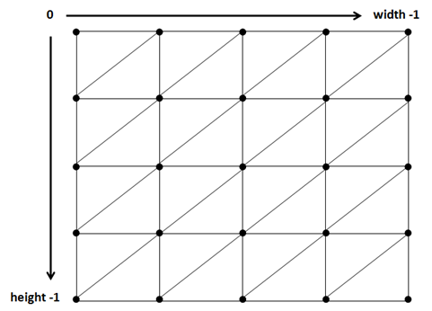
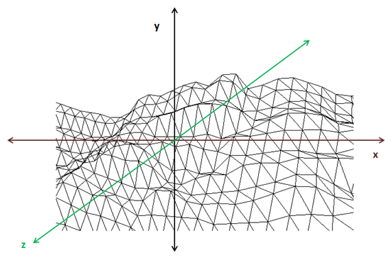
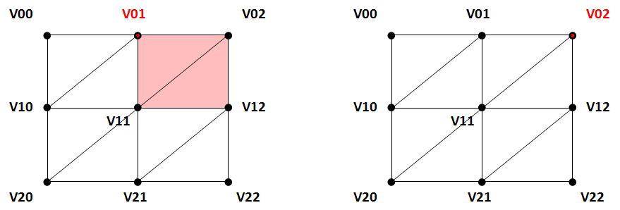
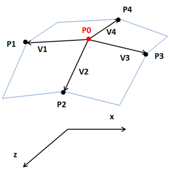
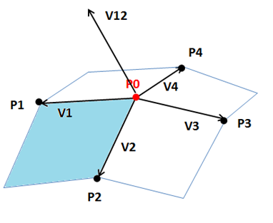
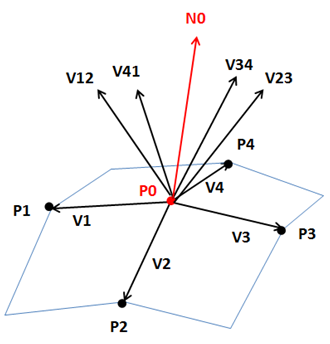
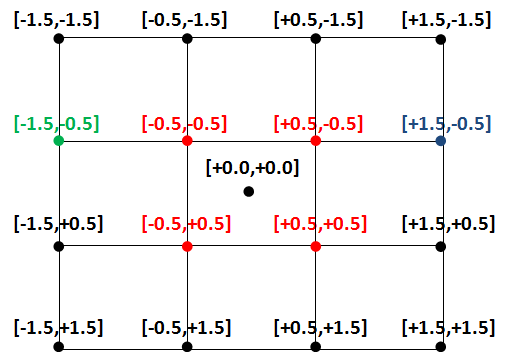

# 高度图（Height Maps）

本章中我们将学习如何使用高度图创建复杂的地形。在开始前，你会注意到我们做了一些重构。我们创建了一些新的包和移动了一些类以更好地组织它们。你可以在源代码中了解这些改变。

所以什么是高度图？高度图是用于生成三维地形的图像，它使用像素颜色来获取表面高度。高度图图像通常是灰度图，它可以由[Terragen](http://planetside.co.uk/)等软件生成。一张高度图图像看起来就像这样。

 

上图就像你俯视一片陆地一样。利用上图，我们将构建由顶点组成的三角形所组成的网格。每个顶点的高度将根据图像的每个像素的颜色来计算。黑色是最低，白色是最高。

我们将为图像的每个像素创建一组顶点，这些顶点将组成三角形，这些三角形将组成下图所示的网格。

 

网格将组成一个巨大的四边形，它将会在X和Z轴上渲染，并根据像素颜色来改变它的Y轴高度。

 

由高度图创建三维地形的过程可概括为以下步骤：
* 加载储存高度图的图像(我们将使用一个`BufferedImage`实例以获取每个像素)。
* 为每个图像像素创建一个顶点，其高度基于像素颜色。
* 将正确的纹理坐标分配给顶点。
* 设置索引以绘制与顶点相关的三角形。

我们将创建一个名为`HeightMapMesh`的类，该类将基于高度图按以上步骤创建一个`Mesh`。让我们先看看该类定义的常量：

```java
private static final int MAX_COLOUR = 255 * 255 * 255;
```

如上所述，我们将基于高度图图像的每个像素的颜色来计算每个顶点的高度。图像通常是灰度图，对于PNG图像来说，这意味着每个像素的每个RGB值可以在0到255之间变化，因此我们有256个值来表示不同的高度。这可能足够了，但如果精度不够，我们可以使用三个RGB值以有更多的值，在此情况下，高度计算范围为0到255^3。我们将使用第二种方法，因此我们不局限于灰度图。

接下来的常量是：

```java
private static final float STARTX = -0.5f;

private static final float STARTZ = -0.5f;
```

网格将由一组顶点（一个顶点对应一个像素）构成，其X和Z坐标的范围如下
* X轴的范围为[-0.5, 0.5]，即[`STARTX`, `-STARTX`]。
* Z轴的范围为[-0.5, 0.5]，即[`STARTZ`, `-STARTZ`]。
 
不用太过担心这些值，稍后得到的网格可以被缩放以适应世界的大小。关于Y轴，我们将设置`minY`和`maxY`两个参数，用于设置Y坐标的最低和最高值。这些参数并不是常数，因为我们可能希望在运行时更改它们，而不使用缩放。最后，地形将包含在范围为`[STARTX, -STARTX]`，`[minY, maxY]`，`[STARTZ, -STARTZ]`的立方体内。

网格将会在`HeightMapMesh`类的构造函数中创建，该类的定义如下。

```java
public HeightMapMesh(float minY, float maxY, String heightMapFile, String textureFile, int textInc) throws Exception {
```

它接收Y轴的最小值和最大值，被用作高度图的图像文件名和要使用的纹理文件名。它还接受一个名为`textInc`的整数，这稍后再说明。

我们在构造函数中做的第一件事就是将高度图图像加载到`BufferedImage`实例中。

```java
this.minY = minY;
this.maxY = maxY;

PNGDecoder decoder = new PNGDecoder(getClass().getResourceAsStream(heightMapFile));
int height = decoder.getHeight();
int width = decoder.getWidth();
ByteBuffer buf = ByteBuffer.allocateDirect(
        4 * decoder.getWidth() * decoder.getHeight());
decoder.decode(buf, decoder.getWidth() * 4, PNGDecoder.Format.RGBA);
buf.flip();
```

然后，我们将纹理文件载入到一个`ByteBuffer`中，并设置构造`Mesh`所需的变量。`incx`和`incz`变量将储存每个顶点的X或Z坐标之间的最小间隔，因此`Mesh`包含在上述区域中。

```java
Texture texture = new Texture(textureFile);

float incx = getWidth() / (width - 1);
float incz = Math.abs(STARTZ * 2) / (height - 1);

List<Float> positions = new ArrayList();
List<Float> textCoords = new ArrayList();
List<Integer> indices = new ArrayList();
```

之后，我们将遍历图像，为每个像素创建一个顶点，设置其纹理坐标与索引，以正确地定义组成`Mesh`的三角形。

```java
for (int row = 0; row < height; row++) {
    for (int col = 0; col < width; col++) {
        // 为当前位置创建顶点
        positions.add(STARTX + col * incx); // x
        positions.add(getHeight(col, row, width, buf)); // y
        positions.add(STARTZ + row * incz); // z

        // 设置纹理坐标
        textCoords.add((float) textInc * (float) col / (float) width);
        textCoords.add((float) textInc * (float) row / (float) height);

        // 创建索引
        if (col < width - 1 && row < height - 1) {
            int leftTop = row * width + col;
            int leftBottom = (row + 1) * width + col;
            int rightBottom = (row + 1) * width + col + 1;
            int rightTop = row * width + col + 1;

            indices.add(rightTop);
            indices.add(leftBottom);
            indices.add(leftTop);

            indices.add(rightBottom);
            indices.add(leftBottom);
            indices.add(rightTop);
        }
    }
}
```

创建顶点坐标的过程是不需要解释的。现在先别管为什么我们用一个数字乘以纹理坐标以及如何计算高度。你可以看到，对于每个顶点，我们定义两个三角形的索引(除非现在是最后一行或最后一列)。让我们用一个**3×3**的图像来想象它们是如何构造的。一个**3×3**的图像包含9个顶点，每因此有**2×4**个三角形组成4个正方形。下图展示了网格，每个顶点被命名为`Vrc`(r：行，c：列)。


当处理第一个顶点(V00)时，我们在红色阴影处定义了两个三角形的索引。

 

当处理第二个顶点(V01)时，我们在红色阴影处又定义了两个三角形的索引。但当处理第三个顶点(V02)时，我们不需要定义更多的索引，该行的所有三角形都已被定义。

 

你可以很容易地想到其他顶点的处理过程是如何进行的。现在，一旦创建了所有的顶点位置、纹理坐标和索引，我们就只需要用所有这些数据创建`Mesh`和相关的`Material`。

```java
float[] posArr = Utils.listToArray(positions);
int[] indicesArr = indices.stream().mapToInt(i -> i).toArray();
float[] textCoordsArr = Utils.listToArray(textCoords);
float[] normalsArr = calcNormals(posArr, width, height);
this.mesh = new Mesh(posArr, textCoordsArr, normalsArr, indicesArr);
Material material = new Material(texture, 0.0f);
mesh.setMaterial(material);
```

你可以看到，我们根据顶点位置计算法线。在看如何计算法线之前，来看看如何获取高度吧。我们已经创建了一个名为`getHeight`的方法，它负责计算顶点的高度。

```java
private float getHeight(int x, int z, int width, ByteBuffer buffer) {
    byte r = buffer.get(x * 4 + 0 + z * 4 * width);
    byte g = buffer.get(x * 4 + 1 + z * 4 * width);
    byte b = buffer.get(x * 4 + 2 + z * 4 * width);
    byte a = buffer.get(x * 4 + 3 + z * 4 * width);
    int argb = ((0xFF & a) << 24) | ((0xFF & r) << 16)
            | ((0xFF & g) << 8) | (0xFF & b);
    return this.minY + Math.abs(this.maxY - this.minY) * ((float) argb / (float) MAX_COLOUR);
    }
```

该方法接受像素的X和Y坐标，图像的宽度以及与之相关的`ByteBuffer`，返回RGB颜色(R、G、B分量之和)并计算包含在`minY`和`maxY`之间的值(`minY`为黑色，`maxY`为白色)。

你可以使用`BufferedImage`来编写一个更简单的方法，它有更方便的方法来获得RGB值，但这将使用AWT。记住AWT不能很好的兼容OSX，所以尽量避免使用它的类。

现在来看看如何计算纹理坐标。第一个方法是将纹理覆盖整个网格，左上角的顶点纹理坐标为(0, 0)，右下角的顶点纹理坐标为(1, 1)。这种方法的问题是，纹理必须是巨大的，以便获得良好的渲染效果，否则纹理将会被过度拉伸。

但我们仍然可以使用非常小的纹理，通过使用高效的技术来获得很好的效果。如果我们设置超出[1, 1]范围的纹理坐标，我们将回到原点并重新开始计算。下图表示在几个正方形中平铺相同的纹理，并超出了[1, 1]范围。

 

这是我们在设置纹理坐标时所要做的。我们将一个参数乘以纹理坐标(计算好像整个网格被纹理包裹的情况)，即`textInc`参数，以增加在相邻顶点之间使用的纹理像素数。

 

目前唯一没有解决的是法线计算。记住我们需要法线，光照才能正确地应用于地形。没有法线，无论光照如何，地形将以相同的颜色渲染。我们在这里使用的方法不一定是最高效的，但它将帮助你理解如何自动计算法线。如果你搜索其他解决方案，可能会发现更有效的方法，只使用相邻点的高度而不需要做交叉相乘操作。尽管如此，这仅需要在启动时完成，这里的方法不会对性能造成太大的损害。

让我们用图解的方式解释如何计算一个法线值。假设我们有一个名为**P0**的顶点。我们首先计算其周围每个顶点(**P1**, **P2**, **P3**, **P4**)和与连接这些点的面相切的向量。这些向量(**V1**, **V2**, **V3**, **V4**)是通过将每个相邻点与**P0**相减(例如**V1 = P1 - P0**)得到的。

 

然后，我们计算连接每一个相邻点的平面的法线。这是与之前计算得到的向量交叉相乘计算的。例如，向量**V1**与**V2**所在的平面(蓝色阴影部分)的法线是由**V1**和**V2**交叉相乘得到的，即**V12 = V1 × V2**。

 

如果我们计算完毕其他平面的法线(**V23 = V2 × V3**，**V34 = V3 × V4**，**V41 = V4 × V1**)，则法线**P0**就是周围所有平面法线(归一化后)之和：**N0 = V12 + V23 + V34 + V41**。



法线计算的方法实现如下所示。

```java
private float[] calcNormals(float[] posArr, int width, int height) {
    Vector3f v0 = new Vector3f();
    Vector3f v1 = new Vector3f();
    Vector3f v2 = new Vector3f();
    Vector3f v3 = new Vector3f();
    Vector3f v4 = new Vector3f();
    Vector3f v12 = new Vector3f();
    Vector3f v23 = new Vector3f();
    Vector3f v34 = new Vector3f();
    Vector3f v41 = new Vector3f();
    List<Float> normals = new ArrayList<>();
    Vector3f normal = new Vector3f();
    for (int row = 0; row < height; row++) {
        for (int col = 0; col < width; col++) {
            if (row > 0 && row < height -1 && col > 0 && col < width -1) {
                int i0 = row*width*3 + col*3;
                v0.x = posArr[i0];
                v0.y = posArr[i0 + 1];
                v0.z = posArr[i0 + 2];

                int i1 = row*width*3 + (col-1)*3;
                v1.x = posArr[i1];
                v1.y = posArr[i1 + 1];
                v1.z = posArr[i1 + 2];                    
                v1 = v1.sub(v0);

                int i2 = (row+1)*width*3 + col*3;
                v2.x = posArr[i2];
                v2.y = posArr[i2 + 1];
                v2.z = posArr[i2 + 2];
                v2 = v2.sub(v0);

                int i3 = (row)*width*3 + (col+1)*3;
                v3.x = posArr[i3];
                v3.y = posArr[i3 + 1];
                v3.z = posArr[i3 + 2];
                v3 = v3.sub(v0);

                int i4 = (row-1)*width*3 + col*3;
                v4.x = posArr[i4];
                v4.y = posArr[i4 + 1];
                v4.z = posArr[i4 + 2];
                v4 = v4.sub(v0);
                    
                v1.cross(v2, v12);
                v12.normalize();

                v2.cross(v3, v23);
                v23.normalize();
                    
                v3.cross(v4, v34);
                v34.normalize();
                    
                v4.cross(v1, v41);
                v41.normalize();
                    
                normal = v12.add(v23).add(v34).add(v41);
                normal.normalize();
            } else {
                normal.x = 0;
                normal.y = 1;
                normal.z = 0;
            }
            normal.normalize();
            normals.add(normal.x);
            normals.add(normal.y);
            normals.add(normal.z);
        }
    }
    return Utils.listToArray(normals);
}
```
最后，为了创建更大的地形，我们有两个选择：
* 创建更大的高度图
* 重用高度图并将其平铺在三维空间中。高度图将像一个地形块，在世界上像瓷砖一样平移。为了做到这一点，高度图边缘的像素必须是相同的(左侧边缘必须与右侧相同，上侧边缘必须与下侧相同)，以避免块之间的间隙。

我们将使用第二种方法(并选择适当的高度图)。为了做到它，我们将创建一个名为`Terrain`的类，该类将创建一个正方形的高度图块，定义如下。

```java
package org.lwjglb.engine.items;

import org.lwjglb.engine.graph.HeightMapMesh;

public class Terrain {

    private final GameItem[] gameItems;

    public Terrain(int blocksPerRow, float scale, float minY, float maxY, String heightMap, String textureFile, int textInc) throws Exception {
        gameItems = new GameItem[blocksPerRow * blocksPerRow];
        HeightMapMesh heightMapMesh = new HeightMapMesh(minY, maxY, heightMap, textureFile, textInc);
        for (int row = 0; row < blocksPerRow; row++) {
            for (int col = 0; col < blocksPerRow; col++) {
                float xDisplacement = (col - ((float) blocksPerRow - 1) / (float) 2) * scale * HeightMapMesh.getXLength();
                float zDisplacement = (row - ((float) blocksPerRow - 1) / (float) 2) * scale * HeightMapMesh.getZLength();

                GameItem terrainBlock = new GameItem(heightMapMesh.getMesh());
                terrainBlock.setScale(scale);
                terrainBlock.setPosition(xDisplacement, 0, zDisplacement);
                gameItems[row * blocksPerRow + col] = terrainBlock;
            }
        }
    }

    public GameItem[] getGameItems() {
        return gameItems;
    }
}
```
让我们详解整个过程，我们拥有由以下坐标定义的块(X和Z使用之前定义的常量)。


假设我们创建了一个由3×3块网格构成的地形。我们假设我们不会缩放地形块(也就是说，变量`blocksPerRow`是**3**而变量`scale`将会是**1**)。我们希望网格的中央在坐标系的(0, 0)。

我们需要移动块，这样顶点就变成如下坐标。



移动是通过调用`setPosition`方法实现的，但记住，我们所设置的是一个位移而不是一个位置。如果你看到上图，你会发现中央块不需要任何移动，它已经定位在适当的坐标上。绘制绿色顶点需要在X轴上位移**-1**，而绘制蓝色顶点需要在X轴上位移**+1**。计算X位移的公式，要考虑到缩放和块的宽度，公式如下：

$$xDisplacement=(col - (blocksPerRow -1 ) / 2) \times scale \times width$$

Z位移的公式为：

$$zDisplacement=(row - (blocksPerRow -1 ) / 2) \times scale \times height$$

如果在`DummyGame`类中创建一个`Terrain`实例，我们可以得到如图所示的效果。

 

你可以在地形周围移动相机，看看它是如何渲染的。由于还没有实现碰撞检测，你可以穿过它并从上面看它。由于我们已经启用了面剔除，当从下面观察时，地形的某些部分不会渲染。