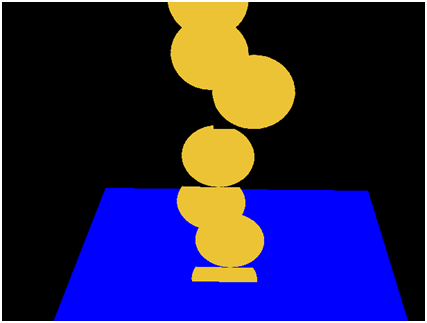
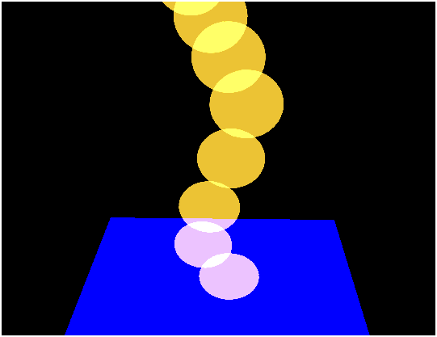
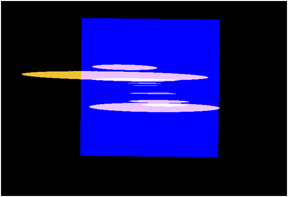
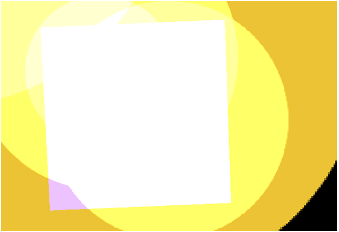
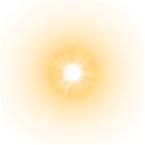
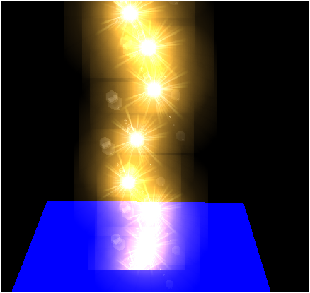
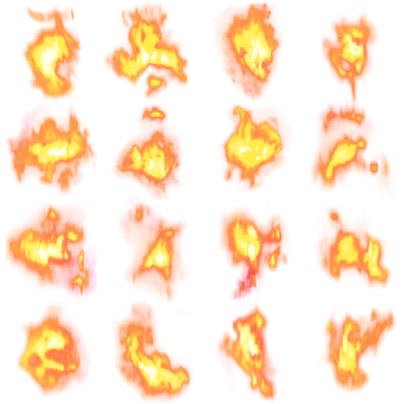
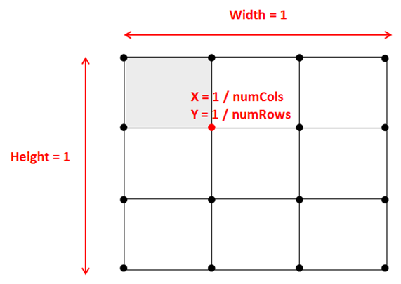
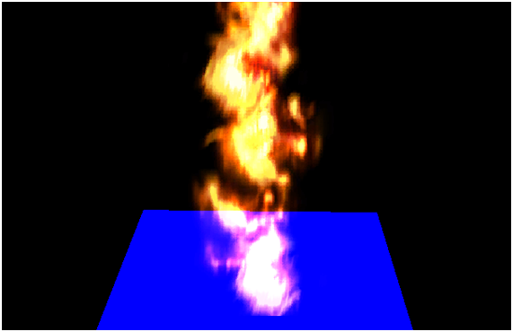

# 粒子（Particles）

## 基础

在本章中，我们将添加粒子效果到游戏引擎中。有了这种效果，我们就能模拟关系、火、灰尘和云。这是一种简单的效果，将改善对任何游戏的图形方面。

在此之前值得一提的是，有很多方法可以实现不同效果的粒子效果。当前情况下，我们将使用面板粒子（Billboard Particle）。该技术使用移动的纹理四边形来表示一个粒子，它们总是面向观察者，在本例中，就是摄像机。你还可以使用面板技术在游戏项上显示信息面板，比如迷你HUD。

让我们开始定义粒子，粒子可以通过以下属性定义：

1. 一个用于表示四边形顶点的网格。
2. 一张纹理。
3. 某一时刻的坐标。
4. 缩放系数。
5. 速度。
6. 移动方向。
7. 生存时间或存活时间。一旦该时间过去，粒子就不再存在。

前四项是`GameItem`类的一部分，但后三项不是。因此，我们要创建一个名为`Particle`的新类，它继承了`GameItem`类，其定义如下：

```java
package org.lwjglb.engine.graph.particles;

import org.joml.Vector3f;
import org.lwjglb.engine.graph.Mesh;
import org.lwjglb.engine.items.GameItem;

public class Particle extends GameItem {

    private Vector3f speed;

    /**
     * 粒子存活的时间，以毫秒为单位
     */
    private long ttl;

    public Particle(Mesh mesh, Vector3f speed, long ttl) {
        super(mesh);
        this.speed = new Vector3f(speed);
        this.ttl = ttl;
    }

    public Particle(Particle baseParticle) {
        super(baseParticle.getMesh());
        Vector3f aux = baseParticle.getPosition();
        setPosition(aux.x, aux.y, aux.z);
        aux = baseParticle.getRotation();
        setRotation(aux.x, aux.y, aux.z);
        setScale(baseParticle.getScale());
        this.speed = new Vector3f(baseParticle.speed);
        this.ttl = baseParticle.geTtl();
    }

    public Vector3f getSpeed() {
        return speed;
    }

    public void setSpeed(Vector3f speed) {
        this.speed = speed;
    }

    public long geTtl() {
        return ttl;
    }

    public void setTtl(long ttl) {
        this.ttl = ttl;
    }

    /**
     * 更新粒子的存活时间
     * @param elapsedTime 经过的时间（毫秒）
     * @return 粒子的存活时间
     */
    public long updateTtl(long elapsedTime) {
        this.ttl -= elapsedTime;
        return this.ttl;
    }
}
```

从上述代码可以看出，粒子的速度和运动方向可以表示为一个向量。该向量的方向决定了粒子的运动方向和速度。粒子存活时间（TTL）被设定为毫秒计数器，每当更新游戏状态时，它都会减少。该类还有一个复制构造函数，也就是说，一个构造函数接收另一个粒子实例来进行复制。

现在，我们需要创建一个粒子生成器或粒子发射器，即一个动态生成粒子、控制其生命周期并根据特定的模式更新其位置的类。我们可以创建很多实现，它们在粒子的创建方式和位置的更新方式（例如，是否考虑重力）方面各不相同。因此，为了保持游戏引擎的通用性，我们将创建一个所有粒子发射器必须要实现的接口。这个名为`IParticleEmitter`的接口定义如下：

```java
package org.lwjglb.engine.graph.particles;

import java.util.List;
import org.lwjglb.engine.items.GameItem;

public interface IParticleEmitter {

    void cleanup();

    Particle getBaseParticle();

    List<GameItem> getParticles();
}
```

`IParticleEmitter`接口有一个清理资源的方法，名为`cleanup`，还有一个获取粒子列表的方法，名为`getParticles`。还有一个名为`getBaseParticle`的方法，但是这个方法是做什么的呢？一个粒子发射器将动态地产生许多例子。每当一个粒子过期，就会创建新的粒子。该粒子更新周期将使用基础粒子作为模板创建新的势力。这就是基础粒子的用途，这也是为什么`Particle`类定义了一个复制构造函数。

在游戏引擎的代码中，我们将只引用`IParticleEmitter`接口，因此基础代码将不依赖于特定的实现。不过，我们可以创建一个实现来模拟不受重力影响的粒子流。这个实现可以用来模拟光线或火焰，名为`FlowParticleEmitter`。

这个类的行为可以通过以下属性进行调整：

* 一次能存在的最大粒子数量
* 创建粒子的最短周期。粒子将在最短的时间内一个接一个地创建，以避免粒子爆发性创建。
* 一组范围，以随机粒子速度和位置。新粒子将使用基础粒子的位置和速度，可以在相应范围内取值，以分散光线。

该类的实现如下：

```java
package org.lwjglb.engine.graph.particles;

import java.util.ArrayList;
import java.util.Iterator;
import java.util.List;
import org.joml.Vector3f;
import org.lwjglb.engine.items.GameItem;

public class FlowParticleEmitter implements IParticleEmitter {

    private int maxParticles;

    private boolean active;

    private final List<GameItem> particles;

    private final Particle baseParticle;

    private long creationPeriodMillis;

    private long lastCreationTime;

    private float speedRndRange;

    private float positionRndRange;

    private float scaleRndRange;

    public FlowParticleEmitter(Particle baseParticle, int maxParticles, long creationPeriodMillis) {
        particles = new ArrayList<>();
        this.baseParticle = baseParticle;
        this.maxParticles = maxParticles;
        this.active = false;
        this.lastCreationTime = 0;
        this.creationPeriodMillis = creationPeriodMillis;
    }

    @Override
    public Particle getBaseParticle() {
        return baseParticle;
    }

    public long getCreationPeriodMillis() {
        return creationPeriodMillis;
    }

    public int getMaxParticles() {
        return maxParticles;
    }

    @Override
    public List<GameItem> getParticles() {
        return particles;
    }

    public float getPositionRndRange() {
        return positionRndRange;
    }

    public float getScaleRndRange() {
        return scaleRndRange;
    }

    public float getSpeedRndRange() {
        return speedRndRange;
    }

    public void setCreationPeriodMillis(long creationPeriodMillis) {
        this.creationPeriodMillis = creationPeriodMillis;
    }

    public void setMaxParticles(int maxParticles) {
        this.maxParticles = maxParticles;
    }

    public void setPositionRndRange(float positionRndRange) {
        this.positionRndRange = positionRndRange;
    }

    public void setScaleRndRange(float scaleRndRange) {
        this.scaleRndRange = scaleRndRange;
    }

    public boolean isActive() {
        return active;
    }

    public void setActive(boolean active) {
        this.active = active;
    }

    public void setSpeedRndRange(float speedRndRange) {
        this.speedRndRange = speedRndRange;
    }

    public void update(long ellapsedTime) {
        long now = System.currentTimeMillis();
        if (lastCreationTime == 0) {
            lastCreationTime = now;
        }
        Iterator<? extends GameItem> it = particles.iterator();
        while (it.hasNext()) {
            Particle particle = (Particle) it.next();
            if (particle.updateTtl(ellapsedTime) < 0) {
                it.remove();
            } else {
                updatePosition(particle, ellapsedTime);
            }
        }

        int length = this.getParticles().size();
        if (now - lastCreationTime >= this.creationPeriodMillis && length < maxParticles) {
            createParticle();
            this.lastCreationTime = now;
        }
    }

    private void createParticle() {
        Particle particle = new Particle(this.getBaseParticle());
        // 添加一些随机的粒子
        float sign = Math.random() > 0.5d ? -1.0f : 1.0f;
        float speedInc = sign * (float)Math.random() * this.speedRndRange;
        float posInc = sign * (float)Math.random() * this.positionRndRange;        
        float scaleInc = sign * (float)Math.random() * this.scaleRndRange;        
        particle.getPosition().add(posInc, posInc, posInc);
        particle.getSpeed().add(speedInc, speedInc, speedInc);
        particle.setScale(particle.getScale() + scaleInc);
        particles.add(particle);
    }

    /**
     * 更新一个粒子的位置
     * @param particle 需要更新的粒子
     * @param elapsedTime 已经过的时间（毫秒）
     */
    public void updatePosition(Particle particle, long elapsedTime) {
        Vector3f speed = particle.getSpeed();
        float delta = elapsedTime / 1000.0f;
        float dx = speed.x * delta;
        float dy = speed.y * delta;
        float dz = speed.z * delta;
        Vector3f pos = particle.getPosition();
        particle.setPosition(pos.x + dx, pos.y + dy, pos.z + dz);
    }

    @Override
    public void cleanup() {
        for (GameItem particle : getParticles()) {
            particle.cleanup();
        }
    }
}
```

现在，我们可以拓展`Scene`类中包含的数据，使其包含一个`ParticleEmitter`的实例数组。

```java
package org.lwjglb.engine;

// 这是导入……

public class Scene {

    // 这有更多属性……

    private IParticleEmitter[] particleEmitters;
```

在该阶段，我们可以开始渲染粒子。粒子不会受到光的影响，也不会产生任何音乐。它们不会有任何骨骼动画，所以用特定的着色器渲染它们是没有意义的。着色器非常简单，它们只会使用投影和模型观察矩阵渲染顶点，并使用纹理设置颜色。

顶点着色器的定义如下：

```glsl
#version 330

layout (location=0) in vec3 position;
layout (location=1) in vec2 texCoord;
layout (location=2) in vec3 vertexNormal;

out vec2 outTexCoord;

uniform mat4 modelViewMatrix;
uniform mat4 projectionMatrix;

void main()
{
    gl_Position = projectionMatrix * modelViewMatrix * vec4(position, 1.0);
    outTexCoord = texCoord;
}
```

片元着色器的定义如下：

```glsl
#version 330

in vec2 outTexCoord;
in vec3 mvPos;
out vec4 fragColor;

uniform sampler2D texture_sampler;

void main()
{
    fragColor = texture(texture_sampler, outTexCoord);
}
```

如你所见，它们非常简单，就像渲染一章中使用的着色器。现在，和其他章节一样，我们需要在`Renderer`类中设置和使用这些着色器。着色器的设置将在一个名为`setupParticlesShader`的方法中完成，其定义如下：

```java
private void setupParticlesShader() throws Exception {
    particlesShaderProgram = new ShaderProgram();
    particlesShaderProgram.createVertexShader(Utils.loadResource("/shaders/particles_vertex.vs"));
    particlesShaderProgram.createFragmentShader(Utils.loadResource("/shaders/particles_fragment.fs"));
    particlesShaderProgram.link();

    particlesShaderProgram.createUniform("projectionMatrix");
    particlesShaderProgram.createUniform("modelViewMatrix");
    particlesShaderProgram.createUniform("texture_sampler");
}
```

现在我们可以在Renderer类中创建渲染方法`renderParticles`，定义如下：

```java
private void renderParticles(Window window, Camera camera, Scene scene) {
    particlesShaderProgram.bind();

    particlesShaderProgram.setUniform("texture_sampler", 0);
    Matrix4f projectionMatrix = transformation.getProjectionMatrix();
    particlesShaderProgram.setUniform("projectionMatrix", projectionMatrix);

    Matrix4f viewMatrix = transformation.getViewMatrix();
    IParticleEmitter[] emitters = scene.getParticleEmitters();
    int numEmitters = emitters != null ? emitters.length : 0;

    for (int i = 0; i < numEmitters; i++) {
        IParticleEmitter emitter = emitters[i];
        Mesh mesh = emitter.getBaseParticle().getMesh();

        mesh.renderList((emitter.getParticles()), (GameItem gameItem) -> {
            Matrix4f modelViewMatrix = transformation.buildModelViewMatrix(gameItem, viewMatrix);
            particlesShaderProgram.setUniform("modelViewMatrix", modelViewMatrix);
        }
        );
    }
    particlesShaderProgram.unbind();
}
```

如果你努力阅读，上述代码应该是不言自明的，它只是设置必要的Uniform，并渲染每个粒子。现在，我们已经创建了测试粒子效果实现所需的所有方法，只需要修改`DummyGame`类，我们就可以创建粒子发射器和基本粒子的特性。

```java
Vector3f particleSpeed = new Vector3f(0, 1, 0);
particleSpeed.mul(2.5f);
long ttl = 4000;
int maxParticles = 200;
long creationPeriodMillis = 300;
float range = 0.2f;
float scale = 0.5f;
Mesh partMesh = OBJLoader.loadMesh("/models/particle.obj");
Texture texture = new Texture("/textures/particle_tmp.png");
Material partMaterial = new Material(texture, reflectance);
partMesh.setMaterial(partMaterial);
Particle particle = new Particle(partMesh, particleSpeed, ttl);
particle.setScale(scale);
particleEmitter = new FlowParticleEmitter(particle, maxParticles, creationPeriodMillis);
particleEmitter.setActive(true);
particleEmitter.setPositionRndRange(range);
particleEmitter.setSpeedRndRange(range);
this.scene.setParticleEmitters(new FlowParticleEmitter[] {particleEmitter});
```

我们现在使用一个普通填充圆作为粒子的纹理，以便更好地理解发生了什么。如果你运行它，你会看到如下所示的东西：



为什么一些粒子似乎被切断了？为什么透明的背景不能解决这个问题？原因是深度测试。粒子的一些片元被丢弃，因为它们具有比该区域的深度缓冲的当前值高的深度值。我们可以通过将其与摄像机之间的距离来排序粒子以解决这个问题，或者我们可以禁用深度写入。

在绘制粒子之前我们需要插入这一行代码：

```java
glDepthMask(false);
```

然后在我们完成渲染之后还原为先前值：

```java
glDepthMask(true);
```

然后我们会得到如下所示的东西：


好了，问题解决。然而，我们仍想应用另一种效果，我们希望颜色被混合，因此颜色将被添加，以达成更好的效果。这是在渲染前增加如下一行代码来实现的：

```java
glBlendFunc(GL_SRC_ALPHA, GL_ONE);
```

与深度的情况一样，渲染完所有粒子后，我们将混合函数恢复为：

```java
glBlendFunc(GL_SRC_ALPHA, GL_ONE_MINUS_SRC_ALPHA);
```

现在我们得到这样的效果：



但我们还没有完成它。如果你把摄像机移到蓝色正方形的上方往下看，你可能会得到这样的东西：



这些粒子看起来不太好，它们应该是圆的，但现在看起来像一张纸。在此之上，我们应该应用面板技术。用于渲染粒子的四边形应该始终面向摄像机，与摄像机方向完全垂直，就好像根本没有旋转一样。摄像机的矩阵将位移和旋转应用于场景中的每一个对象，我们想跳过将要应用的旋转。

警告：在讲数学知识时，如果你觉得不舒服，你可以跳过它。让我们再次回顾那个观察矩阵。该矩阵可以像这样表示（没有应用任何缩放）。

$
\begin{bmatrix}
\color{red}{r_{00}} & \color{red}{r_{10}} & \color{red}{r_{20}} & \color{blue}{dx} \\
\color{red}{r_{01}} & \color{red}{r_{11}} & \color{red}{r_{21}} & \color{blue}{dy} \\
\color{red}{r_{02}} & \color{red}{r_{12}} & \color{red}{r_{22}} & \color{blue}{dz} \\
0 & 0 & 0 & 1
\end{bmatrix}
$

红色的元素代表摄像机的旋转，蓝色的元素代表位移。我们需要取消观察矩阵中的左上角3x3矩阵的旋转效果，所以它会变成这样：

$
\begin{bmatrix}
\color{red}{1} & \color{red}{0} & \color{red}{0} & \color{blue}{dx} \\
\color{red}{0} & \color{red}{1} & \color{red}{0} & \color{blue}{dy} \\
\color{red}{0} & \color{red}{0} & \color{red}{1} & \color{blue}{dz} \\
0 & 0 & 0 & 1
\end{bmatrix}
$

在左上角的红色部分，我们有一个3x3矩阵，把它命名为$M_{r}$并且我们想把它转换成单位矩阵：$I$。任何矩阵乘以它的逆矩阵都会得到单位矩阵：$M_{r} \times M_{r}^{-1} = I$。我们只需要从观察矩阵中取左上角的3x3矩阵，然后乘以它的逆矩阵，但是还可以优化他。一个旋转矩阵有一个有趣的定理，它的逆矩阵与其转置矩阵相等。即：$M_{r} \times M_{r}^{-1} = M_{r} \times M_{r}^{T} = I$。转置矩阵比逆矩阵更容易计算。矩阵的转置就像将其反转过来，将每一列与每一行替换。

$
\begin{bmatrix}
r_{00} & r_{10} & r_{20} \\
r_{01} & r_{11} & r_{21} \\
r_{02} & r_{12} & r_{22}
\end{bmatrix}^{T} 
=
\begin{bmatrix}
r_{00} & r_{01} & r_{02} \\
r_{10} & r_{11} & r_{12} \\
r_{20} & r_{21} & r_{22}
\end{bmatrix}
$

好的，让我们总结一下。我们有该变换：$V \times M$，其中$V$是观察矩阵，$M$是模型矩阵。我们可以这样表达：

$
\begin{bmatrix}
\color{red}{v_{00}} & \color{red}{v_{10}} & \color{red}{v_{20}} & v_{30} \\
\color{red}{v_{01}} & \color{red}{v_{11}} & \color{red}{v_{21}} & v_{31} \\
\color{red}{v_{02}} & \color{red}{v_{12}} & \color{red}{v_{22}} & v_{32} \\
v_{03} & v_{13} & v_{23} & v_{33}
\end{bmatrix}
\times
\begin{bmatrix}
\color{red}{m_{00}} & \color{red}{m_{10}} & \color{red}{m_{20}} & m_{30} \\
\color{red}{m_{01}} & \color{red}{m_{11}} & \color{red}{m_{21}} & m_{31} \\
\color{red}{m_{02}} & \color{red}{m_{12}} & \color{red}{m_{22}} & m_{32} \\
m_{03} & m_{13} & m_{23} & m_{33}
\end{bmatrix}
$

我们想要取消观察矩阵的旋转，得到这样的结果：

$
\begin{bmatrix}
\color{red}{1} & \color{red}{0} & \color{red}{0} & mv_{30} \\
\color{red}{0} & \color{red}{1} & \color{red}{0} & mv_{31} \\
\color{red}{0} & \color{red}{0} & \color{red}{1} & mv_{32} \\
mv_{03} & mv_{13} & mv_{23} & mv_{33}
\end{bmatrix}
$

所以我们只需要将模型矩阵的左上3x3矩阵设为观察矩阵上3x3部分的转置矩阵。

$
\begin{bmatrix}
\color{red}{v_{00}} & \color{red}{v_{10}} & \color{red}{v_{20}} & v_{30} \\
\color{red}{v_{01}} & \color{red}{v_{11}} & \color{red}{v_{21}} & v_{31} \\
\color{red}{v_{02}} & \color{red}{v_{12}} & \color{red}{v_{22}} & v_{32} \\
v_{03} & v_{13} & v_{23} & v_{33}
\end{bmatrix}
\times
\begin{bmatrix}
\color{red}{v_{00}} & \color{red}{v_{01}} & \color{red}{v_{02}} & m_{30} \\
\color{red}{v_{10}} & \color{red}{v_{11}} & \color{red}{v_{12}} & m_{31} \\
\color{red}{v_{20}} & \color{red}{v_{21}} & \color{red}{v_{22}} & m_{32} \\
m_{03} & m_{13} & m_{23} & m_{33}
\end{bmatrix}
$

但在这之后，我们去掉了缩放，实际上真正想要达到的结果是这样：

$\begin{bmatrix}
\color{red}{sx} & \color{red}{0} & \color{red}{0} & mv_{30} \\
\color{red}{0} & \color{red}{sy} & \color{red}{0} & mv_{31} \\
\color{red}{0} & \color{red}{0} & \color{red}{sz} & mv_{32} \\
mv_{03} & mv_{13} & mv_{23} & mv_{33}
\end{bmatrix}$

其中sx，sy和sz就是缩放系数。因此，当我们将模型矩阵的左上3x3矩阵设置为观察矩阵的转置矩阵后，我们需要再次应用缩放。

就这些，我们只需要在`renderParticlesMethod`中像这样修改：

```java
        for (int i = 0; i < numEmitters; i++) {
            IParticleEmitter emitter = emitters[i];
            Mesh mesh = emitter.getBaseParticle().getMesh();

            mesh.renderList((emitter.getParticles()), (GameItem gameItem) -> {
                Matrix4f modelMatrix = transformation.buildModelMatrix(gameItem);

                viewMatrix.transpose3x3(modelMatrix);

                Matrix4f modelViewMatrix = transformation.buildModelViewMatrix(modelMatrix, viewMatrix);
                modelViewMatrix.scale(gameItem.getScale());
                particlesShaderProgram.setUniform("modelViewMatrix", modelViewMatrix);
            }
            );
        }
```

我们还在`Transformation`类中添加了另一种方法，使用两个矩阵来构造模型观察矩阵，而不是使用`GameItem`和观察矩阵。

有了如上更改，当从上方观察粒子时，我们就得到如下结果：



现在集齐了创建一个更真实的粒子效果所需要的所有要素，所以让我们将其改为更精细的纹理。我们将使用如下图片（它是由[GIMP](https://www.gimp.org/)创作的，带有光照和阴影过滤器）：



有了如上纹理，我们会得到如下所示的粒子：



现在更好了！你可能会注意到我们需要调整缩放，因为粒子现在总是对着摄像机，显示的面积总是最大的。

最后，再提一点，为了得到可以在任何场景使用的完美的效果，你需要实现粒子排序和启用深度缓冲区。无论如何，这里有一个示例可以将这种效果囊括到你的游戏中。

## 纹理集（Texture Atlas）

现在我们已经做好了粒子效果的基础建设，现在可以为它添加一些动画效果了。为了实现它，我们将支持纹理集。纹理集（Texture Atlas）是一个包含所有将要使用的纹理的大型图片。使用纹理集，我们就只需要加载一个大的图片，然后再绘制游戏项时，选择该图像的一部分作为纹理。例如，当我们想用不同的纹理多次渲染相同的模型时（例如树或岩石），可以使用这种技术。我们可以使用相同的纹理集并选择适当的坐标，而不是使用很多纹理实例并在它们之间切换（记住，切换状态总是很慢的）。

在此情况下，我们将使用纹理坐标来添加粒子动画。我们遍历不同的纹理来为粒子动画建模，所有这些纹理将被分到一个像这样的纹理集：



纹理集可以被划分为多个方形片段。我们将一个方形片段坐标分配到一个粒子上，并随着时间推移改变它以表示动画。让我们开始吧。我们要做的第一件事是修改`Texture`类来指定纹理集可以拥有的行数和列数。

```java
package org.lwjglb.engine.graph;

// .. 这里是导入

public class Texture {

    // 无关属性省略
    private int numRows = 1;

    private int numCols = 1;

   // 无关代码省略

    public Texture(String fileName, int numCols, int numRows) throws Exception  {
        this(fileName);
        this.numCols = numCols;
        this.numRows = numRows;
    }
```

默认情况下，我们处理的纹理的列数和行数等于1。我们还添加了另一个构造函数来指定行和列。

然后，我们需要追踪一个`GameItem`在纹理集中的坐标，因此只需向该类添加另一个属性，默认值为0。

```java
package org.lwjglb.engine.items;

import org.joml.Vector3f;
import org.lwjglb.engine.graph.Mesh;

public class GameItem {

    // 更多属性省略

    private int textPos;
```

然后我们修改`Particle`类，以便能够通过纹理集自动迭代。

```java
package org.lwjglb.engine.graph.particles;

import org.joml.Vector3f;
import org.lwjglb.engine.graph.Mesh;
import org.lwjglb.engine.graph.Texture;
import org.lwjglb.engine.items.GameItem;

public class Particle extends GameItem {

    private long updateTextureMillis;

    private long currentAnimTimeMillis;
```

属性`updateTextureMillis`定义移动到纹理集中下一个坐标的时间（以毫秒为单位）。数值月底，粒子在纹理上变化的速度就越快。属性`currentAnimTimeMillis`只是跟踪纹理持续当前纹理坐标的时间。

因此，我们需要修改`Particle`类构造函数来设置这些值。我们还计算了纹理集的片段数量，它是由属性`animFrames`定义的。

```java
public Particle(Mesh mesh, Vector3f speed, long ttl, long updateTextureMillis) {
    super(mesh);
    this.speed = new Vector3f(speed);
    this.ttl = ttl;
    this.updateTextureMills = updateTextureMills;
    this.currentAnimTimeMillis = 0;
    Texture texture = this.getMesh().getMaterial().getTexture();
    this.animFrames = texture.getNumCols() * texture.getNumRows();
}
```

现在，我们只需要修改检查粒子是否已经过期的方法，来检查是否需要更新纹理坐标。

```java
public long updateTtl(long elapsedTime) {
    this.ttl -= elapsedTime;
    this.currentAnimTimeMillis += elapsedTime;
    if ( this.currentAnimTimeMillis >= this.getUpdateTextureMillis() && this.animFrames > 0 ) {
        this.currentAnimTimeMillis = 0;
        int pos = this.getTextPos();
        pos++;
        if ( pos < this.animFrames ) {
            this.setTextPos(pos);
        } else {
            this.setTextPos(0);
        }
    }
    return this.ttl;
}
```

除此之外，我们还修改了`FlowRangeEmitter`类，在应该改变粒子纹理坐标的时间周期上增加了一些随机性。你可以在源代码上查看它。

现在，我们可以使用这些数据来设置合适的纹理坐标。我们将在顶点着色器中进行这一操作，因为它输出了要在片元着色器中使用的那些值。这个新着色器的定义如下：

```glsl
#version 330

layout (location=0) in vec3 position;
layout (location=1) in vec2 texCoord;
layout (location=2) in vec3 vertexNormal;

out vec2 outTexCoord;

uniform mat4 modelViewMatrix;
uniform mat4 projectionMatrix;

uniform float texXOffset;
uniform float texYOffset;
uniform int numCols;
uniform int numRows;

void main()
{
    gl_Position = projectionMatrix * modelViewMatrix * vec4(position, 1.0);

    // Support for texture atlas, update texture coordinates
    float x = (texCoord.x / numCols + texXOffset);
    float y = (texCoord.y / numRows + texYOffset);

    outTexCoord = vec2(x, y);
}
```

如你所见，我们现在有三个新Uniform。Uniform`numCols`和`numRows`只储存纹理集的列和行数。为了计算纹理坐标，首先必须缩小这些参数。每个片段的宽度为$1 / numCols$，高度为$1 / numRows$，如下图所示。



然后我们只需要根据行和列应用和偏移，这是由`texXOffset`和`texYOffset`Uniform定义的。

我们将在`Renderer`类中计算这些偏移量，如下述代码所示。我们根据每个粒子的坐标计算它们所处的行和列，并将偏移量计算为片段高度和宽度的倍数。

```java
mesh.renderList((emitter.getParticles()), (GameItem gameItem) -> {
    int col = gameItem.getTextPos() % text.getNumCols();
    int row = gameItem.getTextPos() / text.getNumCols();
    float textXOffset = (float) col / text.getNumCols();
    float textYOffset = (float) row / text.getNumRows();
    particlesShaderProgram.setUniform("texXOffset", textXOffset);
    particlesShaderProgram.setUniform("texYOffset", textYOffset);
```

注意，如果你只需要支持正方形纹理集，你只需要两个Uniform。最终的效果是这样的：



现在，我们有了粒子动画。在下章中，我们讲学习如何优化渲染流程。我们正在渲染具有相同网格的多个元素，并为每个元素进行绘制调用。在下章中，我们讲学习如何在单个调用中渲染它们。这种技术不仅适用于粒子，也适用于渲染共享同一模型，但被放在不同位置或具有不同纹理的多个元素的场景。
