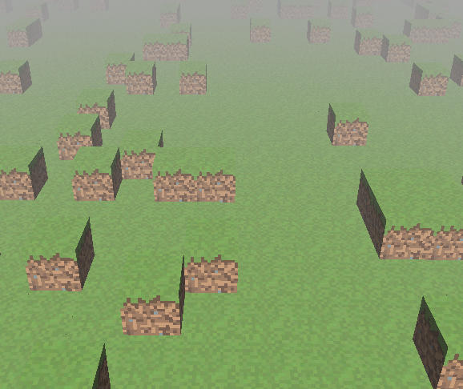
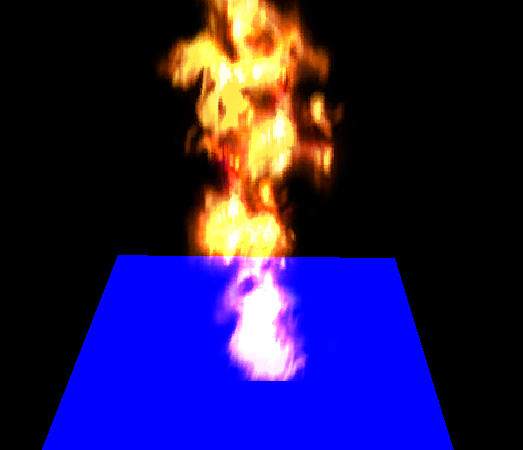

# 实例化渲染（Instanced Rendering）

## 很多实例

在绘制三维场景时，经常会有许多模型用相同的网格表示，但它们具有不同的变换。在此情况下，尽管它们可能是只有几个三角形的简单物体，但性能仍可能会受到影响，这背后的原因就是我们渲染它们的方式。

我们基本上是在循环中遍历所有游戏项，并对函数`glDrawElements`进行调用。如前几章所说的，对OpenGL库的调用应该最小化。对函数`glDrawElements`的每次调用都会造成一定开销。这对于每个`GameItem`实例会反复产生开销。

在处理大量相似物体时，使用一次调用渲染所有这些物体会更有效。这种技术被称为实例化渲染。为了实现同时渲染一组元素，OpenGL提供了一组名为`glDrawXXXInstanced`的函数。在本例中，由于我们正在绘制元素，所以将使用名为`glDrawElementsInstanced`的函数。该函数接收与`glDrawElements`相同的参数，外加一个额外的参数，用于设置要绘制的实例数。

这是一个如何使用`glDrawElements`的示例：

```java
glDrawElements(GL_TRIANGLES, numVertices, GL_UNSIGNED_INT, 0)
```

以下是实例化版本的用法:

```java
glDrawElementsInstanced(GL_TRIANGLES, numVertices, GL_UNSIGNED_INT, 0, numInstances);
```

但是你现在可能想知道，如何为每个实例设置不同的变换。现在，在绘制每个实例之前，我们将使用Uniform来传递不同的变换和实例相关的数据。在进行渲染调用之前，我们需要为每项设置特定的数据。当它们开始渲染时，我们如何做到这一点呢？

当使用实例化渲染时，在顶点着色器中我们可以使用一个输入变量来储存当前绘制实例的索引。例如，使用这个内置变量，我们可以传递一个包含要应用到每个实例的变换的Uniform数组，并仅做一次渲染调用。

这种方法的问题是，它仍然会带来太多的开销。除此之外，我们能够传递的Uniform数量是有限的。因此，需要使用另一种方法，而不是使用Uniform数组，我们将使用实例化数组。

如果你还记得前几章，每个网格的数据都是由一组名为VBO的数据数组定义的。这些VBO中的数据储存在每个唯一的`Mesh`实例中。


使用标准的VBO，在着色器中，我们可以访问与每个顶点（其位置、颜色、纹理等）相关的数据。无论何时运行着色器，输入变量都被设置为指向与每个顶点相关的指定数据。使用实例化数组，我们可以设置每个实例而不是每个顶点所更改的数据。如果我们将这两种类型结合起来，就可以使用常规的VBO来储存每个顶点的信息（坐标，纹理坐标）和用VBO储存每个实例的数据（如模型观察矩阵）。

下图展示了由三个顶点组成的网格，每个顶点定义了坐标、纹理与法线。每个元素的第一个索引是它所属的实例（蓝色）。第二个索引表示实例中的顶点位置。

网格也由两个实例VBO定义。一个用于模型观察矩阵，另一个用于光照观察矩阵。当为第一个实例渲染顶点（第1X个）时，模型观察矩阵和光照观察矩阵是相同的（第1个）。当渲染第二个实例的顶点时，将使用第二个模型观察矩阵和光照观察矩阵。


因此，在渲染第一个实例的第一个顶点时，将使用V11、T11和N11作为坐标、纹理和法线数据，并使用MV1作为模型观察矩阵。当渲染同一个实例的第二个顶点时，将使用V12、T12和N12作为坐标、纹理和法线数据，仍使用MV1作为模型观察矩阵。在渲染第二个实例之前，不会使用MV2和LV2。

为了定义每个实例数据，我们需要在顶点属性之后调用函数`glVertexAttribDivisor`。该函数接收两个参数：

* index：顶点属性的索引（在`glVertexAttribPointer`函数中设置的）。

* divisor: 如果这个值为0，那么在渲染时，每个顶点的数据都会改变。如果将其设置为1，则每渲染一个实例，数据更改一次。如果它被设置为2，则每渲染两个实例就会更改一次，以此类推。

因此，为了设置实例的数据，我们需要在每个属性定义之后进行如下调用：

```java
glVertexAttribDivisor(index, 1);
```

让我们开始修改代码库，以支持实例化渲染。第一步是创建一个名为`InstancedMesh`的新类，该类继承自`Mesh`类。该类的构造函数类似于`Mesh`的构造函数，但有一个额外的参数，即实例数。

在构造函数中，除了依赖超类的构造函数外，我们还将创建两个新的VBO，一个用于模型观察矩阵，另一个用于光照观察矩阵。创建模型观察矩阵的代码如下所示：

```java
modelViewVBO = glGenBuffers();
vboIdList.add(modelViewVBO);
this.modelViewBuffer = MemoryUtil.memAllocFloat(numInstances * MATRIX_SIZE_FLOATS);
glBindBuffer(GL_ARRAY_BUFFER, modelViewVBO);
int start = 5;
for (int i = 0; i < 4; i++) {
    glVertexAttribPointer(start, 4, GL_FLOAT, false, MATRIX_SIZE_BYTES, i * VECTOR4F_SIZE_BYTES);
    glVertexAttribDivisor(start, 1);
    start++;
}
```

我们首先要做的事是创建一个新的VBO和一个新的`FloatBuffer`以在其内储存数据。缓冲区的大小是用浮点数数量计算的，所以它等于实例数乘以4x4矩阵的浮点数大小（等于16）。

一旦VBO被绑定，我们就开始为它定义属性。你可以看到这是在`for`循环中完成的，循环进行了四次。每轮循环定义一个矩阵向量。为什么不简单地为整个矩阵定义一个属性呢？原因是顶点属性不能储存超过四个浮点数。因此，我们需要把矩阵定义分为四部分。让我们重新认识一下`glVertexAttribPointer`的参数：

* Index: 要定义的元素的索引。
* Size: 该属性的分量数。在本例中，它是四个浮点数，这是可接受的最大值。
* Type: 数据类型（在本例中为浮点型）。
* Normalize: 是否应该归一化指定数据。
* Stride（步长）: 理解这里的概念很重要，它设置了连续属性之间的字节偏移量。在本例中，我们需要将其设置为整个矩阵的字节大小。这就像一个用于包装数据的标记，从而可以在顶点或实例之间进行更改。
* Pointer: 此属性定义应用的偏移量。在本例中，我们需要将矩阵定义拆分为四次调用。依矩阵的每个向量增加偏移量。

定义了顶点属性之后，我们需要使用相同的索引调用`glVertexAttribDivisor`。

光照观察矩阵的定义与上述过程类似，你可以在源代码中查看它。继续进行`InstancedMesh`类的定义，重写方法以在渲染之前启用顶点属性（以及在渲染之后要禁用它们）是很重要的。

```java
@Override
protected void initRender() {
    super.initRender();
    int start = 5;
    int numElements = 4 * 2;
    for (int i = 0; i < numElements; i++) {
        glEnableVertexAttribArray(start + i);
    }
}

@Override
protected void endRender() {
    int start = 5;
    int numElements = 4 * 2;
    for (int i = 0; i < numElements; i++) {
        glDisableVertexAttribArray(start + i);
    }
    super.endRender();
}
```

`InstancedMesh`类定义了一个名为`renderListInstanced`的公共方法，它渲染一系列的游戏项，这个方法将游戏项列表分割为大小与创建`InstancedMesh`所设实例数量相等的块。真正的渲染方法是`renderChunkInstanced`，定义如下：

```java
private void renderChunkInstanced(List<GameItem> gameItems, boolean depthMap, Transformation transformation, Matrix4f viewMatrix, Matrix4f lightViewMatrix) {
    this.modelViewBuffer.clear();
    this.modelLightViewBuffer.clear();
    int i = 0;
    for (GameItem gameItem : gameItems) {
        Matrix4f modelMatrix = transformation.buildModelMatrix(gameItem);
        if (!depthMap) {
            Matrix4f modelViewMatrix = transformation.buildModelViewMatrix(modelMatrix, viewMatrix);
            modelViewMatrix.get(MATRIX_SIZE_FLOATS * i, modelViewBuffer);
        }
        Matrix4f modelLightViewMatrix = transformation.buildModelLightViewMatrix(modelMatrix, lightViewMatrix);
        modelLightViewMatrix.get(MATRIX_SIZE_FLOATS * i, this.modelLightViewBuffer);
        i++;
    }
    glBindBuffer(GL_ARRAY_BUFFER, modelViewVBO);
    glBufferData(GL_ARRAY_BUFFER, modelViewBuffer, GL_DYNAMIC_DRAW);
    glBindBuffer(GL_ARRAY_BUFFER, modelLightViewVBO);
    glBufferData(GL_ARRAY_BUFFER, modelLightViewBuffer, GL_DYNAMIC_DRAW);
    glDrawElementsInstanced(GL_TRIANGLES, getVertexCount(), GL_UNSIGNED_INT, 0, gameItems.size());
    glBindBuffer(GL_ARRAY_BUFFER, 0);
}
```

该方法很简单，我们遍历游戏项，计算模型观察矩阵和光照观察矩阵。这些矩阵被转储到它们各自的缓冲区中。这些缓冲区的内容被发送到GPU，最后通过对方法`glDrawElementsInstanced`的调用来渲染它们。

回到着色器，我们需要修改顶点着色器以支持实例化渲染。首先我们为模型观察矩阵添加新的输入参数，这些参数将在使用实例化渲染时传递。

```glsl
layout (location=5) in mat4 modelViewInstancedMatrix;
layout (location=9) in mat4 modelLightViewInstancedMatrix;
```

如你所见，模型观察矩阵从位置5开始。由于矩阵是由一组共四个属性（每个属性储存一个向量）定义的，所以光照观察矩阵从位置9开始。因为我们想在非实例化渲染和实例化渲染中使用同一着色器，所以我们将维护模型观察矩阵和光照观察矩阵的Uniform。我们只需更改它们的名字。

```glsl
uniform int isInstanced;
uniform mat4 modelViewNonInstancedMatrix;
…
uniform mat4 modelLightViewNonInstancedMatrix;
```

我们创建了另一个Uniform来指定是否使用实例化渲染。在使用实例化渲染的情况下代码非常简单，我们只使用输入参数中的矩阵。

```glsl
void main()
{
    vec4 initPos = vec4(0, 0, 0, 0);
    vec4 initNormal = vec4(0, 0, 0, 0);
    mat4 modelViewMatrix;
    mat4 lightViewMatrix;
    if ( isInstanced > 0 )
    {
        modelViewMatrix = modelViewInstancedMatrix;
        lightViewMatrix = modelLightViewInstancedMatrix;
        initPos = vec4(position, 1.0);
        initNormal = vec4(vertexNormal, 0.0);
    }
```

我们暂时不支持动画实例化渲染，以简化示例，但是该技术可以完美地用于此处。

最后，着色器像往常一样设置恰当的值。

```glsl
    vec4 mvPos = modelViewMatrix * initPos;
    gl_Position = projectionMatrix * mvPos;
    outTexCoord = texCoord;
    mvVertexNormal = normalize(modelViewMatrix * initNormal).xyz;
    mvVertexPos = mvPos.xyz;
    mlightviewVertexPos = orthoProjectionMatrix * lightViewMatrix * initPos;
    outModelViewMatrix = modelViewMatrix;
}
```

当然，`Renderer`类已经被修改，以支持Uniform的修改，并将非实例化网格的渲染从实例化网格中分离出来。你可以查看源代码中的修改。

此外，JOML的作者[Kai Burjack](https://github.com/httpdigest)还向源代码添加了一些优化。这些优化已经用于`Transformation`类，并总结为如下几条：

* 删除冗余调用，以设置具有单位值的矩阵。
* 使用四元数进行更有效的旋转。
* 使用特定的旋转和平移矩阵的方法，这些方法是针对这些操作优化的。



## 回顾粒子

在实例化渲染的支持下，我们还可以提高粒子渲染的性能。粒子就是最好的用例。

为了将实例化渲染应用到粒子上我们必须提供对纹理集的支持。这可以通过添加一个带有纹理偏移量的VBO来实现。纹理偏移量可以由两个浮点数组成的单个向量定义，因此不需要像矩阵那样拆分定义。

```java
// 纹理偏移量
glVertexAttribPointer(start, 2, GL_FLOAT, false, INSTANCE_SIZE_BYTES, strideStart);
glVertexAttribDivisor(start, 1);
```

但是，我们将在单个VBO中设置所有实例属性，而不是添加一个新的VBO。下图展示了这个概念。我们将所有属性打包在一个VBO中，每个实例的值都会发生变化。


为了使用单个VBO，我们需要修改实例中所有属性的属性大小。从上述代码中可以看到，纹理偏移量的定义使用了一个名为`INSTANCE_SIZE_BYTES`的常量。这个常量等于两个矩阵（一个用于模型观察矩阵定义，另一个用于光照观察矩阵定义）的字节大小再加上两个浮点数（纹理偏移量）的字节大小，总共是136。步长也需要适当地调整。

你可以在源代码中查看修改。

`Renderer`类也需要修改，以实用实例化渲染粒子和支持纹理集在场景中渲染。在本例中，支持这两种类型（非实例化和实例化）的渲染是没有意义的，所以修改更简单。

粒子的顶点着色器如下所示：

```glsl
#version 330
layout (location=0) in vec3 position;
layout (location=1) in vec2 texCoord;
layout (location=2) in vec3 vertexNormal;
layout (location=5) in mat4 modelViewMatrix;
layout (location=13) in vec2 texOffset;
out vec2 outTexCoord;
uniform mat4 projectionMatrix;
uniform int numCols;
uniform int numRows;
void main()
{
    gl_Position = projectionMatrix * modelViewMatrix * vec4(position, 1.0);

    // 支持纹理集，更新纹理坐标
    float x = (texCoord.x / numCols + texOffset.x);
    float y = (texCoord.y / numRows + texOffset.y);
    outTexCoord = vec2(x, y);}
```

上述修改的效果，看起来和非实例化粒子渲染时完全一样，但性能更高。FPS计数器已作为选项添加到窗口标题中。你可以使用实例化渲染和非实例化渲染来看看自身的性能提升。



## 扩展

结合我们现在所拥有的所有基础构造，我已经基于使用高度图修改了渲染方块数据的代码，还使用了纹理集以使用不同的纹理。它还融合了粒子渲染。看起来是这样的：


请记住，这还有很大的优化空间，但这本书的目的是指导你学习LWJGL和OpenGL的概念和技术。我们的目标不是创建一个完整的游戏引擎（绝对不是一个体素引擎，它需要不同的方法和更多的优化）。

