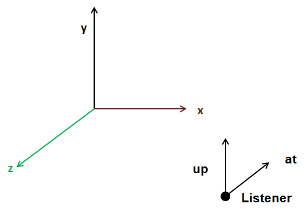

# 音频（Audio）

在此之前我们一直在处理图像，但每个游戏的另一个关键面是音频。本章将在[OpenAL](https://www.openal.org "OpenAL")（Open Audio Library，开放音频库）的帮助下实现这个功能。OpenAL就像是OpenGL在音频的相似物，它允许我们通过抽象层播放声音。该层将我们与音频子系统的复杂底层隔离开来。此外，它还允许我们可以三维场景中特定的位置设置声音，“渲染”声音，随着距离衰减并根据它们的速度进行修改（模拟[多普勒效应](https://en.wikipedia.org/wiki/Doppler_effect)）。

LWJGL支持OpenGL，不需要任何额外的下载，它就已经可以使用了。但是在开始写代码之前，我们需要介绍处理OpenGL时所涉及的主要元素，它们是：

* 缓冲区（Buffer）。
* 声源（Source）。
* 侦听者（Listener）。

缓冲区储存音频数据，即音乐或音效。它们类似于OpenGL中的纹理。OpenAL希望音频数据采用PCM（Pulse Coded Modulation，脉冲编码调制）格式（单声道或多声道），因此我们不能只转储MP3或OGG文件而不首先将它们转换为PCM。

下一个元素是声源，它表示发出声音的三维空间中的位置（一个点）。声源与缓冲区关联（一次只能有一个），可以通过以下属性定义：

* 位置，声源的位置（$x$，$y$和$z$坐标）。顺便一提，OpenAL和OpenGL一样使用右手笛卡尔坐标系，所以你可以假设（为了简化）你的世界坐标等于声音空间坐标系中的坐标。
* 速度，它指定声源移动的速度。这是用来模拟多普勒效应的。
* 增益，用来改变声音的大小（就像是一个放大因数）。

源代码中有额外的属性，稍后在讲解源代码时将描述这些属性。

最后但并不重要的是，侦听者是是产生的声音应该被听到的地方。侦听器就像是被设置在三维音频场景中用来接收声音的麦克风。现在只有一个侦听器。因此，人们常说的音频渲染是以听众的角度完成的。侦听器共享一些属性，但它还有一些附加属性，比如方向。方向表示侦听器所面朝的位置。

因此，三维音频场景有一组发出声音的声源和接收声音的侦听器组成。最终听到的声音取决于听者到不同声源的距离、相对速度和选择的传播模型（Propagation Model）。下图展示了一个包含不同元素类型的三维场景。


那么，让我们开始编写代码，我们将创建一个名为`org.lwjglb.engine.sound`的新包，它将负责管理所有负责处理音频的类。我们将首先从一个名为`SoundBuffer`的类开始，它将表示一个OpenAL缓冲区。该类的定义如下的一个代码片段所示：

```java
package org.lwjglb.engine.sound;

// import ...

public class SoundBuffer {

    private final int bufferId;

    public SoundBuffer(String file) throws Exception {
        this.bufferId = alGenBuffers();
        try (STBVorbisInfo info = STBVorbisInfo.malloc()) {
            ShortBuffer pcm = readVorbis(file, 32 * 1024, info);

            // 复制到缓冲区
            alBufferData(buffer, info.channels() == 1 ? AL_FORMAT_MONO16 : AL_FORMAT_STEREO16, pcm, info.sample_rate());
        }
    }

    public int getBufferId() {
        return this.bufferId;
    }

    public void cleanup() {
        alDeleteBuffers(this.bufferId);
    }

    // ...
}
```

该类的构造函数需要一个声音文件（它可能与其他资源一样位于类路径中），并从中创建一个新的缓冲区。我们要做的第一件事是调用`alGenBuffers`创建一个OpenAL缓冲区。最后，我们的声音缓冲区将用一个整数来表示，就像一个指向它所持有的数据的指针。一旦创建了缓冲区，我们就将音频数据转储到其中。构造函数需要OGG格式的文件，因此我们需要将其转换为PCM格式。你可以查看这如何在源代码中完成的，无论如何，源代码是从LWJGL的OpenAL测试中提取的。

此前版本的LWJGL有一个名为`WaveData`的帮助类，用于加载WAV格式的音频文件。这个类不再出现在LWJGL3中。不过，你可以从该类获得源代码并在游戏中使用它（可能不需要任何修改）。

`SoundBuffer`类还提供了`cleanup`方法来释放资源。

让我们继续为OpenAL建模，它将由一个名为`SoundSource`的类实现。类定义如下：

```java
package org.lwjglb.engine.sound;

import org.joml.Vector3f;

import static org.lwjgl.openal.AL10.*;

public class SoundSource {

    private final int sourceId;

    public SoundSource(boolean loop, boolean relative) {
        this.sourceId = alGenSources();
        if (loop) {
            alSourcei(sourceId, AL_LOOPING, AL_TRUE);
        }
        if (relative) {
            alSourcei(sourceId, AL_SOURCE_RELATIVE, AL_TRUE);
        }
    }

    public void setBuffer(int bufferId) {
        stop();
        alSourcei(sourceId, AL_BUFFER, bufferId);
    }

    public void setPosition(Vector3f position) {
        alSource3f(sourceId, AL_POSITION, position.x, position.y, position.z);
    }

    public void setSpeed(Vector3f speed) {
        alSource3f(sourceId, AL_VELOCITY, speed.x, speed.y, speed.z);
    }

    public void setGain(float gain) {
        alSourcef(sourceId, AL_GAIN, gain);
    }

    public void setProperty(int param, float value) {
        alSourcef(sourceId, param, value);
    }

    public void play() {
        alSourcePlay(sourceId);
    }

    public boolean isPlaying() {
        return alGetSourcei(sourceId, AL_SOURCE_STATE) == AL_PLAYING;
    }

    public void pause() {
        alSourcePause(sourceId);
    }

    public void stop() {
        alSourceStop(sourceId);
    }

    public void cleanup() {
        stop();
        alDeleteSources(sourceId);
    }
}
```

声源类提供了一些方法来设置它的位置、增益和控制方法来停止和暂停播放。请记住，声音控制操作是对一个声源（而不是对缓冲区）执行的。请记住，多个源可以共享同一个缓冲区。与`SoundBuffer`类中一样，`SoundBuffer`由一个标识符标记，该标识符在每个操作中使用。该类还提供了一个`cleanup`方法来释放保留的资源。但是让我们看看构造函数。我们要做的第一件事是调用`alGenSources`创建声源，然后使用构造函数参数设置一些有趣的属性。

第一个参数`loop`，表示要播放的声音是否应该处于循环模式。默认情况下，当通过声源调用播放操作时，当声音播放到最后时将停止。这对于一些声音来说是可以的，但是对于其他一些声音，比如背景音乐，就需要反复播放。当声音停止时不需要手动控制并重新播放声音，我们就只用将循环属性设置为`true`：`alSourcei(sourceId, AL_LOOPING, AL_TRUE);`。

另一个参数`relative`，控制声源的位置是否相对于侦听器。在本例中，当为声源设置位置时，我们基本上是在定义到侦听器的距离（使用想想），而不是OpenAL三维场景中的坐标，也不是世界坐标。这是通过调用`alSourcei(sourceId, AL_SOURCE_RELATIVE, AL_TRUE);”`启用的。但是，我们能用它做什么呢？这个属性很有趣，例如，用于不应该受到侦听器距离影响（减弱）的背景声音。例如，在背景音乐或与播放器控件相关的音效。如果我们将这些声源设置为相对的，并将它们的位置设置为$(0, 0, 0)$，它们将不会被减弱。

现在轮到侦听器了，它是由一个名为`SoundListener`定义的。以下是该类的定义：

```java
package org.lwjglb.engine.sound;

import org.joml.Vector3f;

import static org.lwjgl.openal.AL10.*;

public class SoundListener {

    public SoundListener() {
        this(new Vector3f(0, 0, 0));
    }

    public SoundListener(Vector3f position) {
        alListener3f(AL_POSITION, position.x, position.y, position.z);
        alListener3f(AL_VELOCITY, 0, 0, 0);
    }

    public void setSpeed(Vector3f speed) {
        alListener3f(AL_VELOCITY, speed.x, speed.y, speed.z);
    }

    public void setPosition(Vector3f position) {
        alListener3f(AL_POSITION, position.x, position.y, position.z);
    }

    public void setOrientation(Vector3f at, Vector3f up) {
        float[] data = new float[6];
        data[0] = at.x;
        data[1] = at.y;
        data[2] = at.z;
        data[3] = up.x;
        data[4] = up.y;
        data[5] = up.z;
        alListenerfv(AL_ORIENTATION, data);
    }
}
```

与前面的类不同，你将注意到不需要创建侦听器。总会有一个侦听器，所以不需要创建一个，它已经为我们准备好了。因此，在构造函数中，我们只是简单地设置它的初始位置。基于同样的原因，没有必要使用`cleanup`方法。类也有设置侦听器位置和速度的方法，就像在`SoundSource`类中一样，但是我们有一个额外的方法来修改侦听器的方向。让我们回顾一下方向是什么。侦听器方向由两个向量定义，`at`向量和`up`向量，如下图所示：



`at`向量基本上指向侦听器所朝向的位置，默认情况下它的值为$(0, 0, -1)$。`up`向量确定侦听器向上的方向，默认情况下它指向$(0, 1, 0)$。这两个向量的三个分量都是在`alListenerfv`方法调用中设置的。此方法用于将一组浮点数（浮点数变量）传递到属性（在本例中为方向）。

在继续讲解之前，有必要强调一些与声音和侦听器速度相关的概念。声源与侦听器之间的相对速度会导致OpenAL模拟多普勒效应。如果你不知道多普勒效应是什么，多普勒效应将导致一个离你越来越近的物体发出的频率似乎比它离开时发出的频率要高的效应。问题是，仅仅通过设置声音和侦听器速度，OpenAL不会为你更新它们的位置。它将使用相对速度来计算多普勒效应，但位置不会改变。因此，如果你想要模拟一个移动的声源或者侦听器，你必须注意在游戏循环中更新它们的位置。

现在我们已经定义了关键元素，为了让它们工作，需要初始化OpenAL库，因此将创建一个名为`SoundManager`的新类来处理这个问题。下面是定义该类的代码片段：

```java
package org.lwjglb.engine.sound;

// import ...

public class SoundManager {

    private long device;

    private long context;

    private SoundListener listener;

    private final List<SoundBuffer> soundBufferList;

    private final Map<String, SoundSource> soundSourceMap;

    private final Matrix4f cameraMatrix;

    public SoundManager() {
        soundBufferList = new ArrayList<>();
        soundSourceMap = new HashMap<>();
        cameraMatrix = new Matrix4f();
    }

    public void init() throws Exception {
        this.device = alcOpenDevice((ByteBuffer) null);
        if (device == NULL) {
            throw new IllegalStateException("Failed to open the default OpenAL device.");
        }
        ALCCapabilities deviceCaps = ALC.createCapabilities(device);
        this.context = alcCreateContext(device, (IntBuffer) null);
        if (context == NULL) {
            throw new IllegalStateException("Failed to create OpenAL context.");
        }
        alcMakeContextCurrent(context);
        AL.createCapabilities(deviceCaps);
    }
```

该类保存对`SoundBuffer`和`SoundSource`的实例的引用，以便跟踪和在此之后正确地清理它们。`SoundBuffer`储存在一个列表中，但`SoundSource`储存在一个`Map`中，因此可以通过名称搜索它们。`init`方法初始化OpenAL子系统：

* 开启默认设备。
* 为该设备创建功能。
* 创建一个声音环境，就像是OpenGL那样，并将其设置为当前环境。

`SoundManager`类还具有更新给定摄像机位置的侦听器朝向的方法。在本例中，侦听器将被设置在摄像机所在的位置。那么，给定摄像机的位置和旋转信息，我们如何计算`at`和`up`向量呢？答案是使用与摄像机相关联的观察矩阵。我们需要将`at`$(0, 0, -1)$与`up`$(0, 1, 0)$向量转换为考虑摄像机旋转的向量。让`cameraMatrix`为与摄像机关联的观察矩阵。实现的代码如下：

```java
Matrix4f invCam = new Matrix4f(cameraMatrix).invert();
Vector3f at = new Vector3f(0, 0, -1);
invCam.transformDirection(at);
Vector3f up = new Vector3f(0, 1, 0);
invCam.transformDirection(up);
```

我们要做的第一件事是逆转摄像机观察矩阵。为什么要这么做？这样想，观察矩阵从世界空间坐标变换到观察空间。我们想要的正好相反，我们想要从观察空间坐标（观察矩阵）转换到世界空间坐标，这是侦听器应该被放置的位置。对于矩阵，反比通常就意味着逆转。一旦我们有了这个矩阵，我们只需要转换`at`和`up`向量，使用这个矩阵计算新的方向。

但是，如果你查看源代码，你会看到实现略有不同，我们所做的是：

```java
Vector3f at = new Vector3f();
cameraMatrix.positiveZ(at).negate();
Vector3f up = new Vector3f();
cameraMatrix.positiveY(up);
listener.setOrientation(at, up);
```

上述代码等价于第一种方法，它只是一种更高效的方法。它使用了一种更快的方法，可以在[JOML](https://github.com/JOML-CI/JOML)库中找到，这种方法不需要计算完整的逆矩阵，但是可以得到相同的结果。这方法是由LWJGL论坛中的[JOML作者](https://github.com/httpdigest)提供的，因此你可以在[那里]((http://forum.lwjgl.org/index.php?topic=6080.0)查看更多细节。如果查看源代码，你将看到`SoundManager`类计算它自己的观察矩阵副本。这已经在`Renderer`类中完成了。为了保持代码简单，并避免重构，我倾向于使用这种方式。

这就完了。我们拥有播放声音所需的所有基础结构。你可以查看源代码，了解如何使用所有代码。你可以看到音乐是如何播放的，以及不同效果的声音（这些文件是从[Freesound](https://www.freesound.org/)中获得的，贡献者都储存在名为CREDITS.txt的一个文件中）。如果你获得一些其他文件，你可以会注意到声音衰减与距离或侦听器的方向无关。请检查这些声音是否是单声道，是否不是立体声。OpenGL仅能使用单声道声音进行计算。

后记，OpenAL还允许你通过使用`alDistanceModel`并传递你想使用的模型（`AL11.AL_EXPONENT_DISTANCE`，`AL_EXPONENT_DISTANCE_CLAMP`，等等）。你可以用它们来播放并检查效果。
