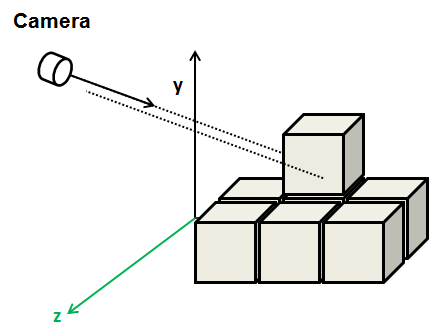
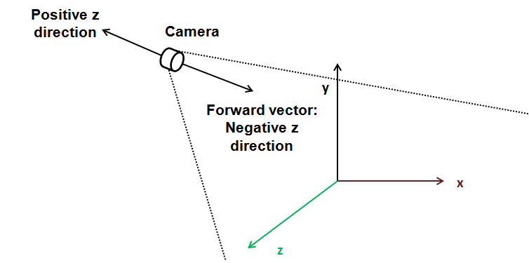
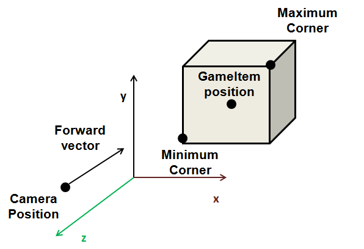
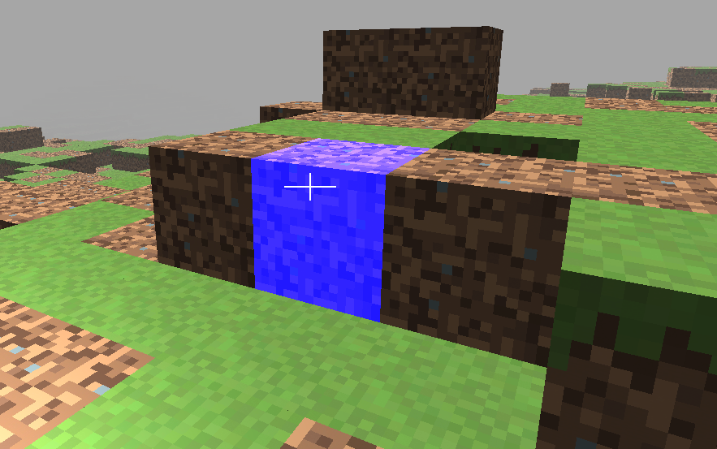
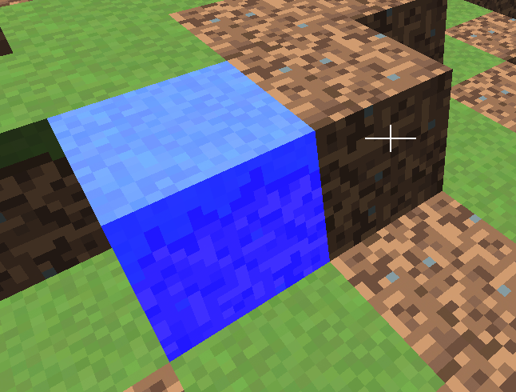

# 三维物体选取（3D Object Picking）

## 摄像机选取

每一个游戏的关键之一是能与环境交互，该功能要求能够在三维场景中选取物体。在本章中，我们将探讨如何实现这一功能。

但是，在开始讲述选取物体的步骤之前，我们需要一种表示所选物体的方法。因此，我们必须做的第一件事是添加一个属性到`GameItem`类，这允许我们标记选定的对象：

```java
private boolean selected;
```

然后，我们需要能够在场景着色器中使用该值。让我们从片元着色器（`scene_fragment.fs`）开始。在本例中，我们将假设从顶点着色器接收一个标记，该标记将确定要渲染的片元是否是选定的物体。

```glsl
in float outSelected;
``` 

然后，在片元着色器的结尾，我们将修改最终的片元颜色，如果选中，则将蓝色分量设置为$1$.

```glsl
if ( outSelected > 0 ) {
    fragColor = vec4(fragColor.x, fragColor.y, 1, 1);
}
```

然后，我们需要能够为每个`GameItem`设置该值。如果你回想一下前面的章节，我们有两种情况：

* 渲染非实例化网格。
* 渲染实例化网格。

在第一种情况下，每个`GameItem`的数据通过Uniform传递，因此我们只需要在顶点着色器中为它添加一个新的Uniform。在第二种情况下，我们需要创建一个新的实例化属性。可以看到下述代码中集成了两种情况到顶点着色器。

```glsl
layout (location=14) in float selectedInstanced;
...
uniform float selectedNonInstanced;
...
    if ( isInstanced > 0 )
    {
        outSelected = selectedInstanced;
...
    }
    else
    {
    outSelected = selectedNonInstanced;
...
```

既然已经做好了基本准备，我们只需要定义如何选择对象。在继续之前，如果你查阅源代码，你可能会注意到观察矩阵现在储存在`Camera`类中。这是因为我们在源代码中的几个类重新计算了观察矩阵，此前它储存在`Transformation`和`SoundManager`类中。为了计算交点，我们就需要创建另一个副本。与其创建另一个副本，我们不如把它集中到`Camera`类中。这一更改还需要观察矩阵在游戏主循环中更新。

让我们继续物体选取的讨论。在本例中，我们将基于一个简单的方法，选取将由摄像机自动地完成，将选择摄像机所面对的最近的物体。让我们讨论一下如何做到它。

下图是我们需要解决的情况：



我们把摄像机放在世界空间的某个坐标中，面朝一个特定方向。任何一个物体，如果它与摄像机的位置和前向的光线投射（Ray Cast）相交，那么它就是候选物体。在所有候选物体中，我们只需要选择最近的一个。

在本例中，游戏项是立方体，因此需要计算摄像机的前向向量与立方体的交点。这似乎是一个非常特殊的情况，但实际上是非常常见的。在许多游戏中，游戏项都与所谓的边界框（Bounding Box）相关连。边界框是一个矩形框，它囊括了该物体的所有顶点。例如，边界框也用于碰撞检测。实际上，在动画章节中，你看到的每个动画帧都定义了一个边界框，这有助于在任意给定时间设置边界。

接下来让我们开始编码。我们将创建一个名为`CameraBoxSelectionDetector`的新类，它有一个名为`selectGameItem`的方法，该方法将接收游戏项列表和摄像机。方法的定义如下：

```java
public void selectGameItem(GameItem[] gameItems, Camera camera) {
    GameItem selectedGameItem = null;
    float closestDistance = Float.POSITIVE_INFINITY;

    dir = camera.getViewMatrix().positiveZ(dir).negate();
    for (GameItem gameItem : gameItems) {
        gameItem.setSelected(false);
        min.set(gameItem.getPosition());
        max.set(gameItem.getPosition());
        min.add(-gameItem.getScale(), -gameItem.getScale(), -gameItem.getScale());
        max.add(gameItem.getScale(), gameItem.getScale(), gameItem.getScale());
        if (Intersectionf.intersectRayAab(camera.getPosition(), dir, min, max, nearFar) && nearFar.x < closestDistance) {
            closestDistance = nearFar.x;
            selectedGameItem = gameItem;
        }
    }

    if (selectedGameItem != null) {
        selectedGameItem.setSelected(true);
    }
}
```

该方法将迭代游戏项，尝试从中获取与摄像机光线投射相交的项。它首先定义一个名为`closestDistance`的变量，该变量将储存最近的距离。对于相交的游戏项，将计算摄像机到交点的距离，如果该距离小于储存在`closestDistance`中的值，则该项将成为新的候选项。

在进入循环之前，我们需要摄像机所面向的方向向量。这很简单，只需使用视图矩阵去获得考虑相机旋转的Z方向。记住，正Z指向屏幕外，所以需要相反的方向向量，这就是为什么要反方向（`negate`）。



在游戏循环中，每个`GameItem`都要进行相交计算。但是，我们该怎么做呢？这就是[JOML](https://github.com/JOML-CI/JOML "JOML")库来帮忙的地方了。我们使用的是[JOML](https://github.com/JOML-CI/JOML "JOML")的`Intersectionf`类，它提供了几种计算二维和三维交点的方法。具体来说，我们使用的是`intersectRayAab`方法。

该方法实现了轴对齐边界框（Axis Aligned Bounding Box，简称AABB）交点检测算法。你可以查看JOML文档中指出的[详细信息](http://people.csail.mit.edu/amy/papers/box-jgt.pdf "这里")。

该方法测试由原点和方向定义的射线是否与由最小和最大坐标定义的边界框相交。这个算法是有效的，因为我们的立方体是轴对齐的，如果旋转它们，这个方法就不起作用。因此，该方法接收以下参数：

* 一个原点：在本例中，这是摄像机的位置。
* 一个方向：在这里是摄像机的朝向，前向向量。
* 边界框的最小坐标。在本例中，立方体以`GameItem`坐标为中心，最小坐标是该坐标减去比例。（在其原始大小中，立方体的长度为2，比例为1）。
* 边界框的最大坐标。不言而喻。
* 一个结果向量。它将储存到远近交点的距离（对于一个轴对齐边界框和一条射线，最多有两个交点）。

如果有交点，该方法将返回`true`。如果为`true`，我们将检查最近距离并在必要时更新它，并储存所选候选`GameItem`的引用。下图展示了该方法中涉及的所有要素。



一旦循环完成，候选`GamItem`将被标记为已选定。

这就是全部了。`selectGameItem`将在`DummyGame`类的更新方法中调用，同时调用的还有观察矩阵更新。
```java
// 更新观察矩阵
camera.updateViewMatrix();

// 更新声音监听器位置
soundMgr.updateListenerPosition(camera);

this.selectDetector.selectGameItem(gameItems, camera);
```

此外，一个十字瞄准线（Cross-hair）已添加到渲染中，以检查一切工作正常。结果如下图所示：



显然，这里给出的方法远远不是最佳的，但它将为你提供基础知识，是你能够自己开发更复杂的方法。场景的某些部分很容易被丢弃，比如摄像机后面的物体，因为它们不会相交。除此之外，你换可以根据摄像机的距离来确定物体，以加快计算速度。此外，只有在摄像机移动或旋转后，才需要进行计算。

## 鼠标选取

用摄像机选取物体完成了，但当我们想用鼠标自由选择物体怎么办？在此情况下，我们希望每当用户单击屏幕时，自动选择最近的对象。

实现它的方法类似于上述方法。在之前的方法中，我们得到了摄像机的位置，并根据摄像机当前的方向使用“前向”方向从摄像机生成射线。在此情况下，我们仍需要投射广西，但方向指向一个远离摄像机的点，也就是点击的点。在本例中，我们需要使用点击的坐标来计算方向向量。

但是，我们如何将视口空间中的$(x,y)$坐标变换到世界空间呢？让我们回顾一下如何从模型空间坐标变换到观察空间。为了达到这个目的，所应用的不同坐标变换是：

* 我们使用模型矩阵将模型坐标变换到世界坐标。
* 我们使用观察矩阵（提供摄像机功能）将世界坐标转换到观察空间坐标。
* 我们通过应用透视投影矩阵将观察坐标变换到齐次裁剪空间（Homogeneous Clip Space）。
* 最终的屏幕坐标由OpenGL为我们自动计算。在此之前，它传递到归一化的终端空间（通过将$x,y,z$坐标除以$w$分量），然后传递到$x,y$屏幕坐标。

所以我们只需要从屏幕坐标$(x,y)$到世界坐标，逆路径遍历。

第一步是将屏幕坐标转换为归一化的终端空间。视口空间中的$(x,y)$坐标的范围是$[0, 屏幕宽度]$ $[0, 屏幕高度]$。屏幕左上角的坐标为$(0, 0)$。我们需要将其转换为$[-1, 1]$范围内的坐标。


很简单的数学：

$$x = 2 \cdot screen_x / screenwidth - 1$$

$$y = 1 - 2 * screen_y / screenheight$$

但是，我们如何计算$z$分量呢？答案很简单，我们只需给它分配$-1$值，这样广西就可以指向最远的可见距离（请记住，在OpenGL中，$-1$指向频幕）。现在我们有了归一化终端空间中的坐标。

为了继续变换，我们需要将它们转换为齐次剪切空间。我们需要有一个$w$分量，它使用齐次坐标。虽然这个概念在前几章已经介绍过了，但让我们再回顾它。为了表示一个三维点，我们需要$x$，$y$和$z$分量，但是我们一直在处理一个额外的$w$分量。我们需要这个额外的分量来使用矩阵执行不同的变换。有些变化不需要这个额外的分量，但有些变换需要。例如，如果我们只有$x$，$y$和$z$分量，那么变换矩阵就不能工作。因此，我们添加了$w$分量，并为它们赋值为$1$，这样我们就可以处理4x4矩阵了。

此外，大多数变换，或者更精确地说，大多数变换矩阵都不会更改$w$分量。投影矩阵是一个例外，该矩阵将$w$分量更改为与$z$分量成比例。

通过将$x$，$y$和$z$分量处以$w$，就可以实现从齐次裁剪空间到归一化的终端坐标的转换。由于这个分量与$z$分量成比例，意味着远处的物体被画得更小。在本例中，需要反其道而行之，我们可以忽略这一步，只需要将$w$分量设置为$1$，并保留其它组件的原始值。

我们现在需要回到观察空间。这很简单，我们只需要计算投影矩阵的逆矩阵并将它与4个分量向量相乘。完成之后，我们就需要把它们转换成世界空间。同样，我们只需要使用观察矩阵，计算它的逆矩阵然后乘以向量。

记住，我们只对方向感兴趣，因此，在本例中，我们将$w$分量设置为$0$。我们还可以将$z$组件再次设置为$-1$，因为我们希望它指向频幕。一旦这样做并应用逆矩阵，我们就得到了世界空间中的向量。我们计算了射线，可以使用与摄像机选取相同的算法。

我们创建了一个名为`MouseBoxSelectionDetector`的新类，它实现了上述步骤。此外，我们将投影矩阵移动到`Window`类，所以我们可以在几个地方使用它们。我们还重构了一点`CameraBoxSelectionDetector`，所以`MouseBoxSelectionDetector`可以继承和使用碰撞检测方法。你可以直接查看源代码，因为实现非常简单。

结果如下所示：



你只需用鼠标单击该方块即可进行选取。

之后你可以参考一篇[优秀文章](https://capnramses.github.io/opengl/raycasting.html "优秀文章")中背完所解释的步骤的细节，其中包含了涉及不同方案的非常详细的说明。
