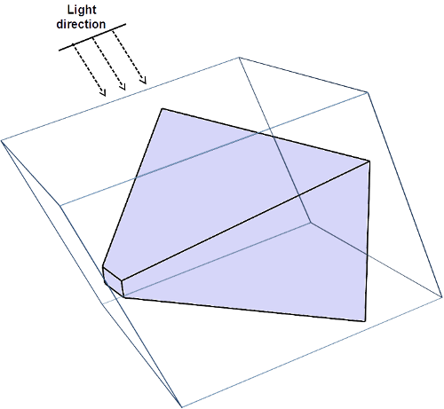
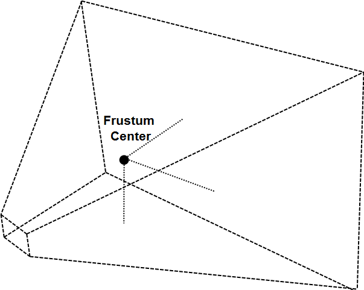
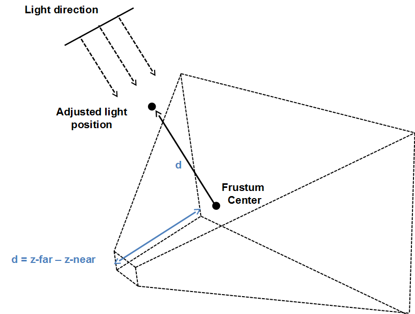
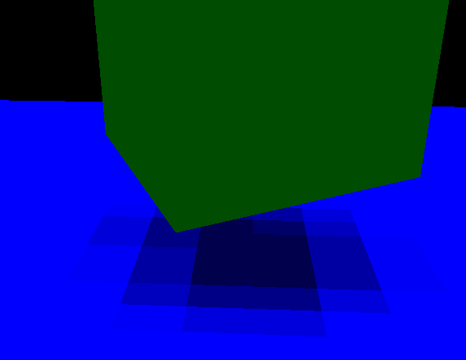
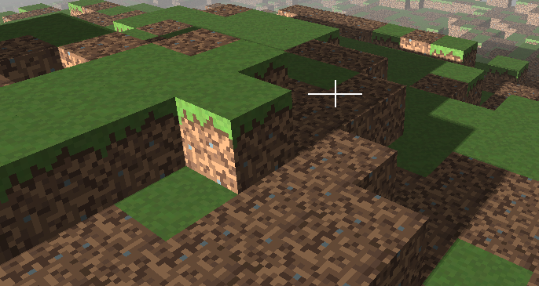

# 级联阴影映射（Cascaded Shadow Maps）

在阴影一章中，我们介绍了阴影映射技术，以便在渲染三维场景时使用平行光显示阴影。此前介绍的方案中要求你手动调整一些参数以改进效果。在本章中，我们将修改该技术，以自动化所有流程，并改进在开放空间中的效果。为了达到目的，我们将使用一种称为级联阴影映射（CMS，Cascaded Shadow Map）的技术。

让我们首先看一下如何自动构造用于渲染阴影的光照视图矩阵和正交投影矩阵。如果你回想阴影一章，我们需要从光线的角度来绘制场景。这意味着创建一个光照视图矩阵，它就像一个作用于光源的摄像机和一个投影矩阵。由于光是定向的，而且应该位于无穷远处，所以我们选择了正交投影。

我们希望所有可见的物体都适用于光照视图投影矩阵。因此，我们需要将视截锥放入光截锥中。下图是我们最终想要实现的效果：



该如何构造它？首先是计算观察投影矩阵的截锥顶点。我们得到世界空间的坐标，然后计算这个截锥的中心，这可以通过将所有的顶点的坐标相加并将结果除以顶点的数量来计算。



有了这些数据，我们就可以设置光源的位置。其位置及其方向将用于构建光照视图矩阵。为了计算位置，我们从此前得到的视锥体的中心开始，逆着光的方向，取相当于视锥体的近Z平面和远Z平面的距离的一点。



构建完成光照视图矩阵，我们需要设置正交投影矩阵。为了计算它们，我们将截锥的顶点转换到光照视图空间，只需要将它们乘以刚刚构建的光照视图矩阵。投影矩阵的尺寸是最大和最小的X和Y值，近Z平面可以设置为与标准投影矩阵相同的值，远Z平面则是光照视图空间中截锥顶点的最大和最小Z值之间的距离。

但是，如果在阴影示例代码的基础上实现上述算法，则可能会对阴影质量感到失望。



原因是阴影分辨率受纹理大小的限制。我们现在正覆盖一个潜在的巨大区域，并且我们用来储存深度信息的纹理没有足够的分辨率来取得良好的效果。你可能认为解决方法只是提高纹理分辨率，但这并不足以完全解决问题，你需要巨大的纹理。

有一个更聪明的解决方案。其关键是，靠近摄像机的物体需要比远处物体的阴影有更高的质量。一种方法是只渲染靠近摄像机的对象的阴影，但这会导致阴影在场景中移动时出现或消失。

级联阴影映射（CSM）使用的方法是将视锥体分割为多个部分。离摄像机较近的部分会覆盖较小的区域，而距离较远的部分会覆盖更广的区域。下图显示了把一个视锥体分为三个部分。


对于每个部分，将渲染深度纹理，调整光照视图和投影矩阵以合适地覆盖每个分割的部分。因此，储存深度映射的纹理覆盖视锥体的区域缩小了。而且，由于离摄像机最近的部分会占用较少的空间，因此深度分辨率会提高。

从上述解释可以看出，我们需要尽可能多的将深度图进行分割，我们还将更改每个光照视图和投影矩阵。因此，要使用CSM需要做的事情是：

* 将视锥体分为n个部分。
* 渲染深度纹理时，对于每个部分：
  * 计算光照视图和投影矩阵。
  * 从光源的角度将场景渲染为单独的深度图。
* 渲染场景时：
  * 使用此前计算的深度图。
  * 确定要绘制的片段所属的部分。
  * 计算阴影因子，如阴影映射中所述。

如你所见，CSM的主要缺点是我们需要从灯光的角度为每个部分渲染场景。这就是为什么通常只用于开放空间的原因。不管怎么说，我们将可以看到如何轻松地减少开销。

所以，让我们看看代码。但是在继续之前，有一个小小的提醒，我不会在这里写上完整的源代码，因为这会非常枯燥。相反，我将介绍主要类、它们的职责和可能需要进一步解释的片段，以便更好地理解。所有与着色相关的类都已移动到一个名为`org.lwjglb.engine.graph.shadow`的新包中。

渲染阴影的代码，换句话说，从光影透视的场景已经移动到了`ShadowRenderer`类中。（该代码以前在`Renderer`类中）。

类定义了以下常量：

```java
public static final int NUM_CASCADES = 3;
public static final float[] CASCADE_SPLITS = new float[]{Window.Z_FAR / 20.0f, Window.Z_FAR / 10.0f, Window.Z_FAR};
```

首先是层级或拆分的数量。第二个定义了每个拆分的部分的远Z平面的位置。如你所见，它们的间距并不相等。离摄像机较近的部分在Z平面上的距离最短。

类还储存了用于渲染深度图的着色器程序的引用，一个列表，其中包含与每个部分相关联的信息，其由`ShadowCascade`类定义，以及对储存深度图数据（纹理）的对象的引用，由`ShadowBuffer`类定义。

`ShadowRenderer`类具有用于设置着色器和所需属性的方法以及一个渲染方法。`render`方法的定义如下所示：

```java
public void render(Window window, Scene scene, Camera camera, Transformation transformation, Renderer renderer) {
    update(window, camera.getViewMatrix(), scene);

    // 设置视口以匹配纹理大小
    glBindFramebuffer(GL_FRAMEBUFFER, shadowBuffer.getDepthMapFBO());
    glViewport(0, 0, ShadowBuffer.SHADOW_MAP_WIDTH, ShadowBuffer.SHADOW_MAP_HEIGHT);
    glClear(GL_DEPTH_BUFFER_BIT);

    depthShaderProgram.bind();

    // 为每层图渲染场景
    for (int i = 0; i < NUM_CASCADES; i++) {
        ShadowCascade shadowCascade = shadowCascades.get(i);

        depthShaderProgram.setUniform("orthoProjectionMatrix", shadowCascade.getOrthoProjMatrix());
        depthShaderProgram.setUniform("lightViewMatrix", shadowCascade.getLightViewMatrix());

        glFramebufferTexture2D(GL_FRAMEBUFFER, GL_DEPTH_ATTACHMENT, GL_TEXTURE_2D, shadowBuffer.getDepthMapTexture().getIds()[i], 0);
        glClear(GL_DEPTH_BUFFER_BIT);

        renderNonInstancedMeshes(scene, transformation);

        renderInstancedMeshes(scene, transformation);
    }

    // 解绑
    depthShaderProgram.unbind();
    glBindFramebuffer(GL_FRAMEBUFFER, 0);
}
```

如你所见，我们为每个部分执行的几个渲染过程，类似于此前阴影图的渲染方法。在每次执行中，我们都会使用相关的`ShadowCascade`实例中保函的信息更改光照视图矩阵和正交投影矩阵。

此外，在每次执行中，我们都需要更改正在使用的纹理。每次都会将深度信息渲染为不同的纹理。此信息储存在`ShadowBuffer`类中，并设置为供FBO使用，代码如下：

```java
glFramebufferTexture2D(GL_FRAMEBUFFER, GL_DEPTH_ATTACHMENT, GL_TEXTURE_2D, shadowBuffer.getDepthMapTexture().getIds()[i], 0);
```

正如刚刚提到的，`ShadowBuffer`类储存与用于储存深度信息的纹理相关的信息。代码与阴影章节中使用的代码非常相似，只是我们使用的是纹理数组。因此，我们创建了一个新的类`ArrTexture`，它创建了一个具有相同属性的纹理数组。此类还提供了一个`bind`方法，用于绑定所有纹理数组，以便在场景着色器中使用它们。该方法接收一个参数，从某个纹理单元开始绑定。

```java
public void bindTextures(int start) {
    for (int i = 0; i < ShadowRenderer.NUM_CASCADES; i++) {
        glActiveTexture(start + i);
        glBindTexture(GL_TEXTURE_2D, depthMap.getIds()[i]);
    }
}
```

`ShadowCascade`类储存与一个部分关联的光照视图和正交投影矩阵。每个分割的部分由一个近Z平面距离和一个远Z平面距离定义，并根据该信息计算矩阵。

该类提供并更新了以观察矩阵和光照方向为输入的方法，该方法首先计算世界空间中的视锥顶点，然后计算出光源的位置。根据光的方向，从截锥的中心到相当于远Z平面到近Z平面之间的距离的距离，计算出该位置。

```java
public void update(Window window, Matrix4f viewMatrix, DirectionalLight light) {
    // 为此层生成投影识图矩阵
    float aspectRatio = (float) window.getWidth() / (float) window.getHeight();
    projViewMatrix.setPerspective(Window.FOV, aspectRatio, zNear, zFar);
    projViewMatrix.mul(viewMatrix);

    // 计算世界空间中的截锥顶点
    float maxZ = -Float.MAX_VALUE;
    float minZ =  Float.MAX_VALUE;
    for (int i = 0; i < FRUSTUM_CORNERS; i++) {
        Vector3f corner = frustumCorners[i];
        corner.set(0, 0, 0);
        projViewMatrix.frustumCorner(i, corner);
        centroid.add(corner);
        centroid.div(8.0f);
        minZ = Math.min(minZ, corner.z);
        maxZ = Math.max(maxZ, corner.z);
    }

    // 从质心逆着光的方向上max.z-min.z的距离
    Vector3f lightDirection = light.getDirection();
    Vector3f lightPosInc = new Vector3f().set(lightDirection);
    float distance = maxZ - minZ;
    lightPosInc.mul(distance);
    Vector3f lightPosition = new Vector3f();
    lightPosition.set(centroid);
    lightPosition.add(lightPosInc);

    updateLightViewMatrix(lightDirection, lightPosition);

    updateLightProjectionMatrix();
}
```

根据光源的位置和方向，我们可以构造光照视图矩阵。这是在`updateLightViewMatrix`方法中完成的：

```java
private void updateLightViewMatrix(Vector3f lightDirection, Vector3f lightPosition) {
    float lightAngleX = (float) Math.toDegrees(Math.acos(lightDirection.z));
    float lightAngleY = (float) Math.toDegrees(Math.asin(lightDirection.x));
    float lightAngleZ = 0;
    Transformation.updateGenericViewMatrix(lightPosition, new Vector3f(lightAngleX, lightAngleY, lightAngleZ), lightViewMatrix);
}
```

最后，我们需要构造正交投影矩阵。这是在`updateLightProjectionMatrix`方法中完成的。该方法将视锥体坐标转换到光照空间。然后我们得到x、y坐标的最小值和最大值来构造包围视锥体的边界框。近Z平面可以设置为0，远Z平面可以设置为坐标的最大值和最小值之间的距离。

```java
private void updateLightProjectionMatrix() {
    // 现在计算光照空间中的截锥大小。
    float minX =  Float.MAX_VALUE;
    float maxX = -Float.MAX_VALUE;
    float minY =  Float.MAX_VALUE;
    float maxY = -Float.MAX_VALUE;
    float minZ =  Float.MAX_VALUE;
    float maxZ = -Float.MAX_VALUE;
    for (int i = 0; i < FRUSTUM_CORNERS; i++) {
        Vector3f corner = frustumCorners[i];
        tmpVec.set(corner, 1);
        tmpVec.mul(lightViewMatrix);
        minX = Math.min(tmpVec.x, minX);
        maxX = Math.max(tmpVec.x, maxX);
        minY = Math.min(tmpVec.y, minY);
        maxY = Math.max(tmpVec.y, maxY);
        minZ = Math.min(tmpVec.z, minZ);
        maxZ = Math.max(tmpVec.z, maxZ);
    }
    float distz = maxZ - minZ;

    orthoProjMatrix.setOrtho(minX, maxX, minY, maxY, 0, distz);
}
```

记住，正交投影就像一个边界框，应该包含所有将要渲染的对象。该边界框以光照视图坐标空间表示。因此，我们要做的是计算包围视锥体的最小边界框，轴与光源位置对齐。

`Renderer`类已被修改为使用视图包中的类以及修改传递给渲染器的信息。在渲染器中，我们需要处理模型、模型观察和光照视图矩阵。在此前的章节中，我们使用模型观察或光照视图矩阵来减少操作的数量。在本例中，我们选择简化要传递的元素的数量，现在只将模型、观察和光照矩阵传递给着色器。此外，对于粒子，我们需要保留比例，因为我们不再传递模型观察矩阵，所以现在信息将丢失。我们重用用于标记所选项的属性来设置比例信息。在粒子着色中，我们将使用该值再次设置缩放。

在场景的顶点着色器中，我们为每个部分计算模型光照视图矩阵，并将其作为输出传递给片元着色器。

```glsl
mvVertexPos = mvPos.xyz;
for (int i = 0 ; i < NUM_CASCADES ; i++) {
    mlightviewVertexPos[i] = orthoProjectionMatrix[i] * lightViewMatrix[i] * modelMatrix * vec4(position, 1.0);
}
```

在片元着色器中，我们使用这些值根据片元所处的部分来查询适当的深度图。这需要在片元着色器中完成，因为对于特定项目，它们的片元可能位于不同的部分中。

此外，在片元着色器中，我们必须决定要分成哪个部分。为了实现它，我们使用片元的Z值，并将其与每个部分的最大Z值进行比较，也就是远Z平面值。这些数据作为一个新的Uniform传递：

```glsl
uniform float cascadeFarPlanes[NUM_CASCADES];
```

如下所示，我们计算分割的部分，变量`idx`将储存要使用的部分：

```glsl
int idx;
for (int i=0; i<NUM_CASCADES; i++)
{
    if ( abs(mvVertexPos.z) < cascadeFarPlanes[i] )
    {
        idx = i;
        break;
    }
}
```

此外，在场景着色器中，我们需要传递一个纹理数组，一个`sampler2D`数组，用于深度图，即与我们分割部分相关联的纹理。源代码用一个Uniform列表（而不是使用数组）储存用于引用与每个部分关联的深度图的纹理单元。

```glsl
uniform sampler2D normalMap;
uniform sampler2D shadowMap_0;
uniform sampler2D shadowMap_1;
uniform sampler2D shadowMap_2;
```

将其更改为一组Uniform会导致难以追踪此示例的其他纹理出现的问题。在任何情况下，你都可以尝试在代码中修改它。

源代码中的其余修改和着色器只是基于上述更改所需的调整，你可以直接在源代码上查看它。

最后，当引入这些更改时，你可能会发现性能下降，这是因为我们绘制的深度图是此前的三倍。如果摄像机未被移动或场景项未发生更改，则不需要反复渲染深度图。深度图储存在纹理中，因此不需要每次渲染调用清除它们。因此，我们在`render`方法中添加了一个新变量，用于指示是否更新深度图，以避免更新深度图，使其保持不变，这会显著提高FPS。最终，你会得到这样的效果：



