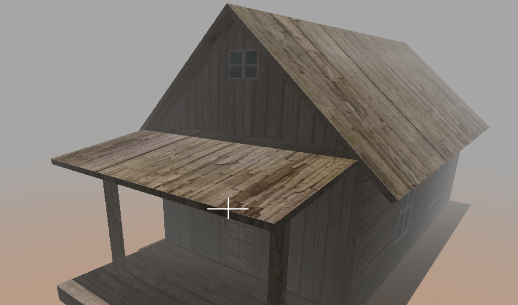
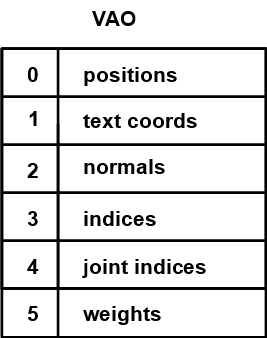
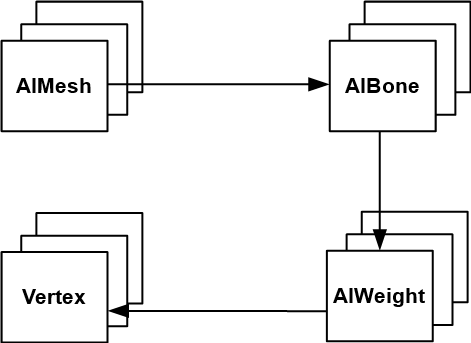
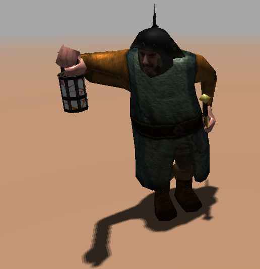

# Assimp库（Assimp）

## 静态网格

加载不同格式的复杂三维模型的功能对于编写游戏至关重要，为其中一些编写解析器需要大量的工作，即便只支持一种格式也可能很耗时。例如，在第九章中描述的wavefront加载器只解析了规范中的一小部分（根本不处理材质）。

幸运的是，已经可以使用[Assimp](http://assimp.sourceforge.net/)库来解析许多常见的3D格式。它是一个C++库，可以以各种格式加载静态和动画模型。LWJGL提供了绑定以便从Java代码中使用它们。在本章中，我们将学习如何使用它。

首先是将Assimp的Maven依赖项添加到`pom.xml`文件中。我们需要添加编译时和运行时依赖项。

```xml
<dependency>
    <groupId>org.lwjgl</groupId>
    <artifactId>lwjgl-assimp</artifactId>
    <version>${lwjgl.version}</version>
</dependency>
<dependency>
    <groupId>org.lwjgl</groupId>
    <artifactId>lwjgl-assimp</artifactId>
    <version>${lwjgl.version}</version>
    <classifier>${native.target}</classifier>
    <scope>runtime</scope>
</dependency>
```

一旦设置了依赖项，我们将创建一个名为`StaticMeshesLoader`的新类，该类将用于加载不带动画的网格，该类定义了两个静态公共方法：

```java
public static Mesh[] load(String resourcePath, String texturesDir) throws Exception {
    return load(resourcePath, texturesDir, aiProcess_JoinIdenticalVertices | aiProcess_Triangulate | aiProcess_FixInfacingNormals);
}

public static Mesh[] load(String resourcePath, String texturesDir, int flags) throws Exception {
    // ....
```

两种方法都有以下参数：
* `resourcePath`：模型文件所在的文件路径。这是一个绝对路径，因为Assimp可能需要加载其他文件（例如wavefront、OBJ等文件的材质文件），并且可能使用与资源路径相同的基路径。如果将资源嵌入JAR文件中，那么assimp将无法导入它，因此它必须是文件系统路径。
* `texturesDir`：保存此模型的文件夹路径。这是CLASSPATH的相对路径。例如，wavefront材质文件可以定义多个纹理文件。代码希望此文件位于`texturesDir`目录下。如果发现纹理加载错误，可能需要在模型文件中手动调整这些路径。

第二个方法有一个名为`flags`的额外参数。此参数允许调整加载过程。第一个方法调用第二个方法，并传递一些在大多数情况下都有用的值：
* `aiProcess_JoinIdenticalVertices`：此标记将减少使用的顶点数，识别可在面之间重用的顶点。
* `aiProcess_Triangulate`：模型可以使用四边形或其他几何图形来定义它们的元素。由于我们只处理三角形，因此必须使用此标记将所有的面拆分为三角形（如果有必要的话）。
* `aiProcess_FixInfacingNormals`：此标记将尝试反转可能指向内部的法线。

还有许多其他标记可以使用，你可以在LWJGL的Javadoc文档中查阅它们。

回看到第二个载入方法，我们要做的第一件事是调用`aiImportFile`方法来加载带有所选标记的模型。

```java
AIScene aiScene = aiImportFile(resourcePath, flags);
if (aiScene == null) {
    throw new Exception("Error loading model");
}
```

载入方法的其余代码如下所示：

```java
int numMaterials = aiScene.mNumMaterials();
PointerBuffer aiMaterials = aiScene.mMaterials();
List<Material> materials = new ArrayList<>();
for (int i = 0; i < numMaterials; i++) {
    AIMaterial aiMaterial = AIMaterial.create(aiMaterials.get(i));
    processMaterial(aiMaterial, materials, texturesDir);
}

int numMeshes = aiScene.mNumMeshes();
PointerBuffer aiMeshes = aiScene.mMeshes();
Mesh[] meshes = new Mesh[numMeshes];
for (int i = 0; i < numMeshes; i++) {
    AIMesh aiMesh = AIMesh.create(aiMeshes.get(i));
    Mesh mesh = processMesh(aiMesh, materials);
    meshes[i] = mesh;
}

return meshes;
```

我们处理模型中包含的材质，材质定义组成模型的网格使用的颜色和纹理。然后我们处理不同的网格，模型可以定义多个网格，每个网格都可以使用为模型定义的一种材质。

如果你看到上面的代码，你可能会看到很多对Assimp库的调用返回的`PointerBuffer`实例。你可以用C指针那样的方式看待它们，它们只是指向储存数据的内存区域。你需要提前知道它们储存的数据类型，以便处理它们。对于材质，我们迭代该缓冲区，创建`AIMaterial`类的实例。在第二种情况下，我们迭代储存网格数据的缓冲区，创建`AIMesh`类的实例。

让我们看看`processMaterial`方法：

```java
private static void processMaterial(AIMaterial aiMaterial, List<Material> materials, String texturesDir) throws Exception {
    AIColor4D colour = AIColor4D.create();

    AIString path = AIString.calloc();
    Assimp.aiGetMaterialTexture(aiMaterial, aiTextureType_DIFFUSE, 0, path, (IntBuffer) null, null, null, null, null, null);
    String textPath = path.dataString();
    Texture texture = null;
    if (textPath != null && textPath.length() > 0) {
        TextureCache textCache = TextureCache.getInstance();
        texture = textCache.getTexture(texturesDir + "/" + textPath);
    }

    Vector4f ambient = Material.DEFAULT_COLOUR;
    int result = aiGetMaterialColor(aiMaterial, AI_MATKEY_COLOR_AMBIENT, aiTextureType_NONE, 0, colour);
    if (result == 0) {
        ambient = new Vector4f(colour.r(), colour.g(), colour.b(), colour.a());
    }

    Vector4f diffuse = Material.DEFAULT_COLOUR;
    result = aiGetMaterialColor(aiMaterial, AI_MATKEY_COLOR_DIFFUSE, aiTextureType_NONE, 0, colour);
    if (result == 0) {
        diffuse = new Vector4f(colour.r(), colour.g(), colour.b(), colour.a());
    }

    Vector4f specular = Material.DEFAULT_COLOUR;
    result = aiGetMaterialColor(aiMaterial, AI_MATKEY_COLOR_SPECULAR, aiTextureType_NONE, 0, colour);
    if (result == 0) {
        specular = new Vector4f(colour.r(), colour.g(), colour.b(), colour.a());
    }

    Material material = new Material(ambient, diffuse, specular, 1.0f);
    material.setTexture(texture);
    materials.add(material);
}
```

我们检查材质是否定义了纹理。如果有，我们加载纹理。我们创建了一个名为`TextureCache`的新类，用于缓存纹理。这是因为几个网格可能共享相同的纹理，我们不想浪费空间一次又一次加载相同的数据。然后我们尝试获得环境、漫反射和镜面反射的材质颜色分量。幸运的是，我们对材质的定义已经包含了这些信息。

`TextureCache`的定义非常简单，它只是一个映射，通过纹理文件的路径对不同的纹理进行索引（你可以直接查看源代码）。由于现在纹理可能使用不同的图像格式（PNG、JPEG等），我们已经修改了纹理的加载方式，现在使用STB库来加载更多的格式，而不是使用PNG库。

让我们看到`StaticMeshesLoader`类。`processMesh`的定义如下：

```java
private static Mesh processMesh(AIMesh aiMesh, List<Material> materials) {
    List<Float> vertices = new ArrayList<>();
    List<Float> textures = new ArrayList<>();
    List<Float> normals = new ArrayList<>();
    List<Integer> indices = new ArrayList();

    processVertices(aiMesh, vertices);
    processNormals(aiMesh, normals);
    processTextCoords(aiMesh, textures);
    processIndices(aiMesh, indices);

    Mesh mesh = new Mesh(Utils.listToArray(vertices),
        Utils.listToArray(textures),
        Utils.listToArray(normals),
        Utils.listIntToArray(indices)
    );
    Material material;
    int materialIdx = aiMesh.mMaterialIndex();
    if (materialIdx >= 0 && materialIdx < materials.size()) {
        material = materials.get(materialIdx);
    } else {
        material = new Material();
    }
    mesh.setMaterial(material);

    return mesh;
}
```

`Mesh`由一组顶点位置、法线方向、纹理坐标和索引定义。每个元素都在`processVertices`、`processNormals`、`processTextCoords`和`processIndices`方法中处理，网格也可以使用其索引指向材质。如果索引与之前处理的材质相对应，我们只需将它们与`Mesh`相关联。

`processXXX`方法非常简单，它们只是在返回所需数据的`AIMesh`实例上调用相应的方法。例如，`processVertices`的定义如下：

```java
private static void processVertices(AIMesh aiMesh, List<Float> vertices) {
    AIVector3D.Buffer aiVertices = aiMesh.mVertices();
    while (aiVertices.remaining() > 0) {
        AIVector3D aiVertex = aiVertices.get();
        vertices.add(aiVertex.x());
        vertices.add(aiVertex.y());
        vertices.add(aiVertex.z());
    }
}
```

你可以看到，我们只是通过调用`mVertices`方法来获取顶点的缓冲区，简单地处理它们来创建一个储存顶点位置的浮点数列表。因为，该方法只返回一个缓冲区，你可以将该数据直接传给创建顶点的OpenGL方法。但我们不这样做，原因有两个。第一个原因是尽量减少对代码库的修改，第二个原因是，通过加载数据到中间层中，你可以执行一些专门的处理任务，甚至调试加载过程。

如果你想要一个更有效的示例，即直接将缓冲区传给OpenGL，可以查看这个[例子](https://github.com/LWJGL/lwjgl3-demos/blob/master/src/org/lwjgl/demo/opengl/assimp/WavefrontObjDemo.java)。

`StaticMeshesLoader`类让`OBJLoader`类过时了，因此它已经从源代码中删除。一个更复杂的OBJ文件已经作为示例提供，如果运行它，你将看到如下内容：



## 动画

现在我们已经使用Assimp加载了静态网格，可以继续讲解动画。如果你回想动画一章，与网格关联的VAO包含顶点位置、纹理坐标、索引和应应用于关节位置以调整最终顶点位置的权重列表。



每个顶点位置都关联了一个改变最终位置的四个权重的列表，引用了将组合以确定顶点最终位置的骨骼索引。在每一帧，一个变换矩阵列表将被作为Uniform加载到每个关节。根据这些数据，算出最终位置。

在动画一章中，我们开发了一个MD5解析器来加载动画网格。在本章中，我们将使用Assimp库。这将允许我们加载MD5之外的更多格式，例如[COLLADA](https://en.wikipedia.org/wiki/COLLADA "COLLADA")，[FBX](https://en.wikipedia.org/wiki/FBX "FBX")等。

在开始编码之前，让我们理清一些术语。在本章中，我们将不加区分地提到骨骼和关节。骨骼或者关节都只是影响顶点的元素，并且具有形成层次的父级。MD5格式使用术语关节，而Assimp使用术语骨骼。

让我们先看一下由Assimp处理的储存着动画信息的结构。我们将首先从骨骼和权重数据开始。对于每个网格，我们可以访问顶点位置、纹理坐标和索引。网格还储存着骨骼列表，每个骨骼由以下属性定义：

* 一个名字。
* 一个偏移矩阵：稍后将用它来计算每个骨骼应该使用的最终变换。

骨骼还指向一个权重列表，每个权重由以下属性定义：

* 一个权重因子，即用于调节与每个顶点相关的骨骼变换影响的数字。
* 一个顶点标识符，即与当前骨骼相关联的顶点。

下图展现了所有这些元素之间的关系。



因此，我们首先要做的事是从上述的结构构造顶点位置、骨骼/关节/索引和相关权重的列表。完成后，我们需要为模型中定一个所有动画帧预先计算每个骨骼/关节的变换矩阵。

Assimp场景对象是定义节点的层次结构，每个节点都由一个名词和一个子节点列表定义。动画使用这些节点来定义应该应用的变换，这个层次结构实际上定义了骨骼的层次结构。每个骨骼都是一个节点，并且有一个父节点（根节点除外），可能还有一组子节点。有一些特殊的节点不是骨骼，它们用于对变换进行分组，在计算变换时进行处理。另一个问题是，这些节点的层次结构是基于整个模型定义的，对于每个网格，我们没有单独的层次结构。

场景还定义了一组动画。一个模型可以有多个动画，可以对模型做行走、跑动等动画。每个动画定义了不同的变换。动画具有以下属性：

* 一个名字。
* 持续时间。即动画的持续时间，由于动画是应用于每个不同帧的每个节点的变换列表，因此名称可能看起来很混乱。
* 一个动画通道（Animation Channel）的列表。动画通道储存应应用于每个节点的特定时间点的位移、旋转和缩放数据，模型中储存动画通道数据的类是`AINodeAnim`。

下图展示了上述所有元素之间的关系：


对于特定的时刻，或者说对于帧，要应用到骨骼的变换是在动画通道中为该时刻定义的变换，乘以所有父节点到根节点的变换。因此，我们需要对场景中存储的信息进行重新排序，流程如下：

* 构造节点层次结构。
* 对每个动画，迭代每个动画通道（对每个动画节点）：为所有帧构造变换矩阵。变换矩阵是位移、旋转和缩放矩阵的组合。
* 重新排列每一帧的信息：构造要应用于网格中每个骨骼的最终变换。这是通过将骨骼的变换矩阵（相关节点的变换矩阵）乘以所有父节点的变换矩阵直到根节点来实现的。

让我们开始编码吧。首先将创建一个名为`AnimMeshesLoader`的类，它由`StaticMeshesLoader`扩展，但它不返回网格数组，而是返回一个`AnimGameItem`实例。它定义了两个公共方法：

```java
public static AnimGameItem loadAnimGameItem(String resourcePath, String texturesDir)
        throws Exception {
    return loadAnimGameItem(resourcePath, texturesDir,
            aiProcess_GenSmoothNormals | aiProcess_JoinIdenticalVertices | aiProcess_Triangulate
            | aiProcess_FixInfacingNormals | aiProcess_LimitBoneWeights);
}

public static AnimGameItem loadAnimGameItem(String resourcePath, String texturesDir, int flags)
        throws Exception {
    AIScene aiScene = aiImportFile(resourcePath, flags);
    if (aiScene == null) {
        throw new Exception("Error loading model");
    }

    int numMaterials = aiScene.mNumMaterials();
    PointerBuffer aiMaterials = aiScene.mMaterials();
    List<Material> materials = new ArrayList<>();
    for (int i = 0; i < numMaterials; i++) {
        AIMaterial aiMaterial = AIMaterial.create(aiMaterials.get(i));
        processMaterial(aiMaterial, materials, texturesDir);
    }

    List<Bone> boneList = new ArrayList<>();
    int numMeshes = aiScene.mNumMeshes();
    PointerBuffer aiMeshes = aiScene.mMeshes();
    Mesh[] meshes = new Mesh[numMeshes];
    for (int i = 0; i < numMeshes; i++) {
        AIMesh aiMesh = AIMesh.create(aiMeshes.get(i));
        Mesh mesh = processMesh(aiMesh, materials, boneList);
        meshes[i] = mesh;
    }

    AINode aiRootNode = aiScene.mRootNode();
    Matrix4f rootTransfromation = AnimMeshesLoader.toMatrix(aiRootNode.mTransformation());
    Node rootNode = processNodesHierarchy(aiRootNode, null);
    Map<String, Animation> animations = processAnimations(aiScene, boneList, rootNode, rootTransfromation);
    AnimGameItem item = new AnimGameItem(meshes, animations);

    return item;
}
```

这些方法与`StaticMeshesLoader`中定义的方法非常相似，但有如下区别：

* 传递默认加载标记的方法使用了新参数：`aiProcess_LimitBoneWeights`。这将会将影响顶点的最大权重数限制为4（这也是我们当前在动画章节中支持的最大值）。
* 实际加载模型的方法只加载不同的网格，但它首先计算节点层次结构，然后在结尾调用`processAnimations`以生成`AnimGameItem`实例。

`processMesh`方法与`StaticMeshesLoader`类中的方法非常相似，只是它创建的网格将关节索引和权重作为参数传递：

```java
processBones(aiMesh, boneList, boneIds, weights);

Mesh mesh = new Mesh(Utils.listToArray(vertices), Utils.listToArray(textures),
    Utils.listToArray(normals), Utils.listIntToArray(indices),
    Utils.listIntToArray(boneIds), Utils.listToArray(weights));
```

关节索引和权重按`processBones`方法计算：

```java
private static void processBones(AIMesh aiMesh, List<Bone> boneList, List<Integer> boneIds,
        List<Float> weights) {
    Map<Integer, List<VertexWeight>> weightSet = new HashMap<>();
    int numBones = aiMesh.mNumBones();
    PointerBuffer aiBones = aiMesh.mBones();
    for (int i = 0; i < numBones; i++) {
        AIBone aiBone = AIBone.create(aiBones.get(i));
        int id = boneList.size();
        Bone bone = new Bone(id, aiBone.mName().dataString(), toMatrix(aiBone.mOffsetMatrix()));
        boneList.add(bone);
        int numWeights = aiBone.mNumWeights();
        AIVertexWeight.Buffer aiWeights = aiBone.mWeights();
        for (int j = 0; j < numWeights; j++) {
            AIVertexWeight aiWeight = aiWeights.get(j);
            VertexWeight vw = new VertexWeight(bone.getBoneId(), aiWeight.mVertexId(),
                    aiWeight.mWeight());
            List<VertexWeight> vertexWeightList = weightSet.get(vw.getVertexId());
            if (vertexWeightList == null) {
                vertexWeightList = new ArrayList<>();
                weightSet.put(vw.getVertexId(), vertexWeightList);
            }
            vertexWeightList.add(vw);
        }
    }

    int numVertices = aiMesh.mNumVertices();
    for (int i = 0; i < numVertices; i++) {
        List<VertexWeight> vertexWeightList = weightSet.get(i);
        int size = vertexWeightList != null ? vertexWeightList.size() : 0;
        for (int j = 0; j < Mesh.MAX_WEIGHTS; j++) {
            if (j < size) {
                VertexWeight vw = vertexWeightList.get(j);
                weights.add(vw.getWeight());
                boneIds.add(vw.getBoneId());
            } else {
                weights.add(0.0f);
                boneIds.add(0);
            }
        }
    }
}
```

此方法遍历特定网格的骨骼定义，获取其权重并生成三个列表：

* `boneList`：储存节点及其偏移矩阵的列表。稍后将使用它来计算节点变换。已创建一个名为`Bone`的新类来储存该信息。此列表将储存所有网格的骨骼。
* `boneIds`：只储存包含`Mesh`的每个顶点的骨骼标识。骨骼在渲染时根据其位置进行标识，此列表仅包含特定网格的骨骼。
* `weights`：储存要应用于关联骨骼的`Mesh`的每个顶点的权重。

`weights`和`boneIds`中储存的数据用于构造`Mesh`数据。`boneList`中储存的数据将在稍后计算动画数据时使用。

让我们回到`loadAnimGameItem`方法。一旦我们创建了网格，还得到了应用于根节点的变换，该变换也将用于计算最终的变换。之后，我们需要处理节点的层次结构，这是在`processNodesHierarchy`方法中完成的。这个方法非常简单，它只是从根节点开始遍历节点层次结构，构造一个节点树。

```java
private static Node processNodesHierarchy(AINode aiNode, Node parentNode) {
    String nodeName = aiNode.mName().dataString();
    Node node = new Node(nodeName, parentNode);

    int numChildren = aiNode.mNumChildren();
    PointerBuffer aiChildren = aiNode.mChildren();
    for (int i = 0; i < numChildren; i++) {
        AINode aiChildNode = AINode.create(aiChildren.get(i));
        Node childNode = processNodesHierarchy(aiChildNode, node);
        node.addChild(childNode);
    }

    return node;
}
```

我们已经创建了一个新的`Node`类，该类将储存`AINode`实例的相关信息，并提供了查找方法来定位节点层次结构，以便按名称查找节点。回到`loadAnimGameItem`方法，我们只使用该数据计算`processAnimations`方法中的动画。该方法返回`Animation`实例的`Map`。请记住，一个模型可以有多个动画，因此它们按名称储存索引。有了这些数据，我们终于可以构建一个`AnimAgameItem`实例。

`processAnimations`方法的定义如下所示：

```java
private static Map<String, Animation> processAnimations(AIScene aiScene, List<Bone> boneList,
        Node rootNode, Matrix4f rootTransformation) {
    Map<String, Animation> animations = new HashMap<>();

    // 处理所有动画
    int numAnimations = aiScene.mNumAnimations();
    PointerBuffer aiAnimations = aiScene.mAnimations();
    for (int i = 0; i < numAnimations; i++) {
        AIAnimation aiAnimation = AIAnimation.create(aiAnimations.get(i));

        // 为每个节点计算变换矩阵
        int numChanels = aiAnimation.mNumChannels();
        PointerBuffer aiChannels = aiAnimation.mChannels();
        for (int j = 0; j < numChanels; j++) {
            AINodeAnim aiNodeAnim = AINodeAnim.create(aiChannels.get(j));
            String nodeName = aiNodeAnim.mNodeName().dataString();
            Node node = rootNode.findByName(nodeName);
            buildTransFormationMatrices(aiNodeAnim, node);
        }

        List<AnimatedFrame> frames = buildAnimationFrames(boneList, rootNode, rootTransformation);
        Animation animation = new Animation(aiAnimation.mName().dataString(), frames, aiAnimation.mDuration());
        animations.put(animation.getName(), animation);
    }
    return animations;
}
```

将为每个动画处理其动画通道，每个通道定义了不同的变换，这些变化应该随着时间的推移应用于一个节点。为每个节点定义的变换在`buildTransFormationMatrices`方法中定义，这些矩阵被每个节点储存。一旦节点层次结构中储存完这些信息，我们就可以构建动画帧。

让我们先回顾一下`buildTransFormationMatrices`方法：

```java
private static void buildTransFormationMatrices(AINodeAnim aiNodeAnim, Node node) {
    int numFrames = aiNodeAnim.mNumPositionKeys();
    AIVectorKey.Buffer positionKeys = aiNodeAnim.mPositionKeys();
    AIVectorKey.Buffer scalingKeys = aiNodeAnim.mScalingKeys();
    AIQuatKey.Buffer rotationKeys = aiNodeAnim.mRotationKeys();

    for (int i = 0; i < numFrames; i++) {
        AIVectorKey aiVecKey = positionKeys.get(i);
        AIVector3D vec = aiVecKey.mValue();

        Matrix4f transfMat = new Matrix4f().translate(vec.x(), vec.y(), vec.z());

        AIQuatKey quatKey = rotationKeys.get(i);
        AIQuaternion aiQuat = quatKey.mValue();
        Quaternionf quat = new Quaternionf(aiQuat.x(), aiQuat.y(), aiQuat.z(), aiQuat.w());
        transfMat.rotate(quat);

        if (i < aiNodeAnim.mNumScalingKeys()) {
            aiVecKey = scalingKeys.get(i);
            vec = aiVecKey.mValue();
            transfMat.scale(vec.x(), vec.y(), vec.z());
        }

        node.addTransformation(transfMat);
    }
}
```

如你所见，`AINodeAnim`实例定义了一组包含位移、旋转和缩放信息的键，这些键是指特定的时刻。我们假设数据是按时间顺序排列的，并构建一个储存要应用于每个帧的变换的矩阵列表。最后的计算是在`buildAnimationFrames`方法中完成的：

```java
private static List<AnimatedFrame> buildAnimationFrames(List<Bone> boneList, Node rootNode,
        Matrix4f rootTransformation) {

    int numFrames = rootNode.getAnimationFrames();
    List<AnimatedFrame> frameList = new ArrayList<>();
    for (int i = 0; i < numFrames; i++) {
        AnimatedFrame frame = new AnimatedFrame();
        frameList.add(frame);

        int numBones = boneList.size();
        for (int j = 0; j < numBones; j++) {
            Bone bone = boneList.get(j);
            Node node = rootNode.findByName(bone.getBoneName());
            Matrix4f boneMatrix = Node.getParentTransforms(node, i);
            boneMatrix.mul(bone.getOffsetMatrix());
            boneMatrix = new Matrix4f(rootTransformation).mul(boneMatrix);
            frame.setMatrix(j, boneMatrix);
        }
    }

    return frameList;
}
```

此方法返回`AnimatedFrame`实例的列表，每个`AnimatedFrame`实例将储存要应用于特定帧的每个骨骼的变换列表。这个方法只是迭代储存所有骨骼的列表。对于每个骨骼：

* 获取相关联的节点。
* 通过将相关联的`Node`的变换与其父节点的所有变换相乘，生成变换矩阵，直至根节点。这是在`Node.getParentTransforms`方法中完成的。
* 它将该矩阵与骨骼的偏倚矩阵相乘。
* 最后的变换是通过将根节点的变换与上述步骤中计算的矩阵相乘来计算的。

源代码中的其他修改是为了适应某些结构而进行的微小修改。最后，你能够加载类似于下图的动画（你需要按空格改变帧）：



这个示例的复杂之处在于Assimp结构的调整，使其适应本书中使用的引擎，并预先计算每个帧的数据。此外，这些概念与动画一章中的概念类似。你可以尝试修改源代码以在帧之间插入，以获得更平滑的动画。
