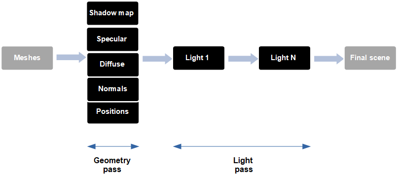
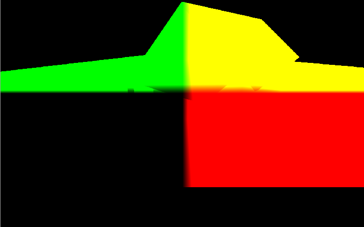
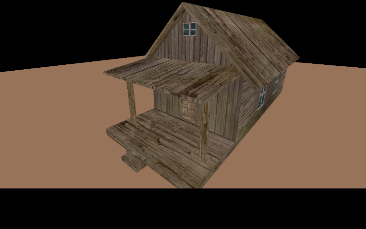
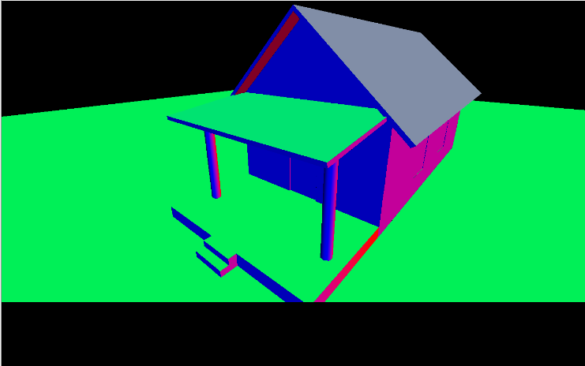
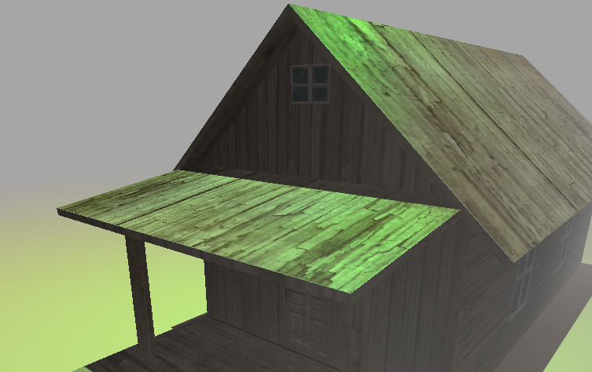

# 延迟着色法（Deferred Shading）

到目前为止，我们渲染三维场景的方式称为正向渲染法（Forward Rendering）。我们首先渲染3D对象，并在片元着色器中应用纹理和光照效果。如果我们有一个具有多种光照和复杂效果的复杂片元着色器处理阶段，这种方法就不是很高效。此外，我们最终可能会将这些效果应用到稍后可能由于深度测试而被丢弃的片元上（尽管这并不完全正确，如果我们启用[早期片元测试](https://www.khronos.org/opengl/wiki/Early_Fragment_Test)的话）。

为了缓解上述问题，我们可以改变方式，使用一种称为延迟着色法的技术来渲染场景。通过延迟着色法，我们先将后期（在片元着色器中）所需的几何信息渲染到缓冲区。当使用储存在这些缓冲区中的信息时，片元着色器所需的复杂运算被推迟（Postpone）、延迟（Defer）到之后的阶段。

因此，使用延迟着色法，我们进行两个渲染阶段（Pass）。第一个是几何处理阶段，我们将场景渲染到储存以下数据的缓冲区中：

* 位置（在本例中，在光照视图坐标系中，尽管你可以看到使用世界坐标的其他示例）。
* 每个位置的漫反射颜色。
* 每个位置的镜面反射分量。
* 每个位置的法线（也在光照视图坐标系中）。
* 有向光的阴影图（你可能会发现这一步在其他实现中是单独完成的）。

所有这些数据都存储在一个称为G缓冲区（G-Buffer）的缓冲区中。

第二个阶段称为光照处理阶段，该阶段需要一个充满整个屏幕的矩形，并使用G缓冲区中储存的信息为每个片元生成颜色信息。当我们进行光照处理阶段时，深度测试将删除所有看不到的场景数据。因此，要执行的操作数量仅限于将在屏幕上显示的。



你可能会问进行额外的渲染阶段能否提高性能，答案是视情况而定。延迟着色法通常在有许多不同的光照处理阶段时使用，在此情况下，额外的渲染阶段将通过减少将在片元着色器中执行的操作来补偿。

让我们开始编码吧，首先要做的是为G缓冲区创建一个新类，名为`GBuffer`，其定义如下所示：

```java
package org.lwjglb.engine.graph;

import org.lwjgl.system.MemoryStack;
import org.lwjglb.engine.Window;
import java.nio.ByteBuffer;
import java.nio.IntBuffer;
import static org.lwjgl.opengl.GL11.*;
import static org.lwjgl.opengl.GL20.*;
import static org.lwjgl.opengl.GL30.*;

public class GBuffer {

    private static final int TOTAL_TEXTURES = 6;

    private int gBufferId;

    private int[] textureIds;

    private int width;

    private int height;
```

类定义了一个常量，该常量为要使用的最大缓冲区数建模。与G缓冲区本身关联的ID，以及单个缓冲区的数组，屏幕的大小也会被储存。

让我们看一下构造函数：

```java
public GBuffer(Window window) throws Exception {
    // 创建G缓冲区
    gBufferId = glGenFramebuffers();
    glBindFramebuffer(GL_DRAW_FRAMEBUFFER, gBufferId);

    textureIds = new int[TOTAL_TEXTURES];
    glGenTextures(textureIds);

    this.width = window.getWidth();
    this.height = window.getHeight();

    // 为位置、漫反射颜色、镜面反射颜色、法线、阴影因子和深度创建纹理
    // 所有坐标都在世界坐标系中
    for(int i=0; i<TOTAL_TEXTURES; i++) {
        glBindTexture(GL_TEXTURE_2D, textureIds[i]);
        int attachmentType;
        switch(i) {
            case TOTAL_TEXTURES - 1:
                // 深度分量
                glTexImage2D(GL_TEXTURE_2D, 0, GL_DEPTH_COMPONENT32F, width, height, 0, GL_DEPTH_COMPONENT, GL_FLOAT,
                        (ByteBuffer) null);
                attachmentType = GL_DEPTH_ATTACHMENT;
                break;
            default:
                glTexImage2D(GL_TEXTURE_2D, 0, GL_RGB32F, width, height, 0, GL_RGB, GL_FLOAT, (ByteBuffer) null);
                attachmentType = GL_COLOR_ATTACHMENT0 + i;
                break;
        }
        // 用于采样
        glTexParameterf(GL_TEXTURE_2D, GL_TEXTURE_MIN_FILTER, GL_NEAREST);
        glTexParameterf(GL_TEXTURE_2D, GL_TEXTURE_MAG_FILTER, GL_NEAREST);

        // 将纹理绑定到G缓冲区
        glFramebufferTexture2D(GL_FRAMEBUFFER, attachmentType, GL_TEXTURE_2D, textureIds[i], 0);
    }

    try (MemoryStack stack = MemoryStack.stackPush()) {
        IntBuffer intBuff = stack.mallocInt(TOTAL_TEXTURES);
        int values[] = {GL_COLOR_ATTACHMENT0, GL_COLOR_ATTACHMENT1, GL_COLOR_ATTACHMENT2, GL_COLOR_ATTACHMENT3, GL_COLOR_ATTACHMENT4, GL_COLOR_ATTACHMENT5};
        for(int i = 0; i < values.length; i++) {
            intBuff.put(values[i]);
        }
        intBuff.flip();
        glDrawBuffers(intBuff);
    }

    // 解绑
    glBindFramebuffer(GL_FRAMEBUFFER, 0);
}
```

首先我们要做的事是创建一个帧缓冲区。记住，帧缓冲区只是一个OpenGL对象，可用于渲染操作，而不是渲染到屏幕。然后我们生成一组纹理（6个纹理），这些纹理将与帧缓冲区关联。

之后，我们使用for循环来初始化纹理，有如下类型：

* “常规纹理”，将储存位置、法线和漫反射分量等。
* 用于储存深度缓冲区的纹理，这将是最后的纹理。

纹理初始化后，我们为它们启用采样并将它们绑定到帧缓冲区。每个纹理使用以`GL_COLOR_ATTACHMENT0`为开头的ID进行绑定。每个纹理都以该ID递增一位，因此坐标使用`GL_COLOR_ATTACHMENT0`绑定，漫反射分量使用`GL_COLOR_ATTACHMENT1`（即`GL_COLOR_ATTACHMENT0 + 1`）附加，以此类推。

在创建完所有纹理之后，我们需要让片元着色器使用它们进行渲染。这是通过调用`glDrawBuffers`完成的。我们只传递带有所用颜色绑定的ID的数组（`GL_COLOR_ ATTACHMENT0`到`GL_COLOR_ATTACHMENT5`）。

类的其他部分只是getter方法和`cleanup`方法。

```java
public int getWidth() {
    return width;
}

public int getHeight() {
    return height;
}

public int getGBufferId() {
    return gBufferId;
}

public int[] getTextureIds() {
    return textureIds;
}

public int getPositionTexture() {
    return textureIds[0];
}

public int getDepthTexture() {
    return textureIds[TOTAL_TEXTURES-1];
}

public void cleanUp() {
    glDeleteFramebuffers(gBufferId);

    if (textureIds != null) {
        for (int i=0; i<TOTAL_TEXTURES; i++) {
            glDeleteTextures(textureIds[i]);
        }
    }
}
```

我们将创建一个名为`SceneBuffer`的新类，它只是另一个帧缓冲区，将在执行光照处理阶段时使用它。我们不直接渲染到屏幕，而是渲染到这个帧缓冲区。这样做，我们可以应用其他效果（如雾、天空盒等）。类的定义如下：

```java
package org.lwjglb.engine.graph;

import org.lwjglb.engine.Window;

import java.nio.ByteBuffer;

import static org.lwjgl.opengl.GL11.*;
import static org.lwjgl.opengl.GL30.*;

public class SceneBuffer {

    private int bufferId;

    private int textureId;

    public SceneBuffer(Window window) throws Exception {
        // 创建缓冲区
        bufferId = glGenFramebuffers();
        glBindFramebuffer(GL_DRAW_FRAMEBUFFER, bufferId);

        // 创建纹理
        int[] textureIds = new int[1];
        glGenTextures(textureIds);
        textureId = textureIds[0];
        glBindTexture(GL_TEXTURE_2D, textureId);
        glTexImage2D(GL_TEXTURE_2D, 0, GL_RGB32F, window.getWidth(), window.getHeight(), 0, GL_RGB, GL_FLOAT, (ByteBuffer) null);

        // 用于采样
        glTexParameterf(GL_TEXTURE_2D, GL_TEXTURE_MIN_FILTER, GL_NEAREST);
        glTexParameterf(GL_TEXTURE_2D, GL_TEXTURE_MAG_FILTER, GL_NEAREST);

        // 附加纹理到G缓冲区
        glFramebufferTexture2D(GL_FRAMEBUFFER, GL_COLOR_ATTACHMENT0, GL_TEXTURE_2D, textureId, 0);

        // 解绑
        glBindFramebuffer(GL_FRAMEBUFFER, 0);
    }

    public int getBufferId() {
        return bufferId;
    }

    public int getTextureId() {
        return textureId;
    }

    public void cleanup() {
        glDeleteFramebuffers(bufferId);

        glDeleteTextures(textureId);
    }
}
```

如你所见，它类似于`GBuffer`类，但这里只使用一个纹理来储存生成的颜色。既然已经创建了这些新类，我们就可以开始使用它们了。在`Renderer`类中，我们将不再使用用于渲染场景的正向渲染着色器（名为`scene_vertex.vs`和`scene_fragment.fs`）。

在`Renderer`类的`init`方法中，你会看到创建了一个`GBuffer`实现，我们分别为几何处理阶段（通过调用`setupGeometryShader`方法）和光照处理阶段（通过调用`setupDirLightShader`和`setupPointLightShader`方法）初始化了另一组着色器。你换可以看到我们创建了一个名为`sceneBuffer`的`SceneBuffer`类的实例，如上所述，它将在渲染光照时使用。名为`bufferPassModelMatrix`的实用矩阵也被实例化（在执行几何处理阶段时将使用它）。你可以看到我们在`init`方法的末尾创建了一个新的`Mesh`，它将用于光照处理阶段。关于这方面的详情将在之后介绍。

```java
public void init(Window window) throws Exception {
    shadowRenderer.init(window);
    gBuffer = new GBuffer(window);
    sceneBuffer = new SceneBuffer(window);
    setupSkyBoxShader();
    setupParticlesShader();
    setupGeometryShader();
    setupDirLightShader();
    setupPointLightShader();
    setupFogShader();

    bufferPassModelMatrix =  new Matrix4f();
    bufferPassMesh = StaticMeshesLoader.load("src/main/resources/models/buffer_pass_mess.obj", "src/main/resources/models")[0];
}
```

几何处理阶段和光照处理阶段使用的着色器定义与通常一致（你可以直接查看源代码），让我们关注它们的内容。我们将从几何处理阶段开始，接下来是顶点着色器代码（`gbuffer_vertex.vs`）：

```glsl
#version 330

const int MAX_WEIGHTS = 4;
const int MAX_JOINTS = 150;
const int NUM_CASCADES = 3;

layout (location=0) in vec3 position;
layout (location=1) in vec2 texCoord;
layout (location=2) in vec3 vertexNormal;
layout (location=3) in vec4 jointWeights;
layout (location=4) in ivec4 jointIndices;
layout (location=5) in mat4 modelInstancedMatrix;
layout (location=9) in vec2 texOffset;
layout (location=10) in float selectedInstanced;

uniform int isInstanced;
uniform mat4 viewMatrix;
uniform mat4 projectionMatrix;
uniform mat4 modelNonInstancedMatrix;
uniform mat4 jointsMatrix[MAX_JOINTS];
uniform mat4 lightViewMatrix[NUM_CASCADES];
uniform mat4 orthoProjectionMatrix[NUM_CASCADES];
uniform int numCols;
uniform int numRows;
uniform float selectedNonInstanced;

out vec2  vs_textcoord;
out vec3  vs_normal;
out vec4  vs_mvVertexPos;
out vec4  vs_mlightviewVertexPos[NUM_CASCADES];
out mat4  vs_modelMatrix;
out float vs_selected;

void main()
{
    vec4 initPos = vec4(0, 0, 0, 0);
    vec4 initNormal = vec4(0, 0, 0, 0);
    mat4 modelMatrix;
    if ( isInstanced > 0 )
    {
        vs_selected = selectedInstanced;
        modelMatrix = modelInstancedMatrix;

        initPos = vec4(position, 1.0);
        initNormal = vec4(vertexNormal, 0.0);
    }
    else
    {
        vs_selected = selectedNonInstanced;
        modelMatrix = modelNonInstancedMatrix;

        int count = 0;
        for(int i = 0; i < MAX_WEIGHTS; i++)
        {
            float weight = jointWeights[i];
            if(weight > 0) {
                count++;
                int jointIndex = jointIndices[i];
                vec4 tmpPos = jointsMatrix[jointIndex] * vec4(position, 1.0);
                initPos += weight * tmpPos;

                vec4 tmpNormal = jointsMatrix[jointIndex] * vec4(vertexNormal, 0.0);
                initNormal += weight * tmpNormal;
            }
        }
        if (count == 0)
        {
            initPos = vec4(position, 1.0);
            initNormal = vec4(vertexNormal, 0.0);
        }
    }
    mat4 modelViewMatrix = viewMatrix * modelMatrix;
    vs_mvVertexPos = modelViewMatrix * initPos;
    gl_Position = projectionMatrix * vs_mvVertexPos;

    // Support for texture atlas, update texture coordinates
    float x = (texCoord.x / numCols + texOffset.x);
    float y = (texCoord.y / numRows + texOffset.y);

    vs_textcoord = vec2(x, y);
    vs_normal = normalize(modelViewMatrix * initNormal).xyz;

    for (int i = 0 ; i < NUM_CASCADES ; i++) {
        vs_mlightviewVertexPos[i] = orthoProjectionMatrix[i] * lightViewMatrix[i] * modelMatrix * initPos;
    }

    vs_modelMatrix = modelMatrix;
}
```

此着色器与上一章中用于渲染场景的顶点着色器非常相似，输出变量的名称有一些变化，但本质上是相同的着色器。事实上，它应该是几近一致的，我们渲染顶点的方式不应该改变，主要的更改是在片元着色器中，它是这样定义的（`gbuffer_fragment.fs`）：

```glsl
#version 330

const int NUM_CASCADES = 3;

in vec2  vs_textcoord;
in vec3  vs_normal;
in vec4  vs_mvVertexPos;
in vec4  vs_mlightviewVertexPos[NUM_CASCADES];
in mat4  vs_modelMatrix;
in float vs_selected;

layout (location = 0) out vec3 fs_worldpos;
layout (location = 1) out vec3 fs_diffuse;
layout (location = 2) out vec3 fs_specular;
layout (location = 3) out vec3 fs_normal;
layout (location = 4) out vec2 fs_shadow;

uniform mat4 viewMatrix;

struct Material
{
    vec4 diffuse;
    vec4 specular;
    int hasTexture;
    int hasNormalMap;
    float reflectance;
};

uniform sampler2D texture_sampler;
uniform sampler2D normalMap;
uniform Material  material;

uniform sampler2D shadowMap_0;
uniform sampler2D shadowMap_1;
uniform sampler2D shadowMap_2;
uniform float cascadeFarPlanes[NUM_CASCADES];
uniform mat4 orthoProjectionMatrix[NUM_CASCADES];
uniform int renderShadow;

vec4 diffuseC;
vec4 speculrC;

void getColour(Material material, vec2 textCoord)
{
    if (material.hasTexture == 1)
    {
        diffuseC = texture(texture_sampler, textCoord);
        speculrC = diffuseC;
    }
    else
    {
        diffuseC = material.diffuse;
        speculrC = material.specular;
    }
}

vec3 calcNormal(Material material, vec3 normal, vec2 text_coord, mat4 modelMatrix)
{
    vec3 newNormal = normal;
    if ( material.hasNormalMap == 1 )
    {
        newNormal = texture(normalMap, text_coord).rgb;
        newNormal = normalize(newNormal * 2 - 1);
        newNormal = normalize(viewMatrix * modelMatrix * vec4(newNormal, 0.0)).xyz;
    }
    return newNormal;
}

float calcShadow(vec4 position, int idx)
{
    if ( renderShadow == 0 )
    {
        return 1.0;
    }

    vec3 projCoords = position.xyz;
    // Transform from screen coordinates to texture coordinates
    projCoords = projCoords * 0.5 + 0.5;
    float bias = 0.005;

    float shadowFactor = 0.0;
    vec2 inc;
    if (idx == 0)
    {
        inc = 1.0 / textureSize(shadowMap_0, 0);
    }
    else if (idx == 1)
    {
        inc = 1.0 / textureSize(shadowMap_1, 0);
    }
    else
    {
        inc = 1.0 / textureSize(shadowMap_2, 0);
    }
    for(int row = -1; row <= 1; ++row)
    {
        for(int col = -1; col <= 1; ++col)
        {
            float textDepth;
            if (idx == 0)
            {
                textDepth = texture(shadowMap_0, projCoords.xy + vec2(row, col) * inc).r; 
            }
            else if (idx == 1)
            {
                textDepth = texture(shadowMap_1, projCoords.xy + vec2(row, col) * inc).r; 
            }
            else
            {
                textDepth = texture(shadowMap_2, projCoords.xy + vec2(row, col) * inc).r; 
            }
            shadowFactor += projCoords.z - bias > textDepth ? 1.0 : 0.0;        
        }    
    }
    shadowFactor /= 9.0;

    if(projCoords.z > 1.0)
    {
        shadowFactor = 1.0;
    }

    return 1 - shadowFactor;
} 

void main()
{
    getColour(material, vs_textcoord);

    fs_worldpos   = vs_mvVertexPos.xyz;
    fs_diffuse    = diffuseC.xyz;
    fs_specular   = speculrC.xyz;
    fs_normal     = normalize(calcNormal(material, vs_normal, vs_textcoord, vs_modelMatrix));

    int idx;
    for (int i=0; i<NUM_CASCADES; i++)
    {
        if ( abs(vs_mvVertexPos.z) < cascadeFarPlanes[i] )
        {
            idx = i;
            break;
        }
    }
    fs_shadow  = vec2(calcShadow(vs_mlightviewVertexPos[idx], idx), material.reflectance);

    if ( vs_selected > 0 ) {
        fs_diffuse = vec3(fs_diffuse.x, fs_diffuse.y, 1);
    }
}
```

最关键的行是：

```glsl
layout (location = 0) out vec3 fs_worldpos;
layout (location = 1) out vec3 fs_diffuse;
layout (location = 2) out vec3 fs_specular;
layout (location = 3) out vec3 fs_normal;
layout (location = 4) out vec2 fs_shadow;
```

这就是我们要引用该片元着色器将写入的纹理的地方。如你所见，我们只是转储位置（在光照视图坐标系中）、漫反射颜色（可以是材质相关的纹理的颜色分量）、镜面反射分量、法线和阴影图的深度值。

旁注：我们已经简化了`Material`类的定义，删除了环境颜色分量。

回到`Renderer`类，`render`方法的定义如下：

```java
public void render(Window window, Camera camera, Scene scene, boolean sceneChanged) {
    clear();

    if (window.getOptions().frustumCulling) {
        frustumFilter.updateFrustum(window.getProjectionMatrix(), camera.getViewMatrix());
        frustumFilter.filter(scene.getGameMeshes());
        frustumFilter.filter(scene.getGameInstancedMeshes());
    }

    // 在设置视口之前渲染深度图
    if (scene.isRenderShadows() && sceneChanged) {
        shadowRenderer.render(window, scene, camera, transformation, this);
    }

    glViewport(0, 0, window.getWidth(), window.getHeight());

    // 每个渲染周期更新投影矩阵一次
    window.updateProjectionMatrix();

    renderGeometry(window, camera, scene);

    initLightRendering();
    renderPointLights(window, camera, scene);
    renderDirectionalLight(window, camera, scene);
    endLightRendering();

    renderFog(window, camera, scene);
    renderSkyBox(window, camera, scene);
    renderParticles(window, camera, scene);
}
```

几何处理阶段是在`renderGeometry`方法中完成的（你可以看到我们不再有`renderScene`）。光照处理阶段分几个步骤完成，首先设置要使用的缓冲区和其他参数（在`initLightRendering`中），然后渲染点光源（在`renderPointLights`中）和平行光（在`renderDirectionalLight`中），最后恢复状态（在`endLightRendering`中）。

让我们从几何处理阶段开始。`renderGeometry`方法几乎等同于在前几章中使用的`renderScene`方法：

```java
private void renderGeometry(Window window, Camera camera, Scene scene) {
    // 渲染G缓冲区以便写入
    glBindFramebuffer(GL_DRAW_FRAMEBUFFER, gBuffer.getGBufferId());

    clear();

    glDisable(GL_BLEND);

    gBufferShaderProgram.bind();

    Matrix4f viewMatrix = camera.getViewMatrix();
    Matrix4f projectionMatrix = window.getProjectionMatrix();
    gBufferShaderProgram.setUniform("viewMatrix", viewMatrix);
    gBufferShaderProgram.setUniform("projectionMatrix", projectionMatrix);

    gBufferShaderProgram.setUniform("texture_sampler", 0);
    gBufferShaderProgram.setUniform("normalMap", 1);

    List<ShadowCascade> shadowCascades = shadowRenderer.getShadowCascades();
    for (int i = 0; i < ShadowRenderer.NUM_CASCADES; i++) {
        ShadowCascade shadowCascade = shadowCascades.get(i);
        gBufferShaderProgram.setUniform("orthoProjectionMatrix", shadowCascade.getOrthoProjMatrix(), i);
        gBufferShaderProgram.setUniform("cascadeFarPlanes", ShadowRenderer.CASCADE_SPLITS[i], i);
        gBufferShaderProgram.setUniform("lightViewMatrix", shadowCascade.getLightViewMatrix(), i);
    }
    shadowRenderer.bindTextures(GL_TEXTURE2);
    int start = 2;
    for (int i = 0; i < ShadowRenderer.NUM_CASCADES; i++) {
        gBufferShaderProgram.setUniform("shadowMap_" + i, start + i);
    }
    gBufferShaderProgram.setUniform("renderShadow", scene.isRenderShadows() ? 1 : 0);

    renderNonInstancedMeshes(scene);

    renderInstancedMeshes(scene, viewMatrix);

    gBufferShaderProgram.unbind();

    glEnable(GL_BLEND);
}
```

仅有的区别是：

* 我们绑定到G缓冲区而不是屏幕。
* 禁用混合，因为我们只想使用最接近摄像机的值（最小深度值），所以不需要混合。

如果使用OpenGL调试器（如RenderDoc）调试示例，则可以看到几何处理阶段期间生成的纹理。位置纹理将如下所示：



储存漫反射分量值的纹理如下所示：



储存法线值的纹理如下所示：



现在轮到光照处理阶段了。我们首先需要在渲染之前设置一些东西，这是在`initLightRendering`方法中完成的：

```java
private void initLightRendering() {
    // 绑定场景缓冲区
    glBindFramebuffer(GL_FRAMEBUFFER, sceneBuffer.getBufferId());

    // 清理G缓冲区
    clear();

    // 禁用深度测试以允许绘制具有相同深度的多个图层
    glDisable(GL_DEPTH_TEST);

    glEnable(GL_BLEND);
    glBlendEquation(GL_FUNC_ADD);
    glBlendFunc(GL_ONE, GL_ONE);

    // 绑定G缓冲区以便读取
    glBindFramebuffer(GL_READ_FRAMEBUFFER, gBuffer.getGBufferId());
}
```

因为我们不会渲染到屏幕上，所以首先需要绑定到纹理上，该纹理将保存光照处理阶段的结果。然后清除缓冲区并禁用深度测试。因为已经在几何处理阶段进行了深度测试，这就不再需要了。另一重要步骤是启用混合。最后一个操作是启用G缓冲区进行读取，它将在光照处理阶段期间使用。

在分析不同光照的渲染方法之前，让我们稍微考虑一下如何渲染光照。我们需要使用G缓冲区的内容，但为了使用它们，需要先渲染一些东西。但是，我们已经绘制了场景，现在要渲染什么？答案很简单，我们只需要渲染一个充满了整个屏幕的矩形。对于该矩形的每个片元，我们将使用G缓冲区中储存的数据并生成正确的输出颜色。你还记得我们在`Renderer`类的`init`方法中加载的`Mesh`吗？它被命名为`bufferPassMesh`，它只储存一个充满整个屏幕的矩形。

那么，光照处理阶段的顶点着色器看起来是怎样的？

```glsl
#version 330

layout (location=0) in vec3 position;
uniform mat4 projectionMatrix;
uniform mat4 modelMatrix;

void main()
{
    gl_Position = projectionMatrix * modelMatrix * vec4(position, 1.0);
}
```

上述代码是渲染点光源和平行光时使用的顶点着色器（`light_vertex.vs`）。它只是使用模型矩阵和投影矩阵来转储顶点。不需要使用观察矩阵，因为这里不需要摄像机。

点光源的片元着色器（`point_light_fragment.fs`）的定义如下：

```glsl
#version 330

out vec4 fragColor;

struct Attenuation
{
    float constant;
    float linear;
    float exponent;
};

struct PointLight
{
    vec3 colour;
    // Light position is assumed to be in view coordinates
    vec3 position;
    float intensity;
    Attenuation att;
};

uniform sampler2D positionsText;
uniform sampler2D diffuseText;
uniform sampler2D specularText;
uniform sampler2D normalsText;
uniform sampler2D shadowText;
uniform sampler2D depthText;

uniform vec2 screenSize;

uniform float specularPower;
uniform PointLight pointLight;

vec2 getTextCoord()
{
    return gl_FragCoord.xy / screenSize;
}

vec4 calcLightColour(vec4 diffuseC, vec4 speculrC, float reflectance, vec3 light_colour, float light_intensity, vec3 position, vec3 to_light_dir, vec3 normal)
{
    vec4 diffuseColour = vec4(0, 0, 0, 1);
    vec4 specColour = vec4(0, 0, 0, 1);

    // Diffuse Light
    float diffuseFactor = max(dot(normal, to_light_dir), 0.0);
    diffuseColour = diffuseC * vec4(light_colour, 1.0) * light_intensity * diffuseFactor;

    // Specular Light
    vec3 camera_direction = normalize(-position);
    vec3 from_light_dir = -to_light_dir;
    vec3 reflected_light = normalize(reflect(from_light_dir , normal));
    float specularFactor = max( dot(camera_direction, reflected_light), 0.0);
    specularFactor = pow(specularFactor, specularPower);
    specColour = speculrC * light_intensity  * specularFactor * reflectance * vec4(light_colour, 1.0);

    return (diffuseColour + specColour);
}

vec4 calcPointLight(vec4 diffuseC, vec4 speculrC, float reflectance, PointLight light, vec3 position, vec3 normal)
{
    vec3 light_direction = light.position - position;
    vec3 to_light_dir  = normalize(light_direction);
    vec4 light_colour = calcLightColour(diffuseC, speculrC, reflectance, light.colour, light.intensity, position, to_light_dir, normal);

    // Apply Attenuation
    float distance = length(light_direction);
    float attenuationInv = light.att.constant + light.att.linear * distance +
        light.att.exponent * distance * distance;
    return light_colour / attenuationInv;
}

void main()
{
    vec2 textCoord = getTextCoord();
    float depth = texture(depthText, textCoord).r;
    vec3 worldPos = texture(positionsText, textCoord).xyz;
    vec4 diffuseC = texture(diffuseText, textCoord);
    vec4 speculrC = texture(specularText, textCoord);
    vec3 normal  = texture(normalsText, textCoord).xyz;
    float shadowFactor = texture(shadowText, textCoord).r;
    float reflectance = texture(shadowText, textCoord).g;

    fragColor = calcPointLight(diffuseC, speculrC, reflectance, pointLight, worldPos.xyz, normal.xyz) * shadowFactor;
}
```

如你所见，它包含你应该熟悉的函数，它们在前几章的场景片元着色器中使用过。这里需要注意的重要事项如下：

```glsl
uniform sampler2D positionsText;
uniform sampler2D diffuseText;
uniform sampler2D specularText;
uniform sampler2D normalsText;
uniform sampler2D shadowText;
uniform sampler2D depthText;
```

这些Uniform建模构成了G缓冲区的不同纹理。我们将使用它们来访问数据。你现在可能会问，当我们渲染一个片元时，如何知道要从这些纹理中获取哪个像素？答案是使用`gl_FragCoord`输入变量，此变量储存当前片元与窗口的相对坐标。因为要从坐标系转换为纹理，我们使用以下函数：

```glsl
vec2 getTextCoord()
{
    return gl_FragCoord.xy / screenSize;
}
```

平行光的片元着色器也很相似，可以查看源代码。现在已经有了着色器，我们回到`Renderer`类。对于点光源，我们将做尽可能多的光照处理，我们只是绑定用于此类型光源的着色器，并为每个着色器绘制矩形。

```java
private void renderPointLights(Window window, Camera camera, Scene scene) {
    pointLightShaderProgram.bind();

    Matrix4f viewMatrix = camera.getViewMatrix();
    Matrix4f projectionMatrix = window.getProjectionMatrix();
    pointLightShaderProgram.setUniform("modelMatrix", bufferPassModelMatrix);
    pointLightShaderProgram.setUniform("projectionMatrix", projectionMatrix);

    // 镜面反射系数
    pointLightShaderProgram.setUniform("specularPower", specularPower);

    // 绑定G缓冲区纹理
    int[] textureIds = this.gBuffer.getTextureIds();
    int numTextures = textureIds != null ? textureIds.length : 0;
    for (int i=0; i<numTextures; i++) {
        glActiveTexture(GL_TEXTURE0 + i);
        glBindTexture(GL_TEXTURE_2D, textureIds[i]);
    }

    pointLightShaderProgram.setUniform("positionsText", 0);
    pointLightShaderProgram.setUniform("diffuseText", 1);
    pointLightShaderProgram.setUniform("specularText", 2);
    pointLightShaderProgram.setUniform("normalsText", 3);
    pointLightShaderProgram.setUniform("shadowText", 4);

    pointLightShaderProgram.setUniform("screenSize", (float) gBuffer.getWidth(), (float)gBuffer.getHeight());

    SceneLight sceneLight = scene.getSceneLight();
    PointLight[] pointLights = sceneLight.getPointLightList();
    int numPointLights = pointLights != null ? pointLights.length : 0;
    for(int i=0; i<numPointLights; i++) {
        // 获取点光源对象的副本并将其位置转换到观察坐标系
        PointLight currPointLight = new PointLight(pointLights[i]);
        Vector3f lightPos = currPointLight.getPosition();
        tmpVec.set(lightPos, 1);
        tmpVec.mul(viewMatrix);
        lightPos.x = tmpVec.x;
        lightPos.y = tmpVec.y;
        lightPos.z = tmpVec.z;
        pointLightShaderProgram.setUniform("pointLight", currPointLight);

        bufferPassMesh.render();
    }

    pointLightShaderProgram.unbind();
}
```

对于平行光来说，方法非常相似。在此情况下，我们只进行一次处理：

```java
private void renderDirectionalLight(Window window, Camera camera, Scene scene) {
    dirLightShaderProgram.bind();

    Matrix4f viewMatrix = camera.getViewMatrix();
    Matrix4f projectionMatrix = window.getProjectionMatrix();
    dirLightShaderProgram.setUniform("modelMatrix", bufferPassModelMatrix);
    dirLightShaderProgram.setUniform("projectionMatrix", projectionMatrix);

    // 镜面反射系数
    dirLightShaderProgram.setUniform("specularPower", specularPower);

    // 绑定G缓冲区纹理
    int[] textureIds = this.gBuffer.getTextureIds();
    int numTextures = textureIds != null ? textureIds.length : 0;
    for (int i=0; i<numTextures; i++) {
        glActiveTexture(GL_TEXTURE0 + i);
        glBindTexture(GL_TEXTURE_2D, textureIds[i]);
    }

    dirLightShaderProgram.setUniform("positionsText", 0);
    dirLightShaderProgram.setUniform("diffuseText", 1);
    dirLightShaderProgram.setUniform("specularText", 2);
    dirLightShaderProgram.setUniform("normalsText", 3);
    dirLightShaderProgram.setUniform("shadowText", 4);

    dirLightShaderProgram.setUniform("screenSize", (float) gBuffer.getWidth(), (float)gBuffer.getHeight());

    // 环境光照
    SceneLight sceneLight = scene.getSceneLight();
    dirLightShaderProgram.setUniform("ambientLight", sceneLight.getAmbientLight());

    // 平行光
    // 获取平行光对象的副本并将其位置转换到观察坐标系
    DirectionalLight currDirLight = new DirectionalLight(sceneLight.getDirectionalLight());
    tmpVec.set(currDirLight.getDirection(), 0);
    tmpVec.mul(viewMatrix);
    currDirLight.setDirection(new Vector3f(tmpVec.x, tmpVec.y, tmpVec.z));
    dirLightShaderProgram.setUniform("directionalLight", currDirLight);

    bufferPassMesh.render();

    dirLightShaderProgram.unbind();
}
```

`endLightRendering`只简单地恢复状态。

```java
private void endLightRendering() {
    // 绑定屏幕以便写入
    glBindFramebuffer(GL_FRAMEBUFFER, 0);
    glEnable(GL_DEPTH_TEST);
    glDisable(GL_BLEND);
}
```

如果运行示例，你将看到如下内容：



本章比预期时间长，但有几个要点需要澄清：

* 为了简化本章，已经删除了聚光源的相关内容。
* 延迟着色法中使用点光源的一种常见技术是计算受该光源影响的场景区域。在此情况下，你可以使用较小的四边形，圆形等，而不是渲染充满屏幕的矩形。请牢记，最好是好的敌人，进行复杂的微积分以确定所需的最小形状可能比使用其他粗糙方法慢。
* 如果没有许多光源，此方法比正向着色法慢。

最后要注意的一点是，如果你想了解这些技术在现实中的应用，可以查看[这个极好的说明](http://www.adriancourreges.com/blog/2015/11/02/gta-v-graphics-study/ "GTA V - Graphics Study")，了解GTA V的帧是如何渲染的。
