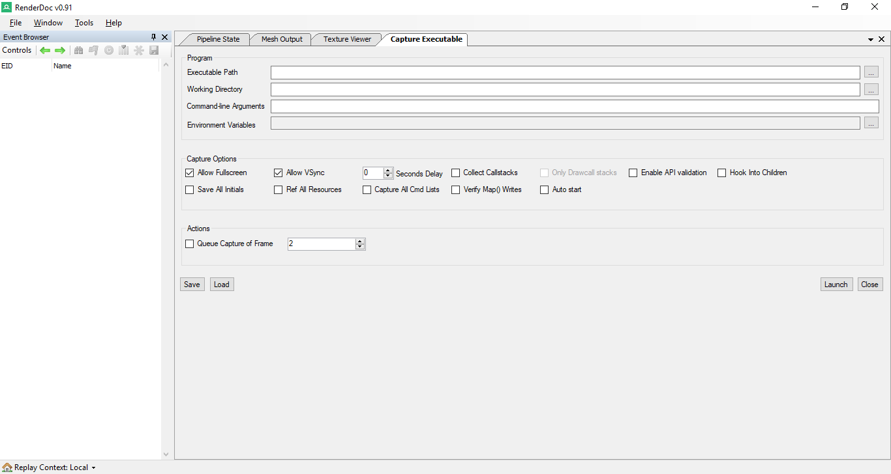
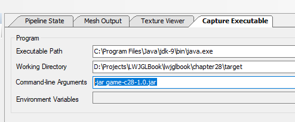
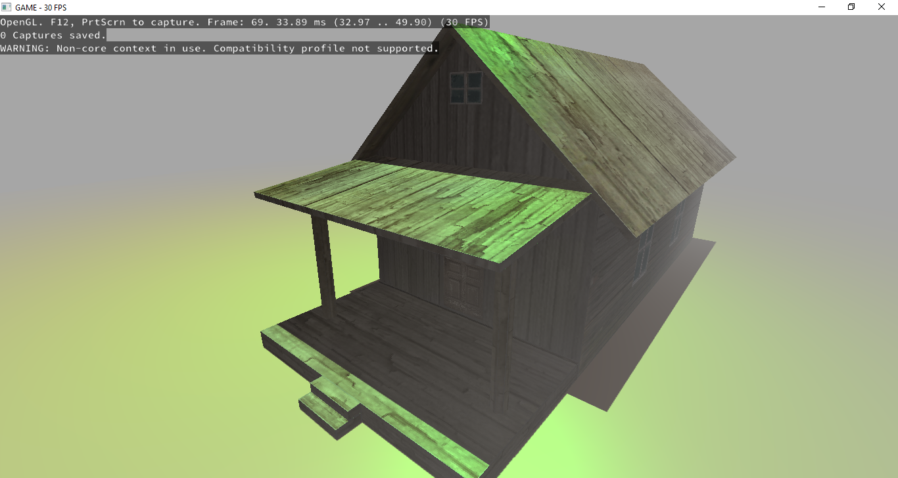
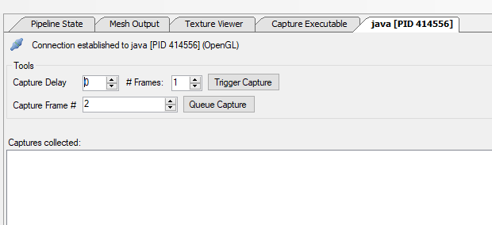
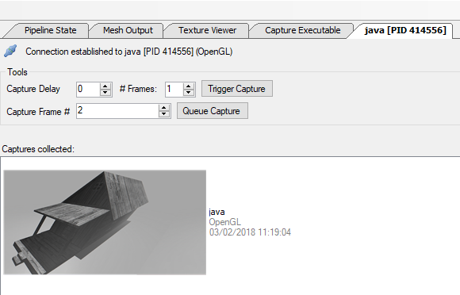
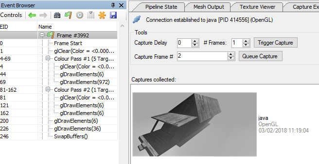
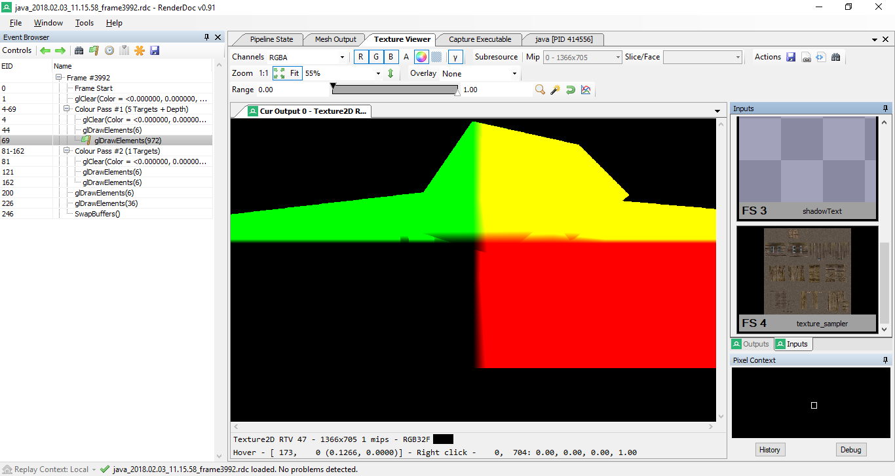
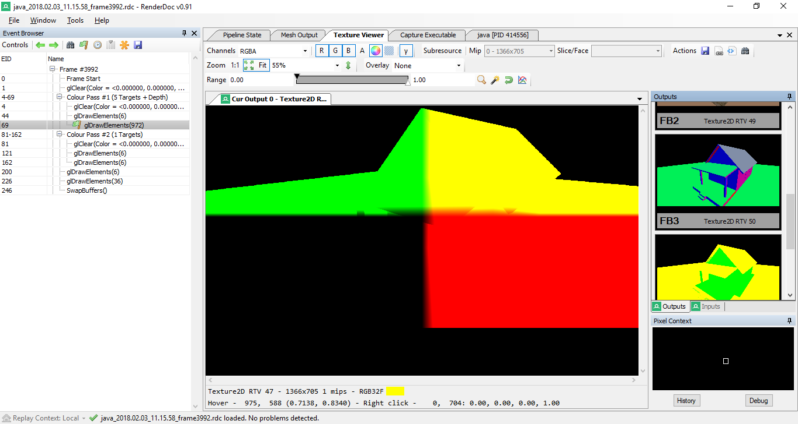
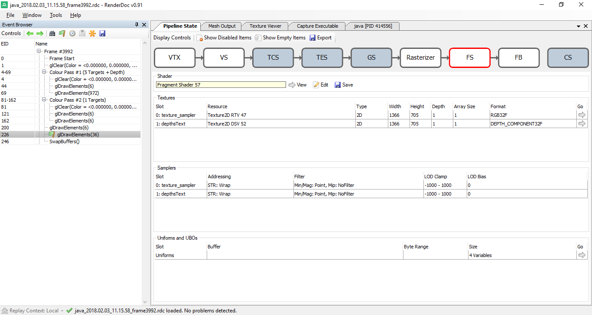

# 附录 A - OpenGL调试（OpenGL Debugging）

调试OpenGL程序可能是一项艰巨的任务。在大多数情况下，你会看到一个黑屏，你无法知道到底发生了什么。为了缓解这个窘况，我们可以使用一些现有的工具来提供关于渲染流程的更多信息。

在本附录中，我们将学习如何使用[RenderDoc](https://renderdoc.org/ "RenderDoc")工具调试LWJGL程序。RenderDoc是一个图形调试工程，可以与Direct3D、Vulkan和OpenGL一起使用。对于OpenGL，它仅支持从3.2到4.5的核心模式。

让我们开始吧，你需要下载并安装对应操作系统的RenderDoc。安装后，当你启动它时，会看到类似于下图的东西：

第一步是配置RenderDoc来运行和监视我们的示例。在“Capture Executable”选项卡中，需要设置以下参数：

* **Executable path**：在本例中，这应该指向JVM启动程序（例如，“C:\Program Files\Java\jdk-9\bin\java.exe”）。
* **Working Directory**：这将为你的程序设置工作目录。在本例中，应该将其设置为Maven转储结果的`target`目录。这样设置后，可以找到依赖项。
* **Command line arguments**：这将包含JVM运行示例所需的参数。在本例中，只需要传递要执行的Jar（例如，“-java game-c28-1.0.jar”）。

你要记住3D模型现已由[Assimp](http://assimp.sourceforge.net/ "Assimp")库加载，我们需要的是实际的文件路径（而不是`CLASSPATH`的相对路径），因此你需要在你设置的工作目录检查路径。在此情况下，最简单快速的测试方法是将src文件夹复制到`target`目录中。

此选项卡中还有许多其他选项用于配置捕获选项。你可以在[RenderDoc文档](https://renderdoc.org/docs/index.html "RenderDoc文档")中查阅它们的用途。一切就绪后，你可以通过点击“Launch”按钮来开始运行程序。你将看到如下内容：

你可能会看到一个警告，因为RenderDoc只能使用OpenGL核心模式。在本例中，我们已经启用了兼容性模式，但它会忽略警告继续工作。程序运行后，你就可以触发它的快照。你将看到添加了一个新的选项卡，名为“java [PID XXXX]”（其中XXXX数字表示Java进程的PID、进程标识号）

从该选项卡中，你可以通过按下“Trigger capture”按钮来捕获程序的状态。生成了一个捕获结果后，你将在同一个选项卡中看到一个小快照。

如果双击该捕获结果，则将加载收集的所有数据，并可以开始查看它。“Event Browser”面板将显示所有在一个渲染周期内执行的与OpenGL相关的调用。

对于第一个渲染流程，你可以看到地面是如何在模型房屋的网格之后绘制的。如果单击一个glDrawELements事件，并选择“Mesh”选项卡，则可以查看绘制的网格，事件的顶点着色器的输入与输出。

你换可以查看用于该绘制操作的输入纹理（通过单击“Texture Viewer”选项卡）。

在中央面板中，你可以看到输出，在右侧面板上可以看到用于输入的纹理列表。还可以逐个查看输出纹理。这很好地说明了延迟着色是如何工作的。

如你所见，该工具提供了有关渲染时发生的情况的宝贵数据，它可以在调试渲染问题时节省宝贵的时间。它甚至可以显示有关渲染管线中使用的着色器的信息。

